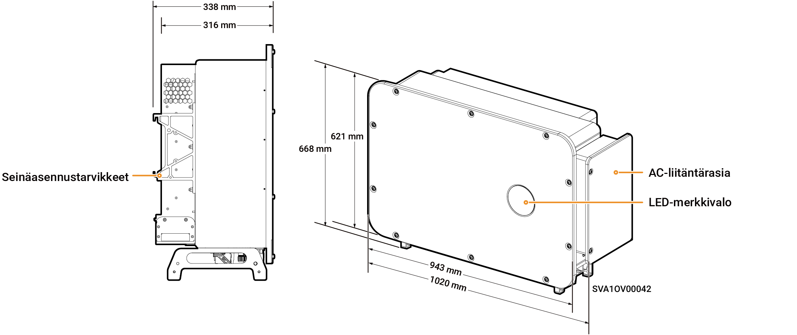

# Sigen PV 125M1-HYA Inverter

### Mitat

<figure><figcaption></figcaption></figure>

### Porttien kuvaukset

<figure><figcaption></figcaption></figure>

<table><thead><tr><th width="95">S/N</th><th width="447">Nimi</th><th>Merkintä</th></tr></thead><tbody><tr><td>1</td><td>SigenStack-verkkoliitäntä</td><td>RJ45 3</td></tr><tr><td>2</td><td>SigenStackin DC-kaapeliliitäntä</td><td>BAT+/BAT-</td></tr><tr><td>3</td><td>Antenniliitäntä</td><td>ANT</td></tr><tr><td>4</td><td>DC-kytkin 1</td><td>DC SWITCH 1</td></tr><tr><td>5</td><td>DC-tuloliitäntäryhmä 1 (Ohjattu DC SWITCH 1:n toimesta)</td><td>PV1–PV8</td></tr><tr><td>6</td><td>DC-tuloliitäntäryhmä 2 (ohjaus DC SWITCH 2)</td><td>PV9–PV16</td></tr><tr><td>7</td><td>DC-kytkin 2</td><td>DC SWITCH 2</td></tr><tr><td>8</td><td>Verkkoliitäntä</td><td>RJ45 1</td></tr><tr><td>9</td><td>Verkkoliitäntä</td><td>RJ45 2</td></tr><tr><td>10</td><td>Monisäikeisen kaapelin kaapeliläpivienti</td><td>-</td></tr><tr><td>11</td><td>Yksisäikeisen kaapelin kaapeliläpivienti</td><td>-</td></tr><tr><td>12</td><td>Sigen CommMod -liitäntä</td><td>4G</td></tr><tr><td>13</td><td>Tiedonsiirtoliitäntä</td><td>COM</td></tr><tr><td>14</td><td>Jäähdytyspuhallin</td><td>-</td></tr></tbody></table>
