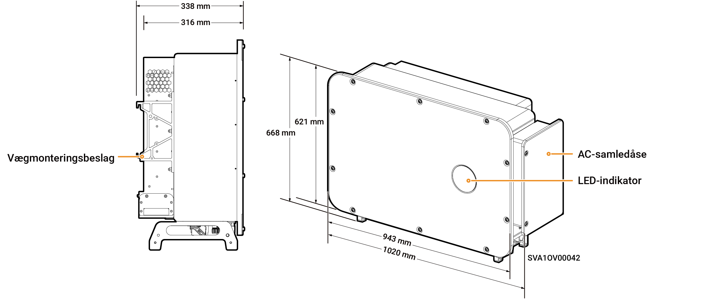
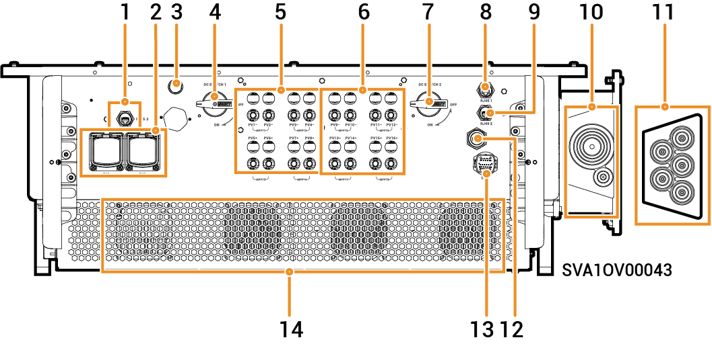

# Sigen PV 125M1-HYA Inverter

### Dimensioner

<figure><figcaption></figcaption></figure>

### Portbeskrivelser

<figure><figcaption></figcaption></figure>

<table><thead><tr><th align="center">Serienummer</th><th width="447">Navn</th><th>Markering</th></tr></thead><tbody><tr><td align="center">1</td><td>SigenStack netværksinterface</td><td>RJ45 3</td></tr><tr><td align="center">2</td><td>SigenStack DC-kabelinterface</td><td>BAT+/BAT-</td></tr><tr><td align="center">3</td><td>Antenneinterface</td><td>ANT</td></tr><tr><td align="center">4</td><td>DC-afbryder 1</td><td>DC SWITCH 1</td></tr><tr><td align="center">5</td><td>DC-indgangsterminalgruppe 1 (styret af DC SWITCH 1)</td><td>PV1 til PV8</td></tr><tr><td align="center">6</td><td>DC-indgangsterminalgruppe 2 (styret af DC SWITCH 2)</td><td>PV9 til PV16</td></tr><tr><td align="center">7</td><td>DC-afbryder 2</td><td>DC SWITCH 2</td></tr><tr><td align="center">8</td><td>Netværksinterface</td><td>RJ45 1</td></tr><tr><td align="center">9</td><td>Netværksinterface</td><td>RJ45 2</td></tr><tr><td align="center">10</td><td>Føringshul til flerlederkabel</td><td>-</td></tr><tr><td align="center">11</td><td>Gennemføringshul til enkeltlederkabel</td><td>-</td></tr><tr><td align="center">12</td><td>Sigen CommMod-interface</td><td>4G</td></tr><tr><td align="center">13</td><td>Kommunikationsinterface</td><td>COM</td></tr><tr><td align="center">14</td><td>Køleventilator</td><td>-</td></tr></tbody></table>
