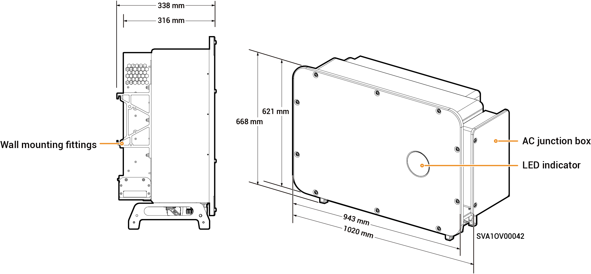

# Sigen PV 125M1-HYA Inverter

### Dimensions

<figure><figcaption></figcaption></figure>

### Port Descriptions

<figure><figcaption></figcaption></figure>

<table><thead><tr><th width="95">S/N</th><th width="447">Name</th><th>Marking</th></tr></thead><tbody><tr><td>1</td><td>SigenStack network interface</td><td>RJ45 3</td></tr><tr><td>2</td><td>SigenStack DC cable interface</td><td>BAT+/BAT-</td></tr><tr><td>3</td><td>Antenna interface</td><td>ANT</td></tr><tr><td>4</td><td>DC switch 1</td><td>DC SWITCH 1</td></tr><tr><td>5</td><td>DC input terminal group 1 (Controlled by DC SWITCH 1)</td><td>PV1 to PV8</td></tr><tr><td>6</td><td>DC input terminal group 2 (Controlled by DC SWITCH 2)</td><td>PV9 to PV16</td></tr><tr><td>7</td><td>DC switch 2</td><td>DC SWITCH 2</td></tr><tr><td>8</td><td>Network interface</td><td>RJ45 1</td></tr><tr><td>9</td><td>Network interface</td><td>RJ45 2</td></tr><tr><td>10</td><td>Routing hole for multi-core cable</td><td>-</td></tr><tr><td>11</td><td>Routing hole for single-core cable</td><td>-</td></tr><tr><td>12</td><td>Sigen CommMod interface</td><td>4G</td></tr><tr><td>13</td><td>Communication interface</td><td>COM</td></tr><tr><td>14</td><td>Cooling fan</td><td>-</td></tr></tbody></table>
