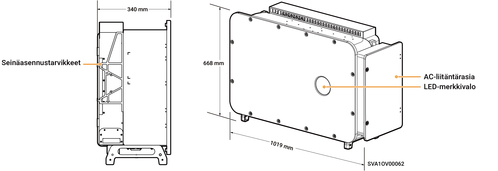

# Sigen PV (150–166)M1, (150–166)M2 Inverter

## Mitat

<figure><figcaption></figcaption></figure>

## Porttien kuvaukset

<figure><figcaption></figcaption></figure>

<table><thead><tr><th width="99">S/N</th><th width="312">Nimi</th><th>Merkintä</th></tr></thead><tbody><tr><td>1</td><td>DC-kytkin 1</td><td>DC SWITCH 1</td></tr><tr><td>2</td><td>
DC-tuloliitäntäryhmä 1

(Ohjattu DC SWITCH 1:n toimesta)
</td><td>PV1–PV9</td></tr><tr><td>3</td><td>
DC-tuloliitäntäryhmä 2

(Ohjattu DC SWITCH 2)
</td><td>PV9–PV18</td></tr><tr><td>4</td><td>DC-kytkin 2</td><td>DC SWITCH 2</td></tr><tr><td>5</td><td>Antenniliitäntä</td><td>ANT</td></tr><tr><td>6</td><td>Verkkoliitäntä</td><td>RJ45 1</td></tr><tr><td>7</td><td>Monisäikeisen kaapelin kaapeliläpivienti</td><td>-</td></tr><tr><td>8</td><td>Yksisäikeisen kaapelin kaapeliläpivienti</td><td>-</td></tr><tr><td>9</td><td>Sigen CommMod -liitäntä</td><td>4G</td></tr><tr><td>10</td><td>Tiedonsiirtoliitäntä</td><td>COM</td></tr><tr><td>11</td><td>Verkkoliitäntä</td><td>RJ45 2</td></tr><tr><td>12</td><td>Jäähdytyspuhallin</td><td>-</td></tr></tbody></table>
