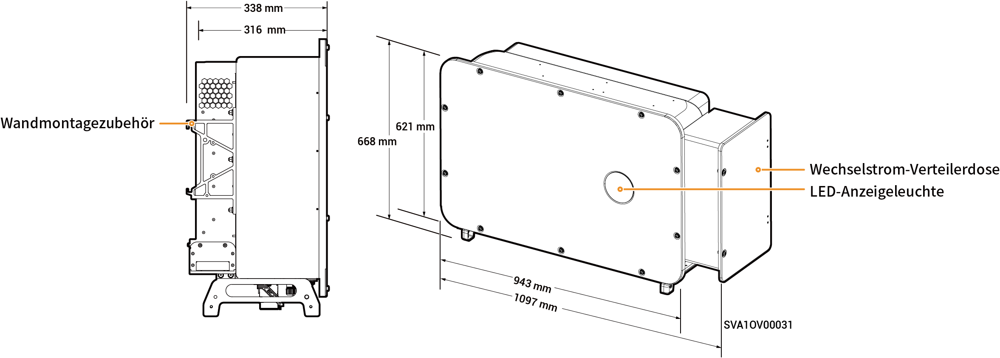

# Sigen PV (50–110)M1-HYB Inverter

## Abmessungen

<figure><figcaption></figcaption></figure>

## Beschreibung der Anschlussbuchsen

<figure><figcaption></figcaption></figure>

<table><thead><tr><th width="60.11114501953125" align="center" valign="middle">Serien-Nr.</th><th valign="top">Bezeichnung</th><th valign="middle">Kennzeichnung</th></tr></thead><tbody><tr><td align="center" valign="middle">1</td><td valign="top">SigenStack Netzwerkschnittstelle</td><td valign="middle">RJ45 3</td></tr><tr><td align="center" valign="middle">2</td><td valign="top">SigenStack DC-Kabelschnittstelle</td><td valign="middle">BAT+/BAT-</td></tr><tr><td align="center" valign="middle">3</td><td valign="top">Antennenanschluss</td><td valign="middle">ANT</td></tr><tr><td align="center" valign="middle">4</td><td valign="top">DC-Schalter 1</td><td valign="middle">DC-SCHALTER 1</td></tr><tr><td align="center" valign="middle">5</td><td valign="top">DC-Eingangsklemme Gruppe 1 (gesteuert durch DC-SCHALTER 1)</td><td valign="middle">PV1 bis PV8</td></tr><tr><td align="center" valign="middle">6</td><td valign="top">DC-Eingangsklemme Gruppe 2 (gesteuert durch DC-SCHALTER 2)</td><td valign="middle">PV9 bis PV16</td></tr><tr><td align="center" valign="middle">7</td><td valign="top">DC-Schalter 2</td><td valign="middle">DC-SCHALTER 2</td></tr><tr><td align="center" valign="middle">8</td><td valign="top">Netzwerkschnittstelle</td><td valign="middle">RJ45 1</td></tr><tr><td align="center" valign="middle">9</td><td valign="top">Netzwerkschnittstelle</td><td valign="middle">RJ45 2</td></tr><tr><td align="center" valign="middle">10</td><td valign="top">Verdrahtungsanschluss für Notstromlasten</td><td valign="middle">-</td></tr><tr><td align="center" valign="middle">11</td><td valign="top">Verdrahtungsanschluss für Stromnetz</td><td valign="middle">-</td></tr><tr><td align="center" valign="middle">12</td><td valign="top">Sigen CommMod-Anschluss</td><td valign="middle">4G</td></tr><tr><td align="center" valign="middle">13</td><td valign="top">Kommunikationsanschluss</td><td valign="middle">COM</td></tr><tr><td align="center" valign="middle">14</td><td valign="top">Kühlgebläse</td><td valign="middle">-</td></tr></tbody></table>
