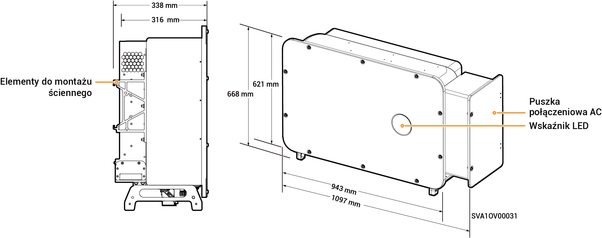

# Sigen PV (50–110)M1-HYB Inverter

## Wymiary

<figure><figcaption></figcaption></figure>

## Opisy portów

<figure><figcaption></figcaption></figure>

<table><thead><tr><th width="60.11114501953125" align="center" valign="middle">S/N</th><th valign="top">Nazwa</th><th valign="middle">Oznakowanie</th></tr></thead><tbody><tr><td align="center" valign="middle">1</td><td valign="top">Interfejs sieciowy SigenStack</td><td valign="middle">RJ45 3</td></tr><tr><td align="center" valign="middle">2</td><td valign="top">Interfejs przewodu SigenStack DC</td><td valign="middle">BAT+/BAT-</td></tr><tr><td align="center" valign="middle">3</td><td valign="top">Interfejs anteny</td><td valign="middle">ANT</td></tr><tr><td align="center" valign="middle">4</td><td valign="top">Przełącznik DC 1</td><td valign="middle">DC SWITCH 1</td></tr><tr><td align="center" valign="middle">5</td><td valign="top">Grupa terminala wejściowego DC 1 (sterowana przez DC SWITCH 1)</td><td valign="middle">PV1 do PV8</td></tr><tr><td align="center" valign="middle">6</td><td valign="top">Grupa terminala wejściowego DC 2 (sterowana przez DC SWITCH 2)</td><td valign="middle">PV9 do PV16</td></tr><tr><td align="center" valign="middle">7</td><td valign="top">Przełącznik DC 2</td><td valign="middle">DC SWITCH 2</td></tr><tr><td align="center" valign="middle">8</td><td valign="top">Interfejs sieciowy</td><td valign="middle">RJ45 1</td></tr><tr><td align="center" valign="middle">9</td><td valign="top">Interfejs sieciowy</td><td valign="middle">RJ45 2</td></tr><tr><td align="center" valign="middle">10</td><td valign="top">Port wejściowy obciążeń domowych z zasilaniem zapasowym</td><td valign="middle">-</td></tr><tr><td align="center" valign="middle">11</td><td valign="top">Port wejściowy sieci energetycznej</td><td valign="middle">-</td></tr><tr><td align="center" valign="middle">12</td><td valign="top">Interfejs Sigen CommMod</td><td valign="middle">4G</td></tr><tr><td align="center" valign="middle">13</td><td valign="top">Interfejs komunikacyjny</td><td valign="middle">COM</td></tr><tr><td align="center" valign="middle">14</td><td valign="top">Wentylator chłodzący</td><td valign="middle">-</td></tr></tbody></table>
