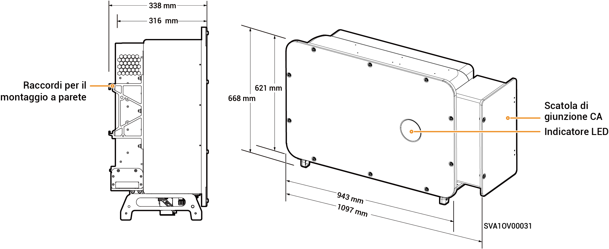

# Sigen PV (50–110)M1-HYB Inverter

## Dimensioni

<figure><figcaption></figcaption></figure>

## Descrizioni delle porte

<figure><figcaption></figcaption></figure>

<table><thead><tr><th width="60.11114501953125" align="center" valign="middle">N.</th><th valign="top">Nome</th><th valign="middle">Indicazione</th></tr></thead><tbody><tr><td align="center" valign="middle">1</td><td valign="top">Interfaccia di rete SigenStack</td><td valign="middle">RJ45 3</td></tr><tr><td align="center" valign="middle">2</td><td valign="top">Interfaccia del cavo CC SigenStack</td><td valign="middle">BAT+/BAT-</td></tr><tr><td align="center" valign="middle">3</td><td valign="top">Interfaccia dell'antenna</td><td valign="middle">ANT</td></tr><tr><td align="center" valign="middle">4</td><td valign="top">Interruttore CC 1</td><td valign="middle">DC SWITCH 1</td></tr><tr><td align="center" valign="middle">5</td><td valign="top">Gruppo di morsetti di ingresso CC 1 (controllati da DC SWITCH 1)</td><td valign="middle">Da PV1 a PV8</td></tr><tr><td align="center" valign="middle">6</td><td valign="top">Gruppo di morsetti di ingresso CC 2 (controllati da DC SWITCH 2)</td><td valign="middle">Da PV9 a PV16</td></tr><tr><td align="center" valign="middle">7</td><td valign="top">Interruttore CC 2</td><td valign="middle">DC SWITCH 2</td></tr><tr><td align="center" valign="middle">8</td><td valign="top">Interfaccia di rete</td><td valign="middle">RJ45 1</td></tr><tr><td align="center" valign="middle">9</td><td valign="top">Interfaccia di rete</td><td valign="middle">RJ45 2</td></tr><tr><td align="center" valign="middle">10</td><td valign="top">Porta di ingresso cablata dei carichi di backup</td><td valign="middle">-</td></tr><tr><td align="center" valign="middle">11</td><td valign="top">Porta di ingresso cablata della rete elettrica</td><td valign="middle">-</td></tr><tr><td align="center" valign="middle">12</td><td valign="top">Interfaccia Sigen CommMod</td><td valign="middle">4G</td></tr><tr><td align="center" valign="middle">13</td><td valign="top">Interfaccia di comunicazione</td><td valign="middle">COM</td></tr><tr><td align="center" valign="middle">14</td><td valign="top">Ventola di raffreddamento</td><td valign="middle">-</td></tr></tbody></table>
