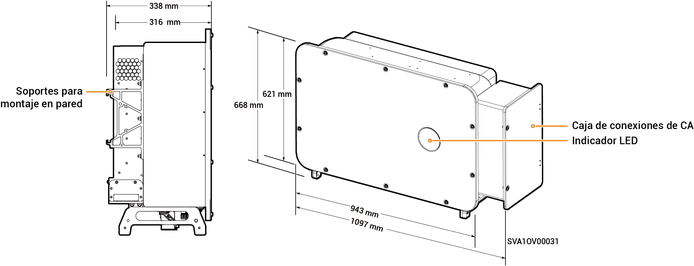

# Sigen PV (50–110)M1-HYB Inverter

## Dimensiones

<figure><figcaption></figcaption></figure>

## Descripciones de los puertos

<figure><figcaption></figcaption></figure>

<table><thead><tr><th width="60.11114501953125" align="center" valign="middle">N.º S.</th><th valign="top">Denominación</th><th valign="middle">Marcado</th></tr></thead><tbody><tr><td align="center" valign="middle">1</td><td valign="top">Interfaz de red SigenStack</td><td valign="middle">RJ45 3</td></tr><tr><td align="center" valign="middle">2</td><td valign="top">Interfaz de cable CC de SigenStack</td><td valign="middle">BAT+/BAT-</td></tr><tr><td align="center" valign="middle">3</td><td valign="top">Interfaz de antena</td><td valign="middle">ANT</td></tr><tr><td align="center" valign="middle">4</td><td valign="top">Interruptor 1 de CC</td><td valign="middle">DC SWITCH 1</td></tr><tr><td align="center" valign="middle">5</td><td valign="top">Grupo 1 de terminales de entrada de CC (controlados por DC SWITCH 1)</td><td valign="middle">PV1 a PV8</td></tr><tr><td align="center" valign="middle">6</td><td valign="top">Grupo 2 de terminales de entrada de CC (controlados por DC SWITCH 2)</td><td valign="middle">PV9 a PV16</td></tr><tr><td align="center" valign="middle">7</td><td valign="top">Interruptor 2 de CC</td><td valign="middle">DC SWITCH 2</td></tr><tr><td align="center" valign="middle">8</td><td valign="top">Interfaz de red</td><td valign="middle">RJ45 1</td></tr><tr><td align="center" valign="middle">9</td><td valign="top">Interfaz de red</td><td valign="middle">RJ45 2</td></tr><tr><td align="center" valign="middle">10</td><td valign="top">Puerto de entrada de cable de las cargas de reserva</td><td valign="middle">-</td></tr><tr><td align="center" valign="middle">11</td><td valign="top">Puerto de entrada de cable de la red eléctrica</td><td valign="middle">-</td></tr><tr><td align="center" valign="middle">12</td><td valign="top">Interfaz Sigen CommMod</td><td valign="middle">4G</td></tr><tr><td align="center" valign="middle">13</td><td valign="top">Interfaz de comunicación</td><td valign="middle">COM</td></tr><tr><td align="center" valign="middle">14</td><td valign="top">Ventilador de refrigeración</td><td valign="middle">-</td></tr></tbody></table>
