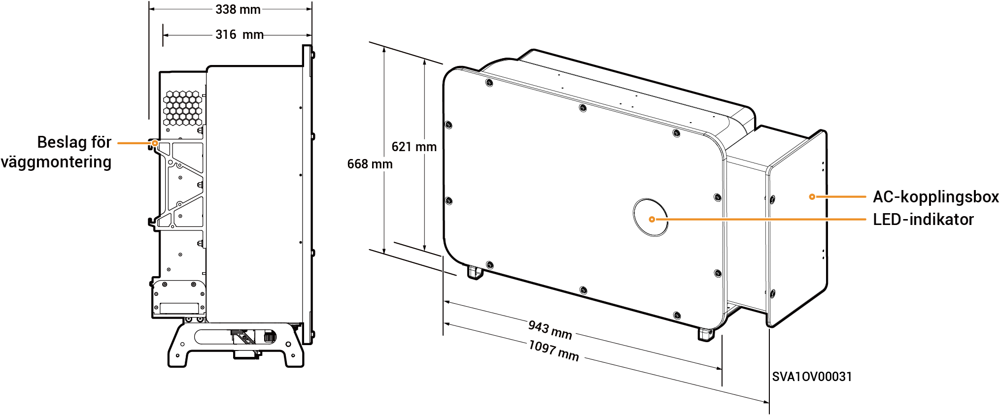

# Sigen PV (50–110)M1-HYB Inverter

## Mått

<figure><figcaption></figcaption></figure>

## Portbeskrivningar

<figure><figcaption></figcaption></figure>

<table><thead><tr><th width="60.11114501953125" align="center" valign="middle">Siffra</th><th valign="top">Namn</th><th valign="middle">Märkning</th></tr></thead><tbody><tr><td align="center" valign="middle">1</td><td valign="top">SigenStack nätverksgränssnitt</td><td valign="middle">RJ45 3</td></tr><tr><td align="center" valign="middle">2</td><td valign="top">SigenStack DC-kabelgränssnitt</td><td valign="middle">BAT+/BAT-</td></tr><tr><td align="center" valign="middle">3</td><td valign="top">Antennuttag</td><td valign="middle">ANT</td></tr><tr><td align="center" valign="middle">4</td><td valign="top">DC-brytare 1</td><td valign="middle">DC SWITCH 1</td></tr><tr><td align="center" valign="middle">5</td><td valign="top">DC-ingångsterminalgrupp 1 (styrs av DC SWITCH 1)</td><td valign="middle">PV1 till PV8</td></tr><tr><td align="center" valign="middle">6</td><td valign="top">DC-ingångsterminalgrupp 2 (styrs av DC SWITCH 2)</td><td valign="middle">PV9 till PV16</td></tr><tr><td align="center" valign="middle">7</td><td valign="top">DC-brytare 2</td><td valign="middle">DC SWITCH 2</td></tr><tr><td align="center" valign="middle">8</td><td valign="top">Nätverksgränssnitt</td><td valign="middle">RJ45 1</td></tr><tr><td align="center" valign="middle">9</td><td valign="top">Nätverksgränssnitt</td><td valign="middle">RJ45 2</td></tr><tr><td align="center" valign="middle">10</td><td valign="top">Wire-in-port för reservlaster</td><td valign="middle">-</td></tr><tr><td align="center" valign="middle">11</td><td valign="top">Ingång för elnätet</td><td valign="middle">-</td></tr><tr><td align="center" valign="middle">12</td><td valign="top">Sigen CommMod-uttag</td><td valign="middle">4G</td></tr><tr><td align="center" valign="middle">13</td><td valign="top">Kommunikationsuttag</td><td valign="middle">COM</td></tr><tr><td align="center" valign="middle">14</td><td valign="top">Fläkt för kylning</td><td valign="middle">-</td></tr></tbody></table>
