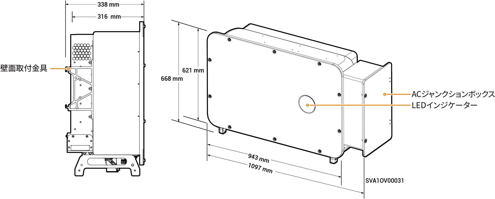
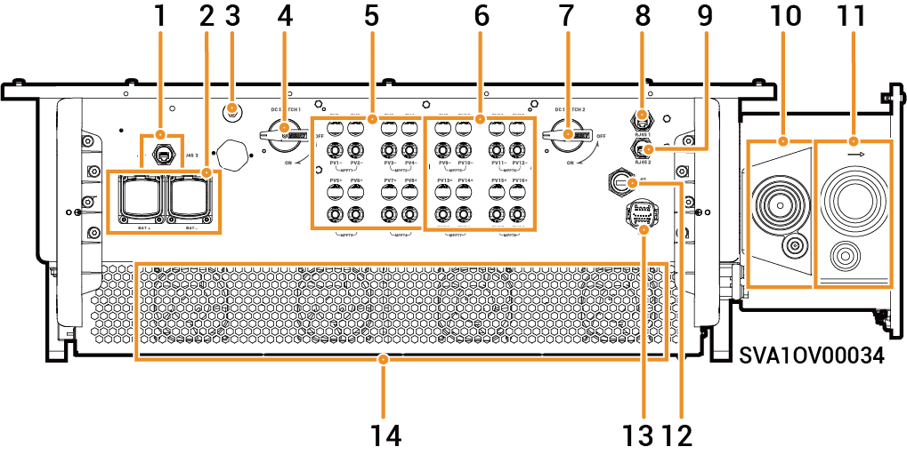

# Sigen PV (50–110)M1-HYB Inverter

### 寸法

<figure><figcaption></figcaption></figure>

### ポート説明

<figure><figcaption></figcaption></figure>

<table><thead><tr><th width="60.11114501953125" align="center" valign="middle">S/N</th><th width="381" valign="top">名称</th><th valign="middle">マーキング</th></tr></thead><tbody><tr><td align="center" valign="middle">1</td><td valign="top">SigenStackネットワーク・インターフェース</td><td valign="middle">RJ45 3</td></tr><tr><td align="center" valign="middle">2</td><td valign="top">SigenStack DCケーブルインターフェース</td><td valign="middle">BAT+/BAT-</td></tr><tr><td align="center" valign="middle">3</td><td valign="top">アンテナインターフェース</td><td valign="middle">ANT</td></tr><tr><td align="center" valign="middle">4</td><td valign="top">DCスイッチ1</td><td valign="middle">DC SWITCH 1</td></tr><tr><td align="center" valign="middle">5</td><td valign="top">DC入力端子グループ1 (DCスイッチ1で制御)</td><td valign="middle">PV1～PV8</td></tr><tr><td align="center" valign="middle">6</td><td valign="top">DC入力端子グループ2 (DCスイッチ2で制御)</td><td valign="middle">PV9～PV16</td></tr><tr><td align="center" valign="middle">7</td><td valign="top">DCスイッチ2</td><td valign="middle">DC SWITCH 2</td></tr><tr><td align="center" valign="middle">8</td><td valign="top">ネットワークインターフェース</td><td valign="middle">RJ45 1</td></tr><tr><td align="center" valign="middle">9</td><td valign="top">ネットワークインターフェース</td><td valign="middle">RJ45 2</td></tr><tr><td align="center" valign="middle">10</td><td valign="top">バックアップ負荷の配線入力ポート</td><td valign="middle">-</td></tr><tr><td align="center" valign="middle">11</td><td valign="top">電力網の配線入力ポート</td><td valign="middle">-</td></tr><tr><td align="center" valign="middle">12</td><td valign="top">Sigen CommModインターフェース</td><td valign="middle">4G</td></tr><tr><td align="center" valign="middle">13</td><td valign="top">通信インターフェース</td><td valign="middle">COM</td></tr><tr><td align="center" valign="middle">14</td><td valign="top">冷却ファン</td><td valign="middle">-</td></tr></tbody></table>
