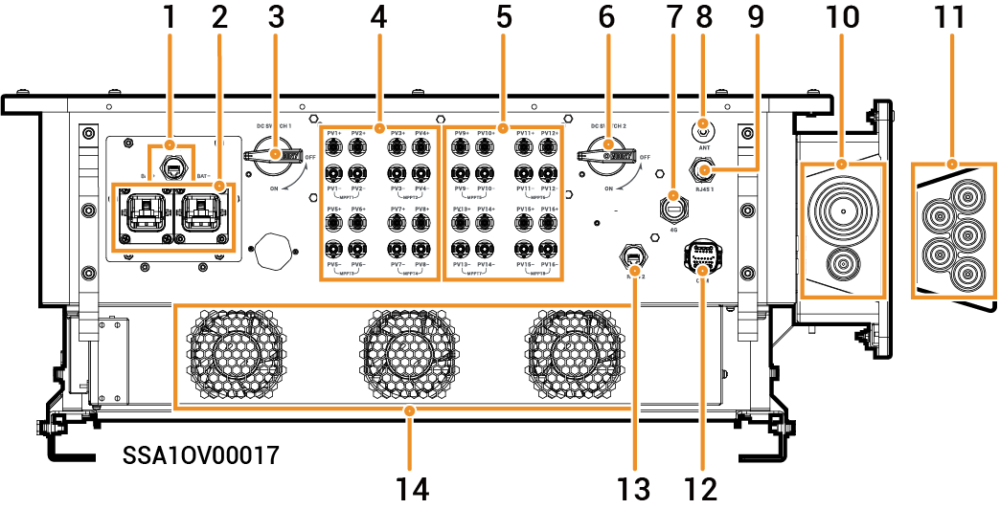

# Sigen PV (50–110)M1-HYA Inverter

### Mitat

<figure><figcaption></figcaption></figure>

### Porttien kuvaukset

<figure><figcaption></figcaption></figure>

<table><thead><tr><th width="60.11114501953125" align="center" valign="top">S/N</th><th width="294.111083984375" valign="top">Nimi</th><th valign="top">Merkintä</th></tr></thead><tbody><tr><td align="center" valign="top">1</td><td valign="top">SigenStack-verkkoliitäntä</td><td valign="top">RJ45 3</td></tr><tr><td align="center" valign="top">2</td><td valign="top">SigenStackin DC-kaapeliliitäntä</td><td valign="top">BAT+/BAT-</td></tr><tr><td align="center" valign="top">3</td><td valign="top">DC-kytkin 1</td><td valign="top">DC SWITCH 1</td></tr><tr><td align="center" valign="top">4</td><td valign="top">
DC-tuloliitäntäryhmä 1

(Ohjattu DC SWITCH 1:n toimesta)
</td><td valign="top">PV1–PV8</td></tr><tr><td align="center" valign="top">5</td><td valign="top">
DC-tuloliitäntäryhmä 2

(Ohjattu DC SWITCH 2)
</td><td valign="top">PV9–PV16</td></tr><tr><td align="center" valign="top">6</td><td valign="top">DC-kytkin 2</td><td valign="top">DC SWITCH 2</td></tr><tr><td align="center" valign="top">7</td><td valign="top">Sigen CommMod -liitäntä</td><td valign="top">4G</td></tr><tr><td align="center" valign="top">8</td><td valign="top">Antenniliitäntä</td><td valign="top">ANT</td></tr><tr><td align="center" valign="top">9</td><td valign="top">Verkkoliitäntä</td><td valign="top">RJ45 1</td></tr><tr><td align="center" valign="top">10</td><td valign="top">Monisäikeisen kaapelin kaapeliläpivienti</td><td valign="top">-</td></tr><tr><td align="center" valign="top">11</td><td valign="top">Yksisäikeisen kaapelin kaapeliläpivienti</td><td valign="top">-</td></tr><tr><td align="center" valign="top">12</td><td valign="top">Tiedonsiirtoliitäntä</td><td valign="top">COM</td></tr><tr><td align="center" valign="top">13</td><td valign="top">Verkkoliitäntä</td><td valign="top">RJ45 2</td></tr><tr><td align="center" valign="top">14</td><td valign="top">Jäähdytyspuhallin</td><td valign="top">-</td></tr></tbody></table>
