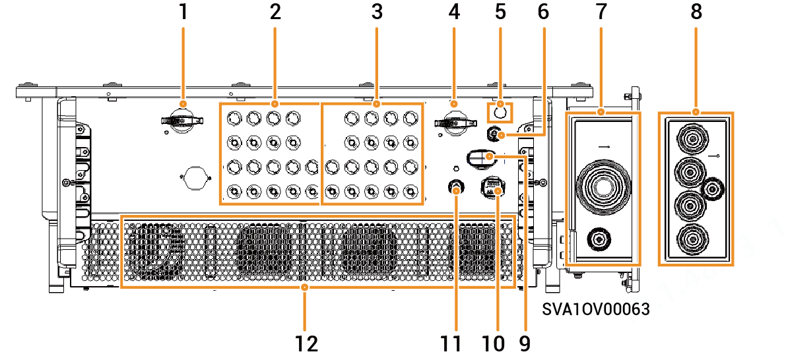

# Sigen PV (150–166)M1, (150–166)M2 Inverter

### Abmessungen

### Beschreibung der Anschlussbuchsen

<figure><figcaption></figcaption></figure>

<table><thead><tr><th width="58.88885498046875" align="center" valign="middle">Serien-Nr.</th><th width="344" valign="top">Bezeichnung</th><th valign="top">Kennzeichnung</th></tr></thead><tbody><tr><td align="center" valign="middle">1</td><td valign="top">DC-Schalter 1</td><td valign="top">DC-SCHALTER 1</td></tr><tr><td align="center" valign="middle">2</td><td valign="top">
DC-Eingangsklemme Gruppe 1

(gesteuert durch DC-SCHALTER 1)
</td><td valign="top">PV1 bis PV9</td></tr><tr><td align="center" valign="middle">3</td><td valign="top">
DC-Eingangsklemme Gruppe 2

(gesteuert durch DC-SCHALTER 2)
</td><td valign="top">PV9 bis PV18</td></tr><tr><td align="center" valign="middle">4</td><td valign="top">DC-Schalter 2</td><td valign="top">DC-SCHALTER 2</td></tr><tr><td align="center" valign="middle">5</td><td valign="top">Antennenanschluss</td><td valign="top">ANT</td></tr><tr><td align="center" valign="middle">6</td><td valign="top">Netzwerkschnittstelle</td><td valign="top">RJ45 1</td></tr><tr><td align="center" valign="middle">7</td><td valign="top">Durchgangsöffnung für mehradriges Kabel</td><td valign="top">-</td></tr><tr><td align="center" valign="middle">8</td><td valign="top">Durchgangsöffnung für einadriges Kabel</td><td valign="top">-</td></tr><tr><td align="center" valign="middle">9</td><td valign="top">Sigen CommMod-Anschluss</td><td valign="top">4G</td></tr><tr><td align="center" valign="middle">10</td><td valign="top">Kommunikationsanschluss</td><td valign="top">COM</td></tr><tr><td align="center" valign="middle">11</td><td valign="top">Netzwerkschnittstelle</td><td valign="top">RJ45 2</td></tr><tr><td align="center" valign="middle">12</td><td valign="top">Kühlgebläse</td><td valign="top">-</td></tr></tbody></table>
