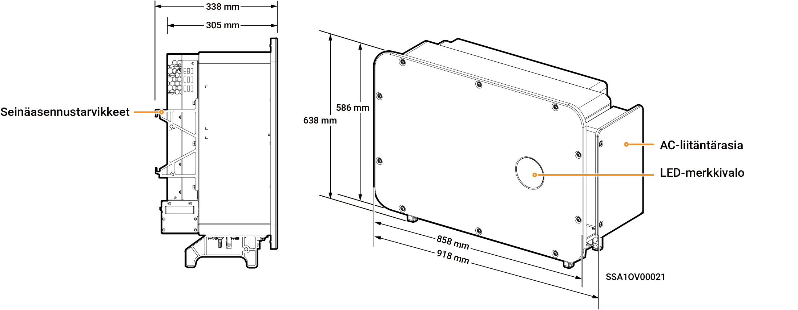

# Sigen PV (50–125)M1 Inverter

### Mitat

<figure><figcaption></figcaption></figure>

### Porttien kuvaukset

<figure><figcaption></figcaption></figure>

<table><thead><tr><th width="58.88885498046875" align="center" valign="middle">S/N</th><th width="344" valign="top">Nimi</th><th valign="top">Merkintä</th></tr></thead><tbody><tr><td align="center" valign="middle">1</td><td valign="top">DC-kytkin 1</td><td valign="top">DC SWITCH 1</td></tr><tr><td align="center" valign="middle">2</td><td valign="top">
DC-tuloliitäntäryhmä 1

(Ohjattu DC SWITCH 1:n toimesta)
</td><td valign="top">PV1–PV8</td></tr><tr><td align="center" valign="middle">3</td><td valign="top">
DC-tuloliitäntäryhmä 2

(Ohjattu DC SWITCH 2)
</td><td valign="top">PV9–PV16</td></tr><tr><td align="center" valign="middle">4</td><td valign="top">DC-kytkin 2</td><td valign="top">DC SWITCH 2</td></tr><tr><td align="center" valign="middle">5</td><td valign="top">Sigen CommMod -liitäntä</td><td valign="top">4G</td></tr><tr><td align="center" valign="middle">6</td><td valign="top">Antenniliitäntä</td><td valign="top">ANT</td></tr><tr><td align="center" valign="middle">7</td><td valign="top">Verkkoliitäntä</td><td valign="top">RJ45 1</td></tr><tr><td align="center" valign="middle">8</td><td valign="top">Monisäikeisen kaapelin kaapeliläpivienti</td><td valign="top">-</td></tr><tr><td align="center" valign="middle">9</td><td valign="top">Yksisäikeisen kaapelin kaapeliläpivienti</td><td valign="top">-</td></tr><tr><td align="center" valign="middle">10</td><td valign="top">Tiedonsiirtoliitäntä</td><td valign="top">COM</td></tr><tr><td align="center" valign="middle">11</td><td valign="top">Verkkoliitäntä</td><td valign="top">RJ45 2</td></tr><tr><td align="center" valign="middle">12</td><td valign="top">Jäähdytyspuhallin</td><td valign="top">-</td></tr></tbody></table>
