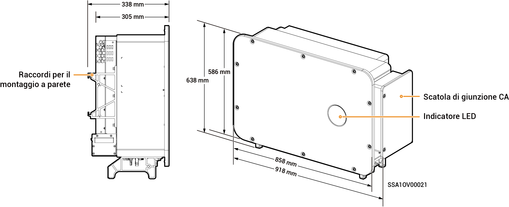
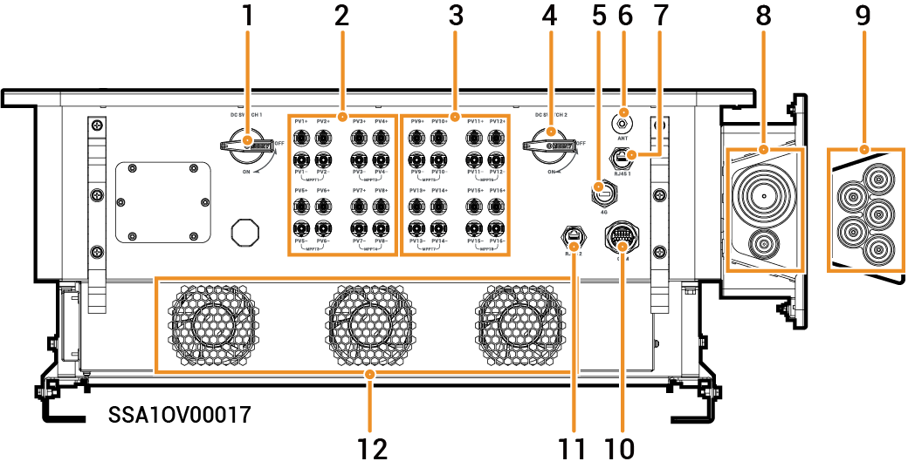

# Sigen PV (50–125)M1 Inverter

### Dimensioni

<figure><figcaption></figcaption></figure>

### Descrizioni delle porte

<figure><figcaption></figcaption></figure>

<table><thead><tr><th width="58.88885498046875" align="center" valign="middle">N.</th><th width="344" valign="top">Nome</th><th valign="top">Indicazione</th></tr></thead><tbody><tr><td align="center" valign="middle">1</td><td valign="top">Interruttore CC 1</td><td valign="top">DC SWITCH 1</td></tr><tr><td align="center" valign="middle">2</td><td valign="top">
Gruppo di morsetti di ingresso CC 1

(Controllati da DC SWITCH 1)
</td><td valign="top">Da PV1 a PV8</td></tr><tr><td align="center" valign="middle">3</td><td valign="top">
Gruppo di morsetti di ingresso CC 2

(Controllati da DC SWITCH 2)
</td><td valign="top">Da PV9 a PV16</td></tr><tr><td align="center" valign="middle">4</td><td valign="top">Interruttore CC 2</td><td valign="top">DC SWITCH 2</td></tr><tr><td align="center" valign="middle">5</td><td valign="top">Interfaccia Sigen CommMod</td><td valign="top">4G</td></tr><tr><td align="center" valign="middle">6</td><td valign="top">Interfaccia dell'antenna</td><td valign="top">ANT</td></tr><tr><td align="center" valign="middle">7</td><td valign="top">Interfaccia di rete</td><td valign="top">RJ45 1</td></tr><tr><td align="center" valign="middle">8</td><td valign="top">Foro di instradamento per cavo multipolare</td><td valign="top">-</td></tr><tr><td align="center" valign="middle">9</td><td valign="top">Foro di instradamento per cavo unipolare</td><td valign="top">-</td></tr><tr><td align="center" valign="middle">10</td><td valign="top">Interfaccia di comunicazione</td><td valign="top">COM</td></tr><tr><td align="center" valign="middle">11</td><td valign="top">Interfaccia di rete</td><td valign="top">RJ45 2</td></tr><tr><td align="center" valign="middle">12</td><td valign="top">Ventola di raffreddamento</td><td valign="top">-</td></tr></tbody></table>
