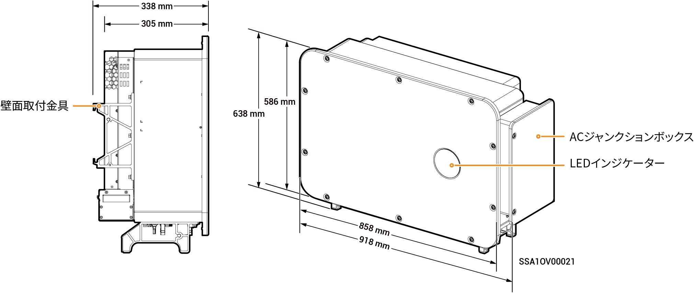

# Sigen PV (50–125)M1 Inverter

### 寸法

<figure><figcaption></figcaption></figure>

### ポート説明

<figure><figcaption></figcaption></figure>

<table><thead><tr><th width="58.88885498046875" align="center" valign="middle">S/N</th><th width="344" valign="top">名称</th><th valign="top">マーキング</th></tr></thead><tbody><tr><td align="center" valign="middle">1</td><td valign="top">DCスイッチ1</td><td valign="top">DC SWITCH 1</td></tr><tr><td align="center" valign="middle">2</td><td valign="top">
DC入力端子グループ1

(DCスイッチ1で制御)
</td><td valign="top">PV1～PV8</td></tr><tr><td align="center" valign="middle">3</td><td valign="top">
DC入力端子グループ2

(DCスイッチ2で制御)
</td><td valign="top">PV9～PV16</td></tr><tr><td align="center" valign="middle">4</td><td valign="top">DCスイッチ2</td><td valign="top">DC SWITCH 2</td></tr><tr><td align="center" valign="middle">5</td><td valign="top">Sigen CommModインターフェース</td><td valign="top">4G</td></tr><tr><td align="center" valign="middle">6</td><td valign="top">アンテナインターフェース</td><td valign="top">ANT</td></tr><tr><td align="center" valign="middle">7</td><td valign="top">ネットワークインターフェース</td><td valign="top">RJ45 1</td></tr><tr><td align="center" valign="middle">8</td><td valign="top">多芯ケーブル用配線穴</td><td valign="top">-</td></tr><tr><td align="center" valign="middle">9</td><td valign="top">単芯ケーブル用配線穴</td><td valign="top">-</td></tr><tr><td align="center" valign="middle">10</td><td valign="top">通信インターフェース</td><td valign="top">COM</td></tr><tr><td align="center" valign="middle">11</td><td valign="top">ネットワークインターフェース</td><td valign="top">RJ45 2</td></tr><tr><td align="center" valign="middle">12</td><td valign="top">冷却ファン</td><td valign="top">-</td></tr></tbody></table>
