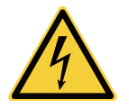
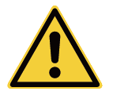
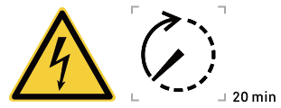
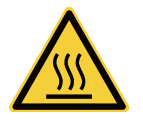
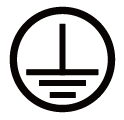

# ラベルの説明

<table><thead><tr><th width="113.09088134765625">記号</th><th>定義</th></tr></thead><tbody><tr><td>
<figure><figcaption></figcaption></figure>
</td><td>
危険！高電圧

電源を入れた時点で機器内部は高電圧となります。機器の稼働中に筐体を開かないでください。訓練を受け熟達した電気技師のみが保守や整備作業を実施する必要があります。
</td></tr><tr><td>
<figure><figcaption></figcaption></figure>
</td><td>
警告！生命の危険あり

電源投入時に高接触電流が存在します。電源を入れる前に、機器が適切に接地されていることを確認してください。機器の動作中は、危険な状況が存在します。機器を操作する前に、保護対策を講じてください。
</td></tr><tr><td>
<figure><figcaption></figcaption></figure>
</td><td>機器の電源がオフになった後、内部コンポーネントの放電遅れが生じます。機器がラベル表記の時間どおりに完全に放電されるまで20分間お待ちください。</td></tr><tr><td>
<figure><figcaption></figcaption></figure>
</td><td>
警告！火傷のおそれがあります。

放熱領域面は機器の稼働中には熱くなっています。火傷を防ぐため触れないようにしてください。
</td></tr><tr><td>
<figure><figcaption></figcaption></figure>
</td><td>放熱領域面は機器の稼働中には熱くなっています。火傷を防ぐため触れないようにしてください。</td></tr><tr><td>
<figure><figcaption></figcaption></figure>
</td><td>アースマーク</td></tr></tbody></table>
