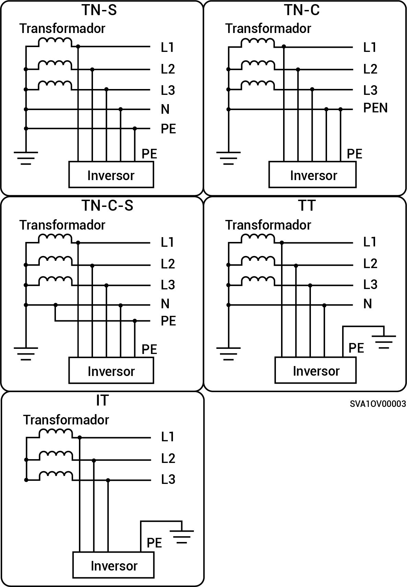

# Métodos de alimentación eléctrica admitidos por la red eléctrica

* Los métodos de alimentación a la red admitidos incluyen TN-S, TN-C, TN-C-S, TT e IT.
* Si se utiliza TT como técnica de alimentación eléctrica de la red eléctrica, el voltaje entre N y PE debe ser < 30 V.

<figure><figcaption></figcaption></figure>
