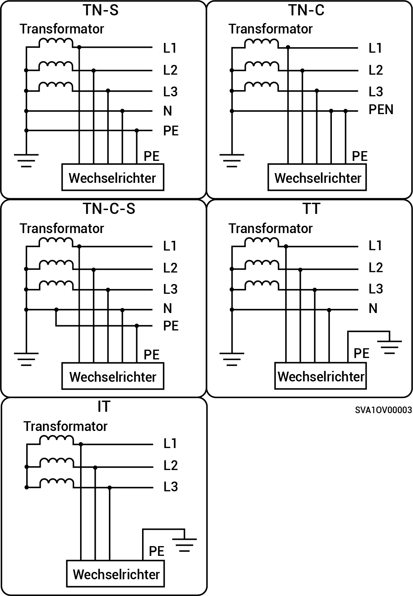

# Unterstützte Stromversorgungsmethoden für das Stromnetz

* Die unterstützten Netzversorgungsmethoden beinhalten TN-S, TN-C, TN-C-S, TT und IT.
* Wenn TT als Stromversorgungsmethode des Stromnetzes verwendet wird, muss die Spannung zwischen N und PE <30 V betragen.

<figure><figcaption></figcaption></figure>
