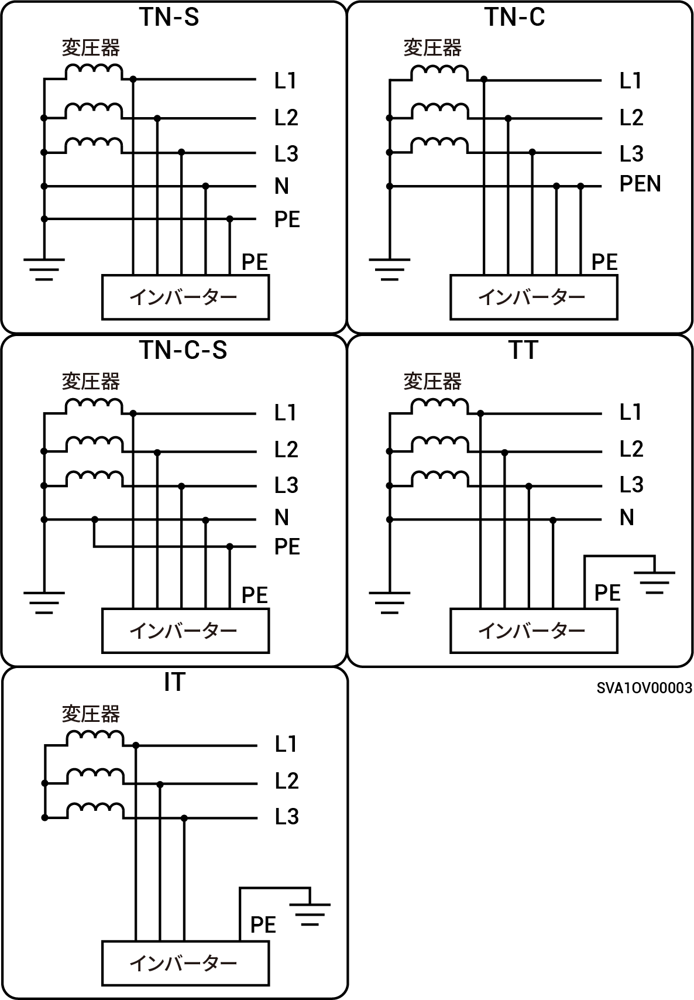

# サポート対象の電力グリッド用の電力供給方式

* サポートされているグリッド電力供給方式にはTN-S、TN-C、TN-C-S、TTとITなどがあります。
* TTが電力グリッドの電力供給方式として利用されている場合、NとPEの間の電圧を30 V未満とする必要があります。

<figure><figcaption></figcaption></figure>

<figure><figcaption></figcaption></figure>
