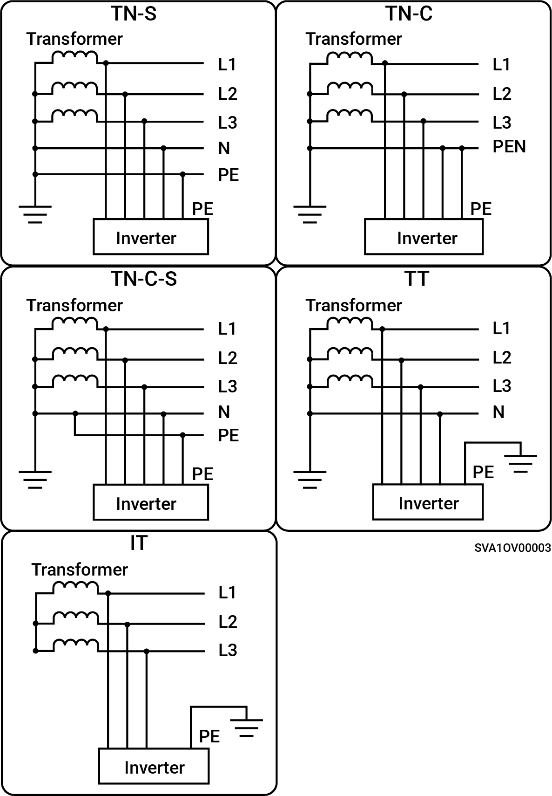

# Understøttede strømforsyningsmetoder til elnettet

* De understøttede metoder til netforsyning inkluderer TN-S, TN-C, TN-C-S, TT og IT.
* Når TT anvendes som strømforsyningsteknik for elnettet, skal spændingen mellem N og PE være < 30 V.

<figure><figcaption></figcaption></figure>
