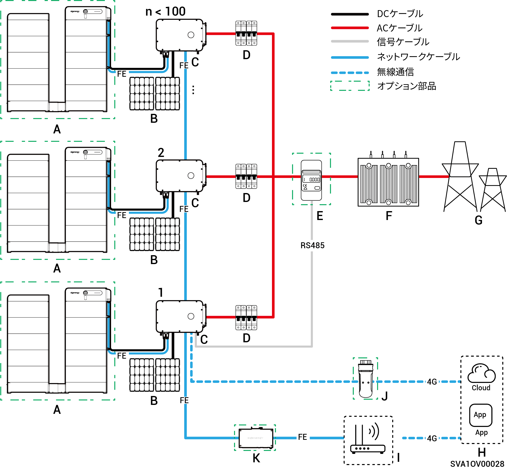
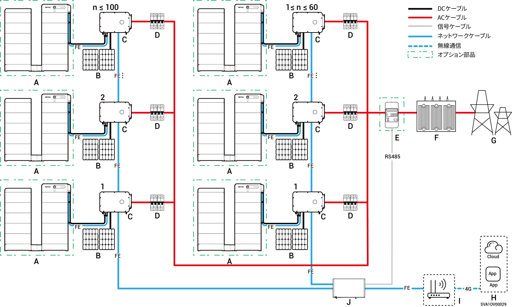
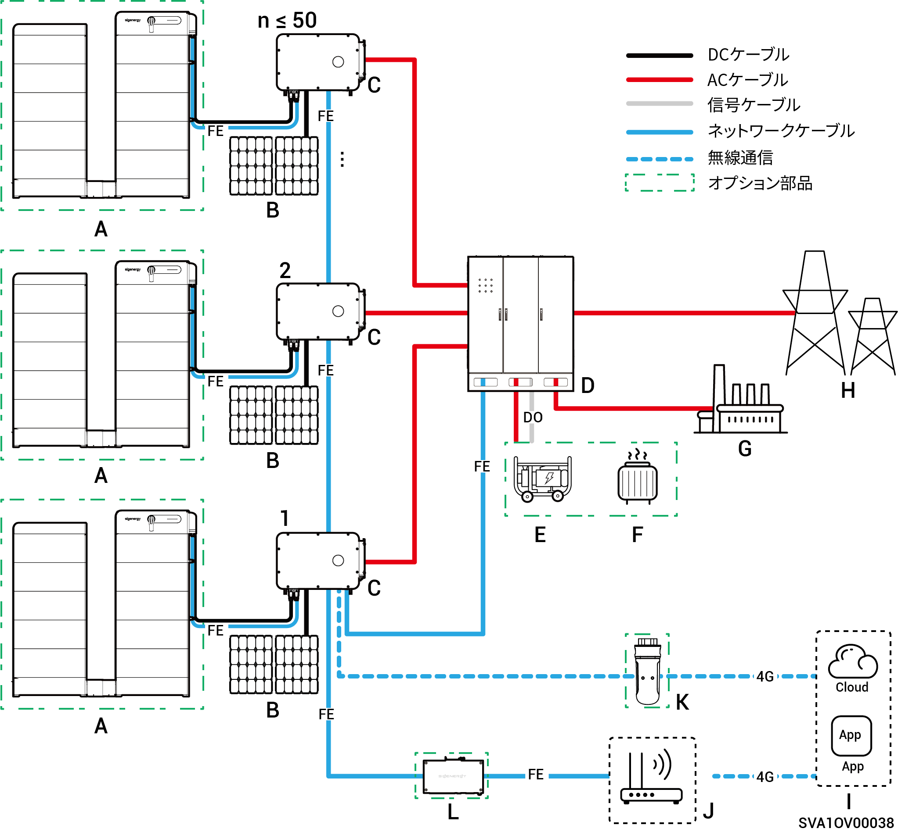
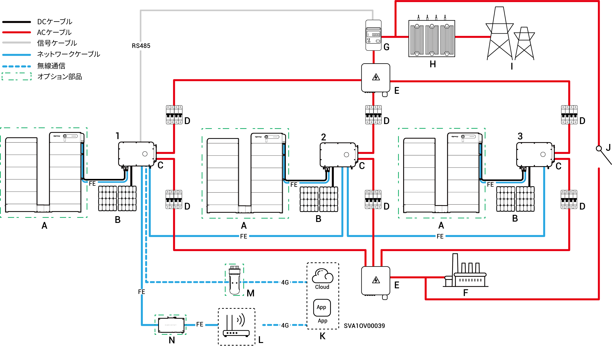

# システム配線の概要

* 当社製品は、C\&Iオングリッド太陽光発電システムに使用できます。オングリッド太陽光発電システムは、PVストリング、インバーター、配電盤などのコンポーネントで構成されます。
* C\&I PV貯蔵システムは、主に、PVパネルで発電された直流電力をバッテリーパックに貯蔵します。また、PVパネルとバッテリーパックの電力を交流に変換し、負荷に供給したり電力網に送電することができます。
* オフグリッド太陽光発電システムでは、インバーターが全負荷電力を処理できる必要があります。インバーターには過渡的な過負荷需要（モーターの起動など）に対応する短時間過負荷能力を有していますが、この上限を超過すると保護シャットダウンが作動します。さらに、周囲温度が高い場合、インバーターの電力ディレーティングが発生します。出力電力ディレーティングが常時負荷要件を下回ると、保護シャットダウンが作動します。
  * システム設計の提案：
    1. 過負荷マッチング：負荷の始動電力/継続時間が、インバーターの短期過負荷能力を下回っていることを確認します。
    2. 電力定格の適応：連続負荷動作電力は、極端な周囲温度下におけるインバーターの実際の出力電力よりも少ない必要があります。
    3. 環境補償：太陽高度と放射照度による電力ディレーティングの影響を考慮し、十分な設計マージンを確保すること。

### **非バックアップ配線図 (インバーターの台数：100台未満)**

<figure><figcaption></figcaption></figure>

<table data-header-hidden><thead><tr><th width="169" valign="top"></th><th width="133.6666259765625" valign="top"></th><th width="121" valign="top"></th><th width="126.77783203125" valign="top"></th><th valign="top"></th></tr></thead><tbody><tr><td valign="top">A. バッテリー</td><td valign="top">B. PVパネル</td><td valign="top">C. インバーター</td><td valign="top">D. ACスイッチ</td><td valign="top">E. 電力センサー</td></tr><tr><td valign="top">F. ボックスタイプ変電所</td><td valign="top">G. 電力グリッド</td><td valign="top">H. mySigen</td><td valign="top">I. ルーター</td><td valign="top">J. CommMod</td></tr><tr><td valign="top">K. CommBridge</td><td valign="top"></td><td valign="top"></td><td valign="top"></td><td valign="top"></td></tr></tbody></table>



* <mark style="color:blue;">各インバーターにACスイッチを装備する必要があり、1台のACスイッチに、同時に2台以上のインバーターを接続することはできません。</mark>
* <mark style="color:blue;">各インバーターに接続されるACスイッチ（D）の定格電圧は500V AC以上の必要があります。定格電流の推奨仕様は以下の通り：</mark>
  * <mark style="color:blue;">定格電力50kWまたは60kWのインバーターの場合：定格電流は125A</mark>
  * <mark style="color:blue;">定格電力75kWまたは80kWのインバーターの場合：定格電流は160A</mark>
  * <mark style="color:blue;">定格電力99.9kWまたは100kWのインバーターの場合：定格電流は200A</mark>
  * <mark style="color:blue;">定格電力110kWまたは125kWのインバーターの場合：定格電流は250A</mark>
* <mark style="color:blue;">インバーターとの通信には、高速イーサネットとWLANの使用が推奨されます。CommMod</mark> <mark style="color:blue;">(J)</mark> <mark style="color:blue;">の無料4G通信を使い切った場合、ユーザーはSIMカードを交換する必要があります。</mark>

### **非バックアップ配線図 (インバーターの台数：1台以上160台以下)**

<figure><figcaption></figcaption></figure>

<table data-header-hidden><thead><tr><th valign="top"></th><th valign="top"></th><th valign="top"></th><th valign="top"></th><th valign="top"></th></tr></thead><tbody><tr><td valign="top">A. バッテリー</td><td valign="top">B. PVパネル</td><td valign="top">C. インバーター</td><td valign="top">D. ACスイッチ</td><td valign="top">E. 電力センサー</td></tr><tr><td valign="top">F. ボックスタイプ変電所</td><td valign="top">G. 電力グリッド</td><td valign="top">H. mySigen</td><td valign="top">I. ルーター</td><td valign="top">J. データロガー</td></tr></tbody></table>



* <mark style="color:blue;">1台のACスイッチに、同時に2台以上のインバーターを接続することはできません。</mark>
* <mark style="color:blue;">各インバーターに接続されるACスイッチ（D）の定格電圧は500V AC以上の必要があります。定格電流の推奨仕様は以下の通り：</mark>
  * <mark style="color:blue;">定格電力50kWまたは60kWのインバーターの場合：定格電流は125A</mark>
  * <mark style="color:blue;">定格電力75kWまたは80kWのインバーターの場合：定格電流は160A</mark>
  * <mark style="color:blue;">定格電力99.9kWまたは100kWのインバーターの場合：定格電流は200A</mark>
  * <mark style="color:blue;">定格電力110kWまたは125kWのインバーターの場合：定格電流は250A</mark>
* <mark style="color:blue;">1台のデータコレクターは160台までのインバーターに接続できます。</mark>

### **バックアップ電源ネットワーク図 (HYBモデル、インバーターの台数：50台以下)**

<figure><figcaption></figcaption></figure>

<table data-header-hidden><thead><tr><th valign="middle"></th><th width="161.2222900390625" valign="middle"></th><th valign="middle"></th><th valign="middle"></th><th valign="middle"></th><th data-hidden></th></tr></thead><tbody><tr><td valign="middle">A. バッテリー</td><td valign="middle">B. PVパネル</td><td valign="middle">C. インバーター</td><td valign="middle">D. Gateway</td><td valign="middle">E. 発電機</td><td></td></tr><tr><td valign="middle">F. スマート負荷</td><td valign="middle">G. バックアップ負荷</td><td valign="middle">H. 電力グリッド</td><td valign="middle">I. mySigen</td><td valign="middle">J. ルーター</td><td></td></tr><tr><td valign="middle">K. CommMod</td><td valign="middle">L. CommBridge</td><td valign="middle"></td><td valign="middle"></td><td valign="middle"></td><td></td></tr></tbody></table>



* <mark style="color:blue;">発電機 (E) は長期のオフグリッド用途のバックアップエネルギー源としてGateway (D) と連携して作動し、これによって太陽光発電、蓄電、ディーゼル発電を円滑に切り替えることができます。</mark>
* <mark style="color:blue;">インバーターとの通信には、高速イーサネットとWLANの使用が推奨されます。CommMod</mark> <mark style="color:blue;">(K)</mark> <mark style="color:blue;">の無料4G通信を使い切った場合、ユーザーはSIMカードを交換する必要があります。</mark>

### **バックアップ配線図 (HYBモデルにバックアップ負荷ポートがある、3台以下)**

<figure><figcaption></figcaption></figure>

<figure><figcaption></figcaption></figure>

<table data-header-hidden><thead><tr><th valign="middle"></th><th valign="middle"></th><th width="159" valign="middle"></th><th width="147" valign="top"></th><th valign="top"></th></tr></thead><tbody><tr><td valign="middle">A. バッテリー</td><td valign="middle">B. PVパネル</td><td valign="middle">C. インバーター</td><td valign="top">D. ACスイッチ</td><td valign="top">E. コンバイナーパネル</td></tr><tr><td valign="middle">F. バックアップ負荷</td><td valign="middle">G. 電力センサー</td><td valign="middle">H. ボックスタイプ変電所</td><td valign="top">I. 電力グリッド</td><td valign="top">J. 手動コントロールスイッチ</td></tr><tr><td valign="middle">K.mySigen</td><td valign="middle">L. ルーター</td><td valign="middle">M. CommMod</td><td valign="top">N. CommBridge</td><td valign="top"></td></tr></tbody></table>



* <mark style="color:blue;">1台のACスイッチに、同時に2台以上のインバーターを接続することはできません。</mark>
* <mark style="color:blue;">バックアップ負荷に接続されるインバーター（バックアップ負荷ポート付き）には、定格電圧500V AC以上のACスイッチ（D）を使用する必要があります。定格電流の推奨仕様は以下の通り：</mark>
  * <mark style="color:blue;">定格電力50kWのインバーターの場合：定格電流は100A</mark>
  * <mark style="color:blue;">定格電力60kWのインバーターの場合：定格電流は125A</mark>
  * <mark style="color:blue;">定格電力80kWのインバーターの場合：定格電流は160A</mark>
  * <mark style="color:blue;">定格電力99.9kWまたは100kWのインバーターの場合：定格電流は200A</mark>
  * <mark style="color:blue;">定格電力110kWのインバーターの場合：定格電流は250A</mark>
* <mark style="color:blue;">電力網に接続されるインバーター（バックアップ負荷ポート付き）には、定格電圧500V AC以上のACスイッチ (D) を使用する必要があります。定格電流の推奨仕様は以下の通り：</mark>
  * <mark style="color:blue;">定格出力50kWのインバーターの場合：定格電流は200A</mark>
  * <mark style="color:blue;">定格出力60kWのインバーターの場合：定格電流は250A</mark>
  * <mark style="color:blue;">定格出力80kW～110kWのインバーターの場合：定格電流は315A</mark>
* <mark style="color:blue;">インバーターとの通信には、高速イーサネットとWLANの使用が推奨されます。CommMod (L) の無料4G通信を使い切った場合、ユーザーはSIMカードを交換する必要があります。</mark>
