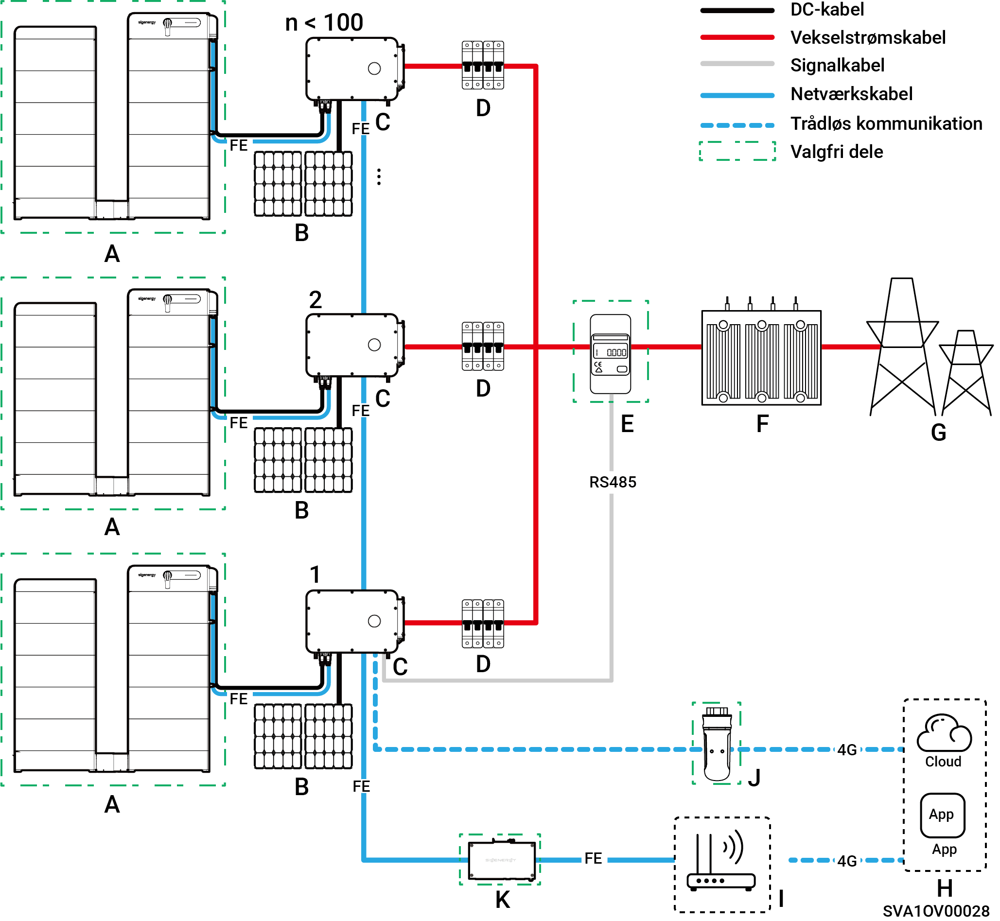
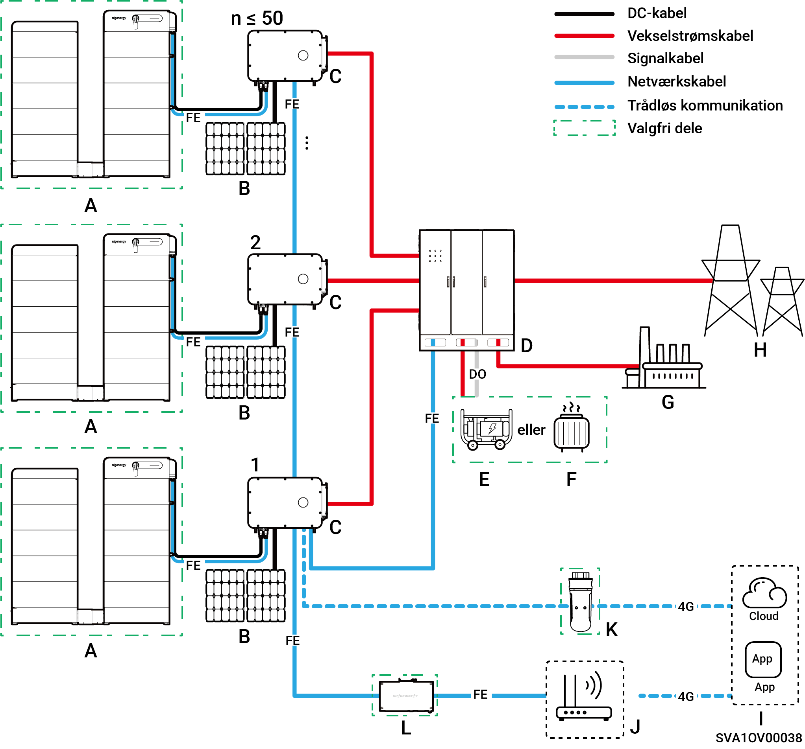
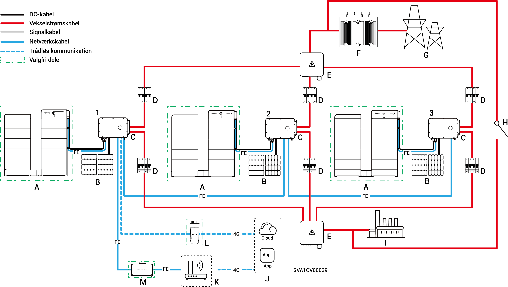

# Introduktion til systemkabling

* Vores produkter kan anvendes i C\&I-nettilsluttede solcelleanlæg. Det nettilsluttede solcelleanlæg består af PV-strenge, invertere, fordelingspaneler og andre komponenter.
* C\&I PV-lagringssystemer lagrer primært jævnstrøm genereret af PV-paneler i batteripakker. De kan også omdanne strøm fra både solcellepaneler og batteripakker til vekselstrøm til forsyning af belastninger eller levering i elnettet.
* I solcelleanlæg, der ikke er tilsluttet elnettet skal inverteren kunne håndtere hele belastningseffekten. Selvom invertere har kortvarig overbelastningskapacitet til at imødekomme forbigående overbelastningsbehov (for eksempel motorstart), vil overskridelse af disse grænser udløse en beskyttelsesnedlukning. Derudover forårsager høje omgivelsestemperaturer inverterens effektreduktion. Hvis den nedsatte udgangseffekt vedvarende falder under belastningskravene, vil dette også aktivere beskyttelsesnedlukninger.
* Forslag til systemdesign:

1. Belastningsmatchning: Sørg for, at belastningens starteffekt/-varighed forbliver under inverterens kortvarige overbelastningskapacitet.
2. Effektjustering: Den kontinuerlige belastningsdriftseffekt skal være lavere end inverterens faktiske udgangseffekt ved ekstreme omgivelsestemperaturer.
3. Miljøkompensation: Tag højde for effektreducerende effekter som følge af højde over havets overflade og solens bestråling; sørg for tilstrækkelig designmargin.

### Ikke-backup **ledningsdiagram (antal invertere < 100)**

<figure><figcaption></figcaption></figure>

<table data-header-hidden><thead><tr><th width="150.1112060546875" valign="top"></th><th width="123.6666259765625" valign="top"></th><th width="119.888916015625" valign="top"></th><th width="190.111083984375" valign="top"></th><th valign="top"></th></tr></thead><tbody><tr><td valign="top">A. Batteri</td><td valign="top">B. PV-panel</td><td valign="top">C. Inverter</td><td valign="top">D. AC-afbryder (afhænger af inverterens effekt)</td><td valign="top">E. Effektsensor</td></tr><tr><td valign="top">F. Boksformet transformerstation</td><td valign="top">G. Elnet</td><td valign="top">H. mySigen</td><td valign="top">I. Router</td><td valign="top">J. CommMod</td></tr><tr><td valign="top">K. CommBridge</td><td valign="top"></td><td valign="top"></td><td valign="top"></td><td valign="top"></td></tr></tbody></table>



* <mark style="color:blue;">Hver inverter skal være udstyret med en AC-afbryder, og flere invertere må ikke tilsluttes én AC-afbryder samtidigt.</mark>
* <mark style="color:blue;">Den nominellse spænding for AC-afbryderen</mark> <mark style="color:blue;">(D), der er tilsluttet hver inverter, skal være ≥ 500 V AC (vekselstrøm). De anbefalede specifikationer for den nominelle strøm er som følger:</mark>
* <mark style="color:blue;">For invertere med en effekt på 50 kW eller 60 kW: den nominelle strøm er 125 A</mark>
* <mark style="color:blue;">For invertere med en effekt på 75 kW eller 80 kW: den nominelle strøm er 160 A</mark>
* <mark style="color:blue;">For invertere med en effekt på 99,9 kW eller 100 kW: den nominelle strøm er 200 A</mark>
* <mark style="color:blue;">For invertere med en effekt på 110 kW eller 125 kW: den nominelle strøm er 250 A</mark>
* <mark style="color:blue;">Det anbefales at bruge Fast Ethernet og WLAN til kommunikation med invertere. Når gratis 4G-trafik på CommMod</mark> <mark style="color:blue;">(J)</mark> <mark style="color:blue;">er opbrugt, skal brugerne udskifte et SIM-kort.</mark>

### Diagram over backup-strømforsyning (når HYB-modellen er konfigureret med en ekstern gateway, invertere ≤ 50 enheder)

<figure><figcaption></figcaption></figure>

<table data-header-hidden><thead><tr><th valign="middle"></th><th width="161.2222900390625" valign="middle"></th><th valign="middle"></th><th valign="middle"></th><th valign="middle"></th><th data-hidden></th></tr></thead><tbody><tr><td valign="middle">A. Batteri</td><td valign="middle">B. PV-panel</td><td valign="middle">C. Inverter</td><td valign="middle">D. Gateway</td><td valign="middle">E. Generator</td><td></td></tr><tr><td valign="middle">F. Smart belastning</td><td valign="middle">G. Backup-belastning</td><td valign="middle">H. Elnet</td><td valign="middle">I. mySigen</td><td valign="middle">J. Router</td><td></td></tr><tr><td valign="middle">K. CommMod</td><td valign="middle">L. CommBridge</td><td valign="middle"></td><td valign="middle"></td><td valign="middle"></td><td></td></tr></tbody></table>



* <mark style="color:blue;">Som en backup-energikilde til langvarige off-grid-anvendelser kan generatoren (E) arbejde sammen med Gateway (D) for at sikre en jævn overgang mellem PV, lagring og dieselgenerering.</mark>
* <mark style="color:blue;">Det anbefales at bruge Fast Ethernet og WLAN til kommunikation med invertere. Når gratis 4G-trafik for CommMod</mark> <mark style="color:blue;">(K)</mark> <mark style="color:blue;">er opbrugt, skal brugerne udskifte et SIM-kort.</mark>

### Backup-ledningsdiagram (Når HYB-model er konfigureret med en intern Gateway, ≤ 3 enheder)

<figure><figcaption></figcaption></figure>

<table data-header-hidden><thead><tr><th valign="middle"></th><th valign="middle"></th><th width="159" valign="middle"></th><th width="147" valign="top"></th><th valign="top"></th></tr></thead><tbody><tr><td valign="middle">A. Batteri</td><td valign="middle">B. PV-panel</td><td valign="middle">C. Inverter</td><td valign="top">D. AC-afbryder (afhænger af inverterens effekt)</td><td valign="top">E. Kombinationspanel</td></tr><tr><td valign="middle">F. Boksformet transformerstation</td><td valign="middle">G. Elnet</td><td valign="middle">H. Manuel kontrolkontakt</td><td valign="top">I. Backup-belastning</td><td valign="top">J. mySigen</td></tr><tr><td valign="middle">K.Router</td><td valign="middle">L. CommMod</td><td valign="middle">M. CommBridge</td><td valign="top"></td><td valign="top"></td></tr></tbody></table>



* <mark style="color:blue;">Flere invertere kan ikke tilsluttes én AC-afbryder samtidig.</mark>
* <mark style="color:blue;">Hver inverter, der er tilsluttet backupbelastningen, skal anvende en AC-afbryder (D) med en nominel spænding på ≥ 500 V AC. De anbefalede specifikationer for nominel strøm er som følger:</mark>
* <mark style="color:blue;">For invertere med en nominel effekt på 50 kW: den nominelle strøm er 100 A</mark>
* <mark style="color:blue;">For invertere med en effekt på 60 kW: den nominelle strøm er 125 A</mark>
* <mark style="color:blue;">For invertere med en effekt på 80 kW: den nominelle strøm er 160 A</mark>
* <mark style="color:blue;">For invertere med en effekt på 99,9 kW eller 100 kW: den nominelle strøm er 200 A</mark>
* <mark style="color:blue;">For invertere med en effekt på 110 kW: den nominelle strøm er 250 A</mark>
* <mark style="color:blue;">Hver inverter, der er forbundet til elnettet, skal bruge en AC-afbryder ( D) med en nominel spænding på ≥ 500 V a.c. De anbefalede specifikationer for nominel strøm er som følger:</mark>
* <mark style="color:blue;">For invertere med en effekt på 50 kW: den nominelle strøm er 200 A</mark>
* <mark style="color:blue;">For invertere med en effekt på 60 kW: den nominelle strøm er 250 A</mark>
* <mark style="color:blue;">For invertere med en effekt på 80 kW til 110 kW: den nominelle strøm er 315 A</mark>
* <mark style="color:blue;">Det anbefales at bruge Fast Ethernet og WLAN til kommunikation med invertere. Når gratis 4G-trafik for CommMod (L) er opbrugt, skal brugerne udskifte et SIM-kort.</mark>
