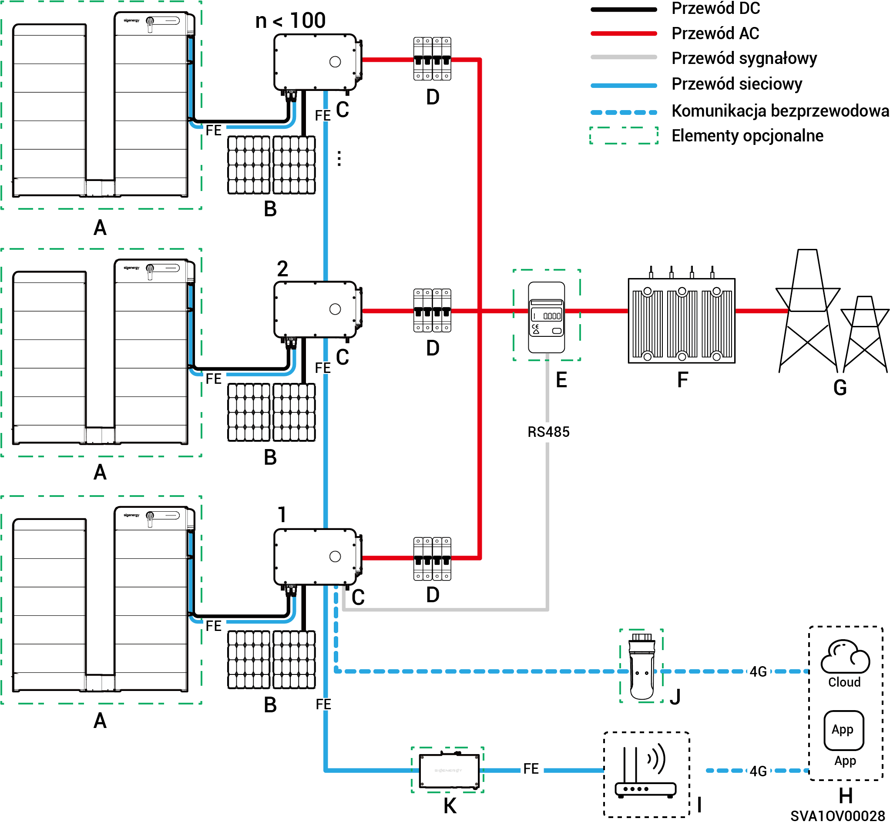
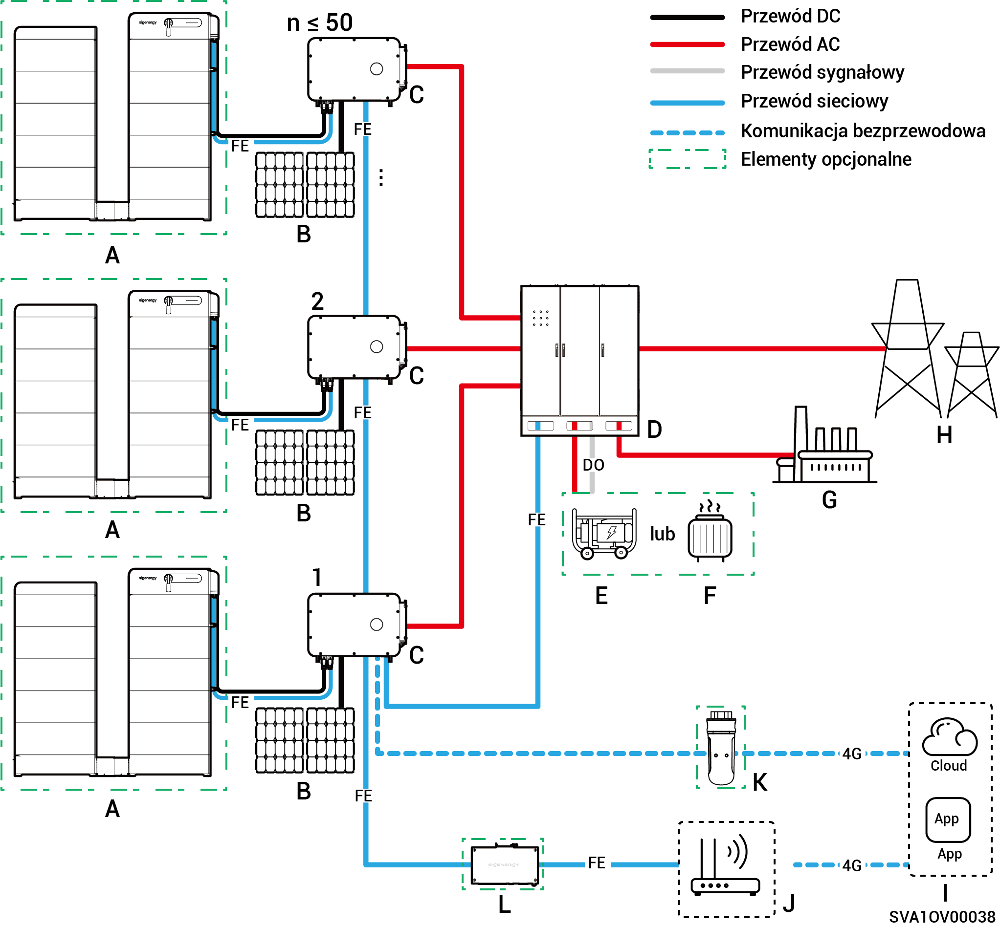
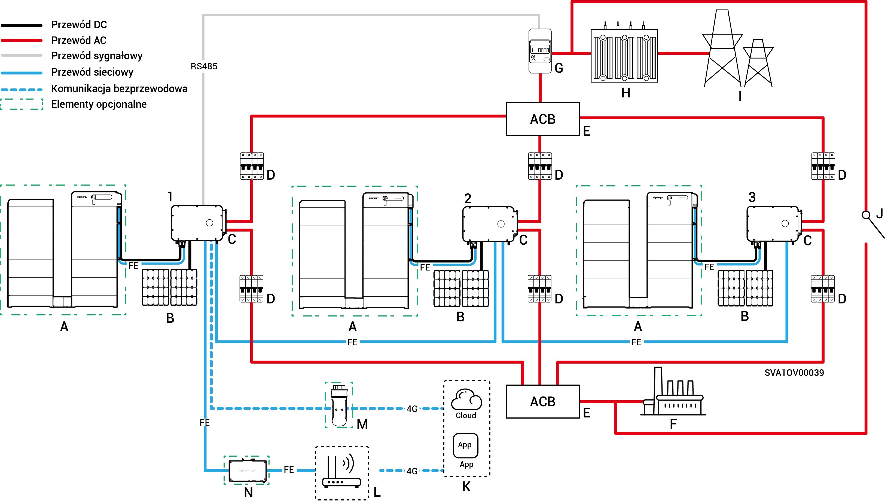

# Wprowadzenie na temat okablowania instalacji

* Nasze produkty mogą być stosowane w sieciowych systemach fotowoltaicznych (C\&I). Sieciowy system fotowoltaiczny składa się z łańcuchów fotowoltaicznych, falowników, paneli rozdzielczych i innych komponentów.
* Systemy magazynowania energii PV C\&I służą głównie do magazynowania prądu stałego generowanego przez panele fotowoltaiczne w akumulatorach. Mogą one również przetwarzać energię zarówno z paneli fotowoltaicznych, jak i akumulatorów na prąd przemienny, który może zasilać odbiorniki lub sieć energetyczną.
* W wyspowych systemach fotowoltaicznych falownik musi obsłużyć całą moc obciążenia. Chociaż falowniki posiadają zdolność do krótkotrwałego przeciążenia, aby sprostać przejściowemu zapotrzebowaniu na przeciążenie (na przykład przy rozruchu silnika), przekroczenie ograniczeń powoduje zadziałanie wyłącznika ochronnego. Ponadto wysoka temperatura otoczenia powoduje obniżenie mocy falownika. Jeśli obniżona moc wyjściowa stale wypada poniżej wymagań obciążenia, również aktywuje się wyłącznik ochronny.
  * Sugestie dotyczące projektowania systemu:
    1. Dopasowanie przeciążeniowe: Upewnić się, że moc rozruchowa/czas trwania obciążenia pozostają poniżej krótkoterminowej przeciążalności falownika.
    2. Dostosowanie mocy znamionowej: W ekstremalnych temperaturach otoczenia ciągła moc robocza obciążenia musi być niższa niż rzeczywista moc wyjściowa falownika.
    3. Kompensacja środowiskowa: Uwzględnić obniżenie mocy pod wpływem wysokości n.p.m. i natężenia promieniowania słonecznego; zapewnić wystarczający margines projektowy.

### Schemat okablowania **bez zasilania zapasowego (liczba falowników < 100)**

<figure><figcaption></figcaption></figure>

<table data-header-hidden><thead><tr><th width="169" valign="top"></th><th width="133.6666259765625" valign="top"></th><th width="121" valign="top"></th><th width="156.77783203125" valign="top"></th><th valign="top"></th></tr></thead><tbody><tr><td valign="top">A. Akumulator</td><td valign="top">B. Panel fotowoltaiczny</td><td valign="top">C. Falownik</td><td valign="top">D. Przełącznik AC(Zależy od mocy obciążenia)</td><td valign="top">E. Miernik prądu</td></tr><tr><td valign="top">F. Podstacja kontenerowa</td><td valign="top">G. Sieć energetyczna</td><td valign="top">H. mySigen</td><td valign="top">I. Router</td><td valign="top">J. CommMod</td></tr><tr><td valign="top">K. CommBridge</td><td valign="top"></td><td valign="top"></td><td valign="top"></td><td valign="top"></td></tr></tbody></table>



* <mark style="color:blue;">Każdy falownik musi być wyposażony w przełącznik AC, a do jednego przełącznika prądu przemiennego nie można jednocześnie podłączyć wielu falowników.</mark>
* <mark style="color:blue;">Napięcie znamionowe przełącznika AC</mark> <mark style="color:blue;">(D) podłączonego do każdego falownika musi wynosić ≥ 500 V AC. Zalecane parametry prądu znamionowego są następujące:</mark>
  * <mark style="color:blue;">W przypadku falowników o mocy 50 kW lub 60 kW: natężenie znamionowe wynosi 125 A</mark>
  * <mark style="color:blue;">W przypadku falowników o mocy 75 kW lub 80 kW: natężenie znamionowe wynosi 160 A</mark>
  * <mark style="color:blue;">W przypadku falowników o mocy 99,9 kW lub 100 kW: natężenie znamionowe wynosi 200 A</mark>
  * <mark style="color:blue;">W przypadku falowników o mocy 110 kW lub 125 kW: natężenie znamionowe wynosi 250 A</mark>
* <mark style="color:blue;">Do komunikacji z falownikami zaleca się korzystanie z sieci Fast Ethernet oraz WLAN. Gdy wyczerpie się bezpłatny limit danych 4G CommMod</mark> <mark style="color:blue;">(J)</mark> <mark style="color:blue;">, użytkownik musi wymienić kartę SIM.</mark>

### Schemat sieci z zasilaniem zapasowym (Gdy model HYB jest skonfigurowany z zewnętrzną bramą sieciową, liczba falowników ≤ 50)

<figure><figcaption></figcaption></figure>

<table data-header-hidden><thead><tr><th valign="middle"></th><th width="161.2222900390625" valign="middle"></th><th valign="middle"></th><th valign="middle"></th><th valign="middle"></th><th data-hidden></th></tr></thead><tbody><tr><td valign="middle">A. Akumulator</td><td valign="middle">B. Panel fotowoltaiczny</td><td valign="middle">C. Falownik</td><td valign="middle">D. Brama</td><td valign="middle">E. Generator</td><td></td></tr><tr><td valign="middle">F. Obciążenie inteligentne</td><td valign="middle">G. Obciążenia zapasowe</td><td valign="middle">H. Sieć energetyczna</td><td valign="middle">I. mySigen</td><td valign="middle">J. Router</td><td></td></tr><tr><td valign="middle">K. CommMod</td><td valign="middle">L. CommBridge</td><td valign="middle"></td><td valign="middle"></td><td valign="middle"></td><td></td></tr></tbody></table>



* <mark style="color:blue;">W długotrwałych zastosowaniach bez dostępu do sieci energetycznej jako zapasowe źródło energii może działać generator wysokoprężny (E) we współpracy z bramą energetyczną (D), zapewniając bezproblemowe przechodzenie pomiędzy fotowoltaiką, magazynowaniem i generatorem wysokoprężnym.</mark>
* <mark style="color:blue;">Do komunikacji z falownikami zaleca się korzystanie z sieci Fast Ethernet oraz WLAN. Gdy wyczerpie się bezpłatny limit danych 4G CommMod</mark> <mark style="color:blue;">(K)</mark> <mark style="color:blue;">, użytkownik musi wymienić kartę SIM.</mark>

### Schemat okablowania **bez zasilania zapasowego (1 ≤ liczba falowników ≤ 160)**

<figure><figcaption></figcaption></figure>

<table data-header-hidden><thead><tr><th valign="top"></th><th valign="top"></th><th valign="top"></th><th valign="top"></th><th valign="top"></th></tr></thead><tbody><tr><td valign="top">A. Akumulator</td><td valign="top">B. Panel fotowoltaiczny</td><td valign="top">C. Falownik</td><td valign="top">D. Przełącznik AC</td><td valign="top">E. Miernik prądu</td></tr><tr><td valign="top">F. Podstacja kontenerowa</td><td valign="top">G. Sieć energetyczna</td><td valign="top">H. mySigen</td><td valign="top">I. Router</td><td valign="top">J. Rejestratory danych</td></tr></tbody></table>



* <mark style="color:blue;">Do jednego przełącznika AC nie można jednocześnie podłączyć wielu falowników.</mark>
* <mark style="color:blue;">Napięcie znamionowe przełącznika AC (D) podłączonego do każdego falownika musi wynosić ≥ 500 V AC. Zalecane parametry prądu znamionowego są następujące:</mark>
* <mark style="color:blue;">W przypadku falowników o mocy 50 kW lub 60 kW: natężenie znamionowe wynosi 125 A</mark>
* <mark style="color:blue;">W przypadku falowników o mocy 75 kW lub 80 kW: natężenie znamionowe wynosi 160 A</mark>
* <mark style="color:blue;">W przypadku falowników o mocy 99,9 kW lub 100 kW: natężenie znamionowe wynosi 200 A</mark>
* <mark style="color:blue;">W przypadku falowników o mocy 110 kW lub 125 kW: natężenie znamionowe wynosi 250 A</mark>
* <mark style="color:blue;">Pojedynczy rejestrator danych może być podłączony do nawet 160 falowników.</mark>

### Schemat połączeń zasilania zapasowego (Gdy model HYB jest skonfigurowany z wewnętrzną bramą sieciową, ≤ 3 modułów)

<figure><figcaption></figcaption></figure>

<table data-header-hidden><thead><tr><th valign="middle"></th><th valign="middle"></th><th width="135" valign="middle"></th><th width="147" valign="top"></th><th valign="top"></th></tr></thead><tbody><tr><td valign="middle">A. Akumulator</td><td valign="middle">B. Panel fotowoltaiczny</td><td valign="middle">C. Falownik</td><td valign="top">D. Przełącznik AC(Zależy od mocy obciążenia)</td><td valign="top">E. Panel Kombinerowy</td></tr><tr><td valign="middle">F. Obciążenie zapasowe</td><td valign="middle">G. Miernik prądu</td><td valign="middle">H. Podstacja kontenerowa</td><td valign="top">I. Sieć energetyczna</td><td valign="top">J. Przełącznik sterowany ręcznie</td></tr><tr><td valign="middle">K. mySigen</td><td valign="middle">L. Router</td><td valign="middle">M. CommMod</td><td valign="top">N. CommBridge</td><td valign="top"></td></tr></tbody></table>



* <mark style="color:blue;">Do jednego przełącznika AC nie można jednocześnie podłączyć wielu falowników.</mark>
* <mark style="color:blue;">Każdy falownik podłączony do obciążenia zapasowego musi wykorzystywać przełącznik AC (D) o napięciu znamionowym ≥500V AC. Zalecane specyfikacje natężenia znamionowego podano poniżej:</mark>
  * <mark style="color:blue;">W przypadku falowników o mocy 50 kW: natężenie znamionowe wynosi 100 A</mark>
  * <mark style="color:blue;">W przypadku falowników o mocy 60 kW: natężenie znamionowe wynosi 125 A</mark>
  * <mark style="color:blue;">W przypadku falowników o mocy 80 kW: natężenie znamionowe wynosi 160 A</mark>
  * <mark style="color:blue;">W przypadku falowników o mocy 99,9 kW lub 100 kW: natężenie znamionowe wynosi 200 A</mark>
  * <mark style="color:blue;">W przypadku falowników o mocy 110 kW: natężenie znamionowe wynosi 250 A</mark>
* <mark style="color:blue;">Każdy falownik podłączony do sieci musi wykorzystywać przełącznik AC ( D) o napięciu znamionowym ≥500V AC. Zalecane specyfikacje natężenia znamionowego podano poniżej:</mark>
  * <mark style="color:blue;">W przypadku falowników o mocy 50 kW: natężenie znamionowe wynosi 200 A</mark>
  * <mark style="color:blue;">W przypadku falowników o mocy 60 kW: natężenie znamionowe wynosi 250 A</mark>
  * <mark style="color:blue;">W przypadku falowników o mocy 80 kW to 110 kW: natężenie znamionowe wynosi 315 A</mark>
* <mark style="color:blue;">Do komunikacji z falownikami zaleca się korzystanie z sieci Fast Ethernet oraz WLAN. Gdy wyczerpie się bezpłatny limit danych 4G CommMod (L), użytkownik musi wymienić kartę SIM.</mark>
