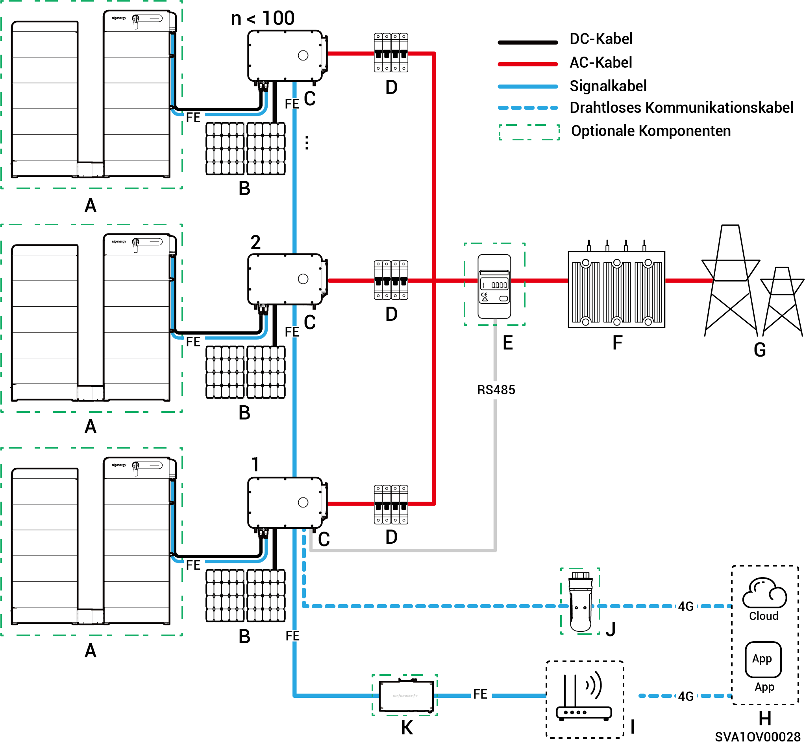
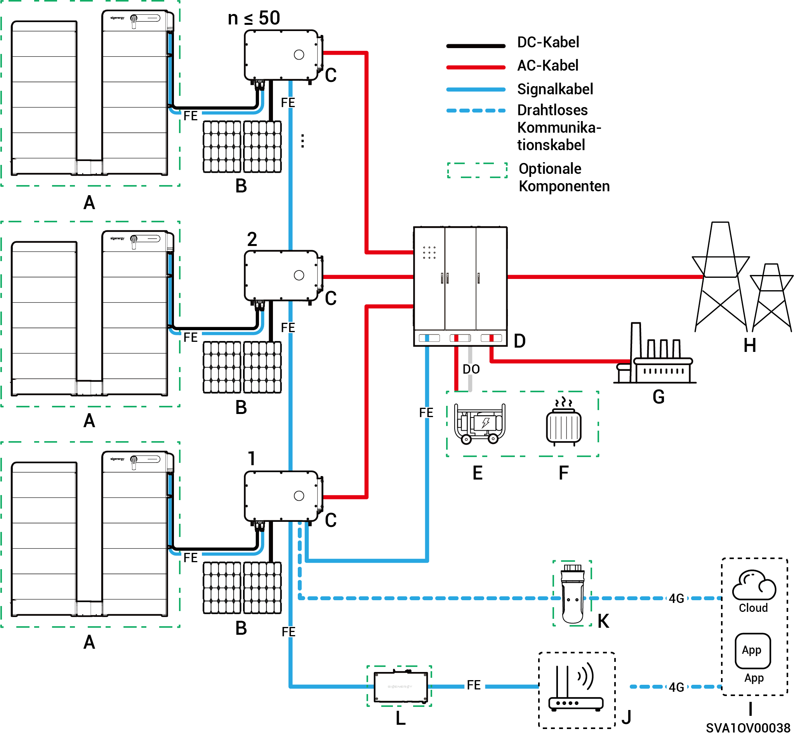

# Einführung in die Systemverdrahtung

* Unsere Produkte können in netzgekoppelte C\&I-Solarsysteme verwendet werden. Das netzgekoppelte Solarsystem besteht aus PV-Strängen, Wechselrichtern, Verteilerkästen sowie weiteren Bauteilen.
* C\&I PV-Speichersysteme speichern hauptsächlich den durch die PV-Paneele erzeugten Gleichstrom in Batteriepaketen. Sie können auch den Strom der PV-Paneele und Batteriepakete in Wechselstrom umwandeln oder in das Netz einspeisen.
* In netzunabhängigen Solarsystemen muss der Wechselrichter den gesamten Laststrom verarbeiten. Während Wechselrichter über kurzzeitige Überlastfähigkeiten verfügen, um vorübergehende Überlastanforderungen zu erfüllen (z. B. Motorstart), löst die Überschreitung dieser Grenzwerte eine Schutzabschaltung aus. Zusätzlich verursachen hohe Umgebungstemperaturen eine Leistungsminderung des Wechselrichters. Wenn die Leistungsminderung der Ausgangsleistung ständig unterhalb der Lastanforderungen liegt, wird dies auch eine aktive Schutzabschaltung auslösen.
  * Vorschläge zum Systementwurf:
    1. Überlastanpassung: Stellen Sie sicher, dass die Laststartleistung/-dauer unterhalb der kurzzeitigen Überlastfähigkeit des Wechselrichters bleibt.
    2. Anpassung der Leistungseinstufung: Die durchgehende Lastbetriebsleistung muss unter extremen Umgebungstemperaturen unterhalb der tatsächlichen Ausgangsleistung des Wechselrichters liegen.
    3. Umweltkompensation: Beachten Sie die Auswirkungen der Leistungsminderung aufgrund von Höhenlage und Sonnenstrahlung; sorgen Sie für ausreichende Entwurfsreserven.

### **Verdrahtungsdiagramm (Anzahl der Wechselrichter < 100)** ohne Notstrom

<figure><figcaption></figcaption></figure>

<table data-header-hidden><thead><tr><th width="169" valign="top"></th><th width="133.6666259765625" valign="top"></th><th width="121" valign="top"></th><th width="156.77783203125" valign="top"></th><th valign="top"></th></tr></thead><tbody><tr><td valign="top">A. Batterie</td><td valign="top">B. PV-Modul</td><td valign="top">C. Wechselrichter</td><td valign="top">D. AC-Schalter</td><td valign="top">E. Leistungssensor</td></tr><tr><td valign="top">F. Kastenförmige Unterstation</td><td valign="top">G. Stromnetz</td><td valign="top">H. mySigen</td><td valign="top">I. Router</td><td valign="top">J. CommMod</td></tr><tr><td valign="top">K. CommBridge</td><td valign="top"></td><td valign="top"></td><td valign="top"></td><td valign="top"></td></tr></tbody></table>



* <mark style="color:blue;">Jeder Wechselrichter muss mit einem AC-Schalter ausgestattet sein und mehrere Wechselrichter dürfen nicht gleichzeitig an einem einzigen Schalter angeschlossen sein.</mark>
* <mark style="color:blue;">Die Nennspannung des AC-Schalters</mark> <mark style="color:blue;">(D), der an jedem Wechselrichter angeschlossen ist, muss ≥ 500 V AC betragen. Die empfohlenen Spezifikationen für den Nennstrom sind wie folgt:</mark>
  * <mark style="color:blue;">Bei Wechselrichtern mit einer Nennleistung von 50 kW oder 60 kW: Nennstrom beträgt 125 A</mark>
  * <mark style="color:blue;">Bei Wechselrichtern mit einer Nennleistung von 75 kW oder 80 kW: Nennstrom beträgt 160 A</mark>
  * <mark style="color:blue;">Bei Wechselrichtern mit einer Nennleistung von 99,9 kW oder 100 kW: Nennstrom beträgt 200 A</mark>
  * <mark style="color:blue;">Bei Wechselrichtern mit einer Nennleistung von 110 kW oder 125 kW: Nennstrom beträgt 250 A</mark>
* <mark style="color:blue;">Es wird empfohlen, schnelles Ethernet und WLAN zur Kommunikation mit Wechselrichtern zu verwenden. Wenn der kostenlose 4G-Datenverkehr von CommMod</mark> <mark style="color:blue;">(J)</mark> <mark style="color:blue;">aufgebraucht ist, muss der Nutzer die SIM-Karte austauschen.</mark>

### Netzwerkdiagramm (**HYB model**, Wechselrichter ≤ 50 Einheiten) mit Notstrom

<figure><figcaption></figcaption></figure>

<table data-header-hidden><thead><tr><th valign="middle"></th><th width="161.2222900390625" valign="middle"></th><th valign="middle"></th><th valign="middle"></th><th valign="middle"></th><th data-hidden></th></tr></thead><tbody><tr><td valign="middle">A. Batterie</td><td valign="middle">B. PV-Modul</td><td valign="middle">C. Wechselrichter</td><td valign="middle">D. Gateway</td><td valign="middle">E. Generator</td><td></td></tr><tr><td valign="middle">F. Intelligente Last</td><td valign="middle">G. Notstromlast</td><td valign="middle">H. Stromnetz</td><td valign="middle">I. mySigen</td><td valign="middle">J. Router</td><td></td></tr><tr><td valign="middle">K. CommMod</td><td valign="middle">L. CommBridge</td><td valign="middle"></td><td valign="middle"></td><td valign="middle"></td><td></td></tr></tbody></table>



* <mark style="color:blue;">Als Notstromquelle für langfristige netzunabhängige Anwendungen kann der Generator (E) zusammen mit dem Gateway (D) einen reibungslosen Übergang zwischen PV, Speicherung und Dieselstromerzeugung gewährleisten.</mark>
* <mark style="color:blue;">Es wird empfohlen, schnelles Ethernet und WLAN zur Kommunikation mit Wechselrichtern zu verwenden. Wenn der kostenlose 4G-Datenverkehr von</mark> <mark style="color:blue;">(K)</mark> <mark style="color:blue;">aufgebraucht ist, muss der Nutzer die SIM-Karte austauschen.</mark>

### Notstrom-Verdrahtungsdiagramm (**Das Modell HYB verfügt über eine Anschlussbuchse für die Notstromlast**, ≤ 3 Einheiten)

<figure><figcaption></figcaption></figure>

<table data-header-hidden><thead><tr><th valign="middle"></th><th valign="middle"></th><th width="159" valign="middle"></th><th width="147" valign="top"></th><th valign="top"></th></tr></thead><tbody><tr><td valign="middle">A. Batterie</td><td valign="middle">B. PV-Modul</td><td valign="middle">C. Wechselrichter</td><td valign="top">D. AC-Schalter (abhängig von der Wechselrichterleistung)</td><td valign="top">E. ACB</td></tr><tr><td valign="middle">F. Kastenförmige Unterstation</td><td valign="middle">G. Stromnetz</td><td valign="middle">H. Manueller Steuerschalter</td><td valign="top">I. Notstromlast</td><td valign="top">J. mySigen</td></tr><tr><td valign="middle">K. Router</td><td valign="middle">L. CommMod</td><td valign="middle">M. CommBridge</td><td valign="top"></td><td valign="top"></td></tr></tbody></table>



* <mark style="color:blue;">Mehrere Wechselrichter dürfen nicht gleichzeitig an einem einzigen Schalter angeschlossen sein.</mark>
* <mark style="color:blue;">Jeder Wechselrichter (mit einer Anschlussbuchse für Notstrom), der an den Notstrom angeschlossen ist, muss einen AC-Schalter (D) mit einer Nennspannung von ≥ 500 V AC verwenden. Die empfohlenen Spezifikationen des Nennstroms sind wie folgt:</mark>
  * <mark style="color:blue;">Bei Wechselrichtern mit einer Nennleistung von 50 kW: Nennstrom beträgt 100 A</mark>
  * <mark style="color:blue;">Bei Wechselrichtern mit einer Nennleistung von 60 kW: Nennstrom beträgt 125 A</mark>
  * <mark style="color:blue;">Bei Wechselrichtern mit einer Nennleistung von 80 kW: Nennstrom beträgt 160 A</mark>
  * <mark style="color:blue;">Bei Wechselrichtern mit einer Nennleistung von 99,9 kW oder 100 kW: Nennstrom beträgt 200 A</mark>
  * <mark style="color:blue;">Bei Wechselrichtern mit einer Nennleistung von 110 kW: Nennstrom beträgt 250 A</mark>
* <mark style="color:blue;">Jeder Wechselrichter (mit einer Anschlussbuchse für Notstrom), der an das Stromnetz angeschlossen ist, muss einen AC-Schalter (D) mit einer Nennspannung von ≥ 500 V AC verwenden. Die empfohlenen Spezifikationen des Nennstroms sind wie folgt:</mark>
  * <mark style="color:blue;">Bei Wechselrichtern mit einer Nennleistung von 50 kW: Nennstrom beträgt 200 A</mark>
  * <mark style="color:blue;">Bei Wechselrichtern mit einer Nennleistung von 60 kW: Nennstrom beträgt 250 A</mark>
  * <mark style="color:blue;">Bei Wechselrichtern mit einer Nennleistung von 80 kW bis 110 kW: Nennstrom beträgt 315 A</mark>
* <mark style="color:blue;">Es wird empfohlen, schnelles Ethernet und WLAN zur Kommunikation mit Wechselrichtern zu verwenden. Wenn der kostenlose 4G-Datenverkehr von CommMod (L) aufgebraucht ist, muss der Nutzer die SIM-Karte austauschen.</mark>
