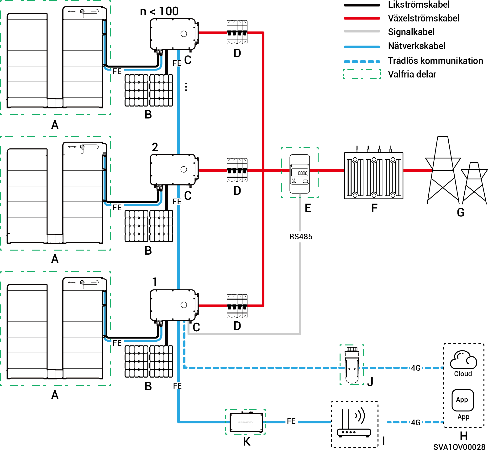
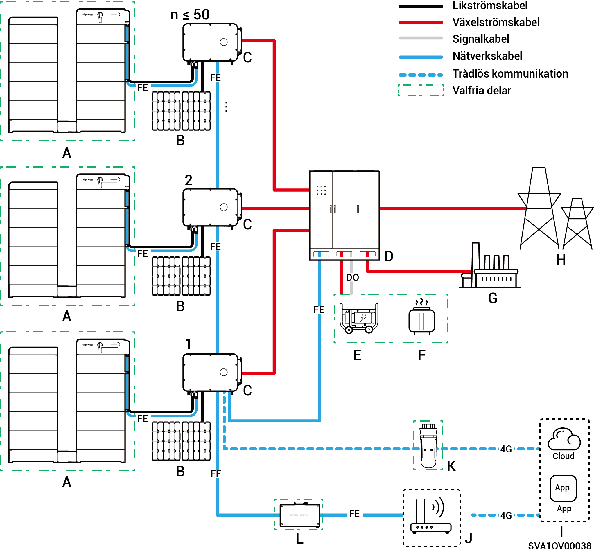

# Introduktion till systemkabeldragning

* Våra produkter kan användas i nätanslutna solcellssystem för C\&I. Det nätanslutna solcellssystemet består av PV-strängar, växelriktare, strömdistributionspaneler och andra komponenter.
* C\&I solcellslagringssystem lagrar i första hand likström som genereras av solpaneler i batteripaket. De kan också omvandla ström från både solpaneler och batteripaket till växelström för att försörja förbrukare eller mata in i elnätet.
* Även om växelriktarna har kapacitet för kortvarig överbelastning för att klara tillfälliga överbelastningsbehov (exempelvis motorstart), utlöser överskridande av dessa gränser en skyddande avstängning. Dessutom leder höga omgivningstemperaturer till att växelriktarens effekt minskar. Om den reducerade uteffekten under en längre tid understiger belastningskraven aktiveras även skyddsavstängningar.
  * Förslag till systemdesign:
    1. Matchning, överbelastning: Se till att laddningens starteffekt/varaktighet ligger under växelriktarens förmåga till kortvarig överbelastning.
    2. Anpassning av effektklassning: Driftseffekten vid kontinuerlig belastning måste vara lägre än växelriktarens faktiska uteffekt vid extrema omgivningstemperaturer.
    3. Miljökompensation: Ta hänsyn till effektminskningspåverkan från höjd över havet och solinstrålning; ge tillräcklig konstruktionsmarginal.

### **Kopplingsschema** för icke-reserv **(antal växelriktare < 100)**

<figure><figcaption></figcaption></figure>

<table data-header-hidden><thead><tr><th width="169" valign="top"></th><th width="133.6666259765625" valign="top"></th><th width="121" valign="top"></th><th width="156.77783203125" valign="top"></th><th valign="top"></th></tr></thead><tbody><tr><td valign="top">A. Batteri</td><td valign="top">A. Solpanel</td><td valign="top">C. Växelriktare</td><td valign="top">D. AC Switch</td><td valign="top">E. Effektsensor</td></tr><tr><td valign="top">F. Box-type substation</td><td valign="top">G. Elnät</td><td valign="top">H. mySigen</td><td valign="top">I. Router</td><td valign="top">J. CommMod</td></tr><tr><td valign="top">K. CommBridge</td><td valign="top"></td><td valign="top"></td><td valign="top"></td><td valign="top"></td></tr></tbody></table>



* <mark style="color:blue;">Varje växelriktare måste vara utrustad med en växelströmbrytare, och flera växelriktare kan inte anslutas till en växelströmbrytare samtidigt.</mark>
* <mark style="color:blue;">Märkspänningen för AC switch</mark> <mark style="color:blue;">(D) som är ansluten till varje växelriktare måste vara ≥ 500 Va.c., Rekommenderade specifikationer för märkström är följande:</mark>
  * <mark style="color:blue;">För växelriktare med en nominell effekt på 50 kW eller 60 kW: märkström är 125 A</mark>
  * <mark style="color:blue;">För växelriktare med en märkeffekt på 75 kW eller 80 kW: märkström är 160 A</mark>
  * <mark style="color:blue;">För växelriktare med en nominell effekt på 99,9 kW eller 100 kW: märkström är 200 A</mark>
  * <mark style="color:blue;">För växelriktare med en nominell effekt på 110 kW eller 125 kW: märkström är 250 A</mark>
* <mark style="color:blue;">Vi rekommenderar att du använder snabbt Ethernet och trådlöst nätverk för kommunikation med växelriktarna. När ingen 4G-surf eller CommMod</mark> <mark style="color:blue;">(J)</mark> <mark style="color:blue;">finns måste användaren ersätta ett SIM-kort.</mark>

### Nätverksschema för reserveffekt (**HYB-modell**, växelriktare ≤ 50 enheter)

<figure><figcaption></figcaption></figure>

<table data-header-hidden><thead><tr><th valign="middle"></th><th width="161.2222900390625" valign="middle"></th><th valign="middle"></th><th valign="middle"></th><th valign="middle"></th><th data-hidden></th></tr></thead><tbody><tr><td valign="middle">A. Batteri</td><td valign="middle">A. Solpanel</td><td valign="middle">C. Växelriktare</td><td valign="middle">D. Gateway</td><td valign="middle">E. Generator</td><td></td></tr><tr><td valign="middle">F. Smart last</td><td valign="middle">G. Reservlast</td><td valign="middle">H. Elnät</td><td valign="middle">I. mySigen</td><td valign="middle">J. Router</td><td></td></tr><tr><td valign="middle">K. CommMod</td><td valign="middle">L. CommBridge</td><td valign="middle"></td><td valign="middle"></td><td valign="middle"></td><td></td></tr></tbody></table>



* <mark style="color:blue;">Som reservkraftkälla för långvarig drift utan elnät kan generatorn (E) arbeta tillsammans med Gateway (D), för att ge mjuka övergångar mellan solceller, lagrad energi och kraft från dieselgeneratorn.</mark>
* <mark style="color:blue;">Vi rekommenderar att du använder snabbt Ethernet och trådlöst nätverk för kommunikation med växelriktarna. När ingen 4G-surf eller CommMod</mark> <mark style="color:blue;">(K)</mark> <mark style="color:blue;">finns måste användaren ersätta ett SIM-kort.</mark>

### Kopplingsschema för reserv (**HYB-modellen har en laddningsport för reserv**, ≤ 3 enheter)

<figure><figcaption></figcaption></figure>

<table data-header-hidden><thead><tr><th valign="middle"></th><th valign="middle"></th><th width="159" valign="middle"></th><th width="147" valign="top"></th><th valign="top"></th></tr></thead><tbody><tr><td valign="middle">A. Batteri</td><td valign="middle">A. Solpanel</td><td valign="middle">C. Växelriktare</td><td valign="top">D. AC Switch</td><td valign="top">E. ACB</td></tr><tr><td valign="middle">F. Box-type substation</td><td valign="middle">G. Elnät</td><td valign="middle">H. Manuell brytare</td><td valign="top">I. Reservlast</td><td valign="top">J. mySigen</td></tr><tr><td valign="middle">K. Router</td><td valign="middle">L. CommMod</td><td valign="middle">M. CommBridge</td><td valign="top"></td><td valign="top"></td></tr></tbody></table>



* <mark style="color:blue;">Det går inte att ansluta flera växelriktare samtidigt till en AC-switch.</mark>
* <mark style="color:blue;">Varje växelriktare (med en reservladdningsport) som är ansluten till reservladdningen måste använda en växelströmsbrytare (D) med en märkspänning på ≥ 500V a.c. De rekommenderade specifikationerna för märkström är följande:</mark>
  * <mark style="color:blue;">För växelriktare med en nominell effekt på 50 kW: märkström är 100 A</mark>
  * <mark style="color:blue;">För växelriktare med en nominell effekt på 60 kW: märkström är 125 A</mark>
  * <mark style="color:blue;">För växelriktare med en nominell effekt på 80 kW: märkström är 160 A</mark>
  * <mark style="color:blue;">För växelriktare med en nominell effekt på 99,9 kW eller 100 kW: märkström är 200 A</mark>
  * <mark style="color:blue;">För växelriktare med en nominell effekt på 110 kW: märkström är 250 A</mark>
* <mark style="color:blue;">Varje växelriktare (med en reservladdningsport) som är ansluten till elnätet måste använda en växelströmsbrytare (D) med en märkspänning på ≥ 500V a.c. De rekommenderade specifikationerna för märkström är följande:</mark>
  * <mark style="color:blue;">För växelriktare med en nominell effekt på 50 kW: märkström är 200 A</mark>
  * <mark style="color:blue;">För växelriktare med en nominell effekt 60 kW: märkström är 250 A</mark>
  * <mark style="color:blue;">För växelriktare med en nominell effekt kW på 80kW till 110 kW: märkström är 315 A</mark>
* <mark style="color:blue;">Vi rekommenderar att du använder snabbt Ethernet och trådlöst nätverk för kommunikation med växelriktarna. När ingen 4G-surf eller CommMod (L) finns måste användaren ersätta ett SIM-kort.</mark>
