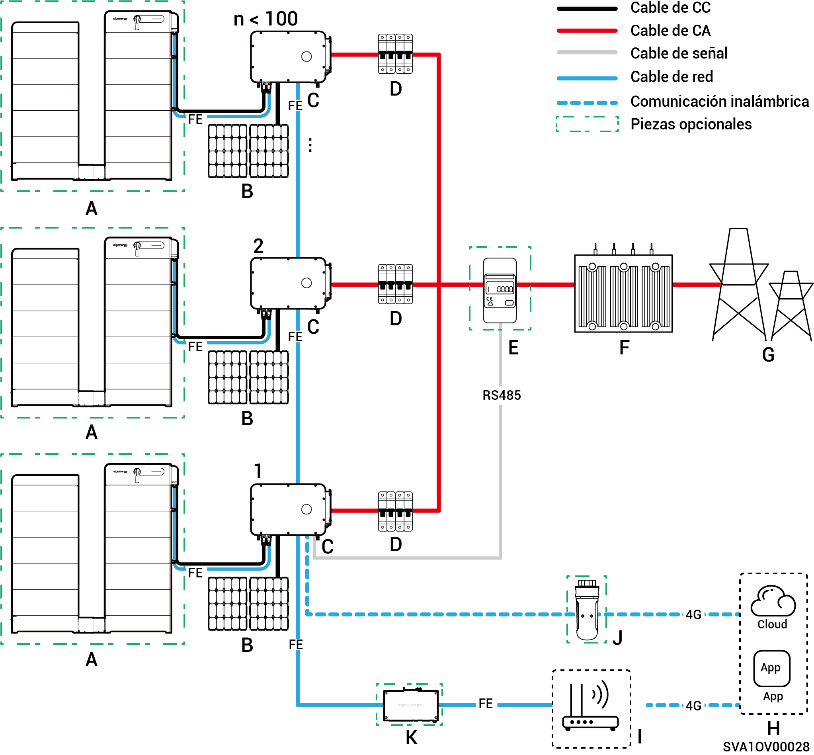
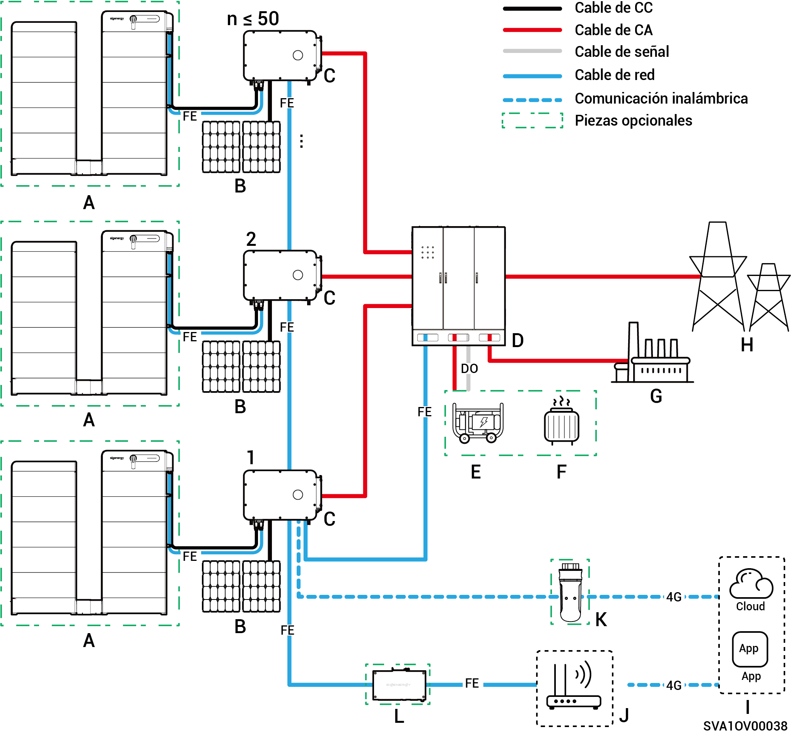
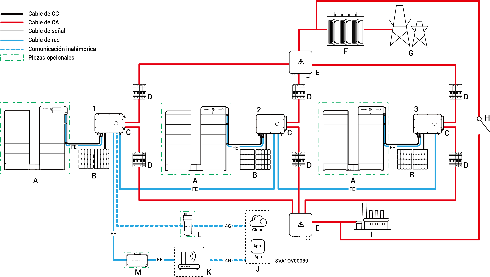

# Introducción al cableado del sistema

* Nuestros productos pueden usarse en sistemas solares comerciales e industriales (C\&I) conectados a la red. El sistema conectado a la red está formado por cadenas fotovoltaicas, inversores, paneles de distribución y otros componentes.
* La función principal de los sistemas de almacenamiento de energía fotovoltaica comerciales e industriales es almacenar en paquetes de baterías la corriente continua generada por los paneles fotovoltaicos. También pueden convertir la energía, tanto de los paneles fotovoltaicos como de los paquetes de baterías en corriente alterna para alimentar cargas o suministrarla a la red.
* En sistemas solares fuera de red el inversor debe manejar toda la potencia de la carga. Aunque los inversores disponen de una capacidad de sobrecarga de corto plazo para satisfacer demandas de sobrecarga transitorias (por ejemplo, arranque de motores), superar estos límites activa un apagado de protección. Además, unas temperaturas ambiente elevadas provocan una degradación de la capacidad del inversor. Si la potencia de salida degradada está persistentemente por debajo de los requisitos de carga, ello también activará apagados de protección.
  * Sugerencias de diseño del sistema:
    1. Absorción de sobrecargas: Asegúrese de que la potencia/duración de los arranques de las cargas se mantiene por debajo de la capacidad de sobrecarga de corto plazo del inversor.
    2. Adaptación del nivel de potencia: La potencia operativa de la carga continua debe ser inferior a la potencia de salida real del inversor bajo temperaturas ambiente extremas.
    3. Compensación ambiental: Tenga en cuenta los efectos de degradación de la capacidad debidos a altitud y radiación solar. Prevea un margen de diseño suficiente.

### **Diagrama de cableado (número de inversores < 100)** sin reserva

<figure><figcaption></figcaption></figure>

<table data-header-hidden><thead><tr><th width="169" valign="top"></th><th width="133.6666259765625" valign="top"></th><th width="121" valign="top"></th><th width="156.77783203125" valign="top"></th><th valign="top"></th></tr></thead><tbody><tr><td valign="top">A. Batería</td><td valign="top">A. Panel fotovoltaico</td><td valign="top">C. Inversor</td><td valign="top">D. Interruptor de CA</td><td valign="top">E. Sensor de energía</td></tr><tr><td valign="top">F. Subestación de tipo caja</td><td valign="top">G. Red eléctrica</td><td valign="top">H. mySigen</td><td valign="top">I. Enrutador</td><td valign="top">J. CommMod</td></tr><tr><td valign="top">K. CommBridge</td><td valign="top"></td><td valign="top"></td><td valign="top"></td><td valign="top"></td></tr></tbody></table>



* <mark style="color:blue;">Cada inversor debe equiparse con un interruptor de CA y no pueden conectarse varios inversores a un interruptor de CA al mismo tiempo.</mark>
* <mark style="color:blue;">El voltaje nominal del interruptor de CA</mark> <mark style="color:blue;">(D) conectado a cada inversor debe ser ≥ 500 Vca y se recomiendan las especificaciones de corriente nominal siguientes:</mark>
  * <mark style="color:blue;">Para inversores con un nivel de potencia de 50 o 60 kW: la corriente nominal es de 125 A</mark>
  * <mark style="color:blue;">Para inversores con un nivel de potencia de 75 u 80 kW: la corriente nominal es de 160 A</mark>
  * <mark style="color:blue;">Para inversores con un nivel de potencia de 99,9 o 100 kW: la corriente nominal es de 200 A</mark>
  * <mark style="color:blue;">Para inversores con un nivel de potencia de 110 o 125 kW: la corriente nominal es de 250 A</mark>
* <mark style="color:blue;">Se recomienda utilizar Fast Ethernet y WLAN para la comunicación con los inversores. Cuando el tráfico 4G gratuito de CommMod</mark> <mark style="color:blue;">(J)</mark> <mark style="color:blue;">se agote, los usuarios deben sustituir la tarjeta SIM.</mark>

### Diagrama de conexión en red de la energía de reserva (**modelo HYB**, inversores ≤ 50 unidades)

<figure><figcaption></figcaption></figure>

<table data-header-hidden><thead><tr><th valign="middle"></th><th width="161.2222900390625" valign="middle"></th><th valign="middle"></th><th valign="middle"></th><th valign="middle"></th><th data-hidden></th></tr></thead><tbody><tr><td valign="middle">A. Batería</td><td valign="middle">A. Panel fotovoltaico</td><td valign="middle">C. Inversor</td><td valign="middle">D. Gateway</td><td valign="middle">E. Generador</td><td></td></tr><tr><td valign="middle">F. Carga inteligente</td><td valign="middle">G. Carga de reserva</td><td valign="middle">H. Red eléctrica</td><td valign="middle">I. mySigen</td><td valign="middle">J. Enrutador</td><td></td></tr><tr><td valign="middle">K. CommMod</td><td valign="middle">L. CommBridge</td><td valign="middle"></td><td valign="middle"></td><td valign="middle"></td><td></td></tr></tbody></table>



* <mark style="color:blue;">Como generador de energía de reserva para aplicaciones sin conexión a la red de largo plazo, el generador (E) puede trabajar en tándem con la Gateway (D) para proporcionar una transición suave entre generación fotovoltaica, almacenamiento y generación diésel.</mark>
* <mark style="color:blue;">Se recomienda utilizar Fast Ethernet y WLAN para la comunicación con los inversores. Cuando el tráfico 4G gratuito de CommMod</mark> <mark style="color:blue;">(K)</mark> <mark style="color:blue;">se agote, los usuarios deben sustituir la tarjeta SIM.</mark>

### Diagrama de cableado de reserva (**el modelo HYB tiene un puerto de cargas de reserva**, ≤ 3 unidades)

<figure><figcaption></figcaption></figure>

<table data-header-hidden><thead><tr><th valign="middle"></th><th valign="middle"></th><th width="159" valign="middle"></th><th width="147" valign="top"></th><th valign="top"></th></tr></thead><tbody><tr><td valign="middle">A. Batería</td><td valign="middle">A. Panel fotovoltaico</td><td valign="middle">C. Inversor</td><td valign="top">D. Interruptor de CA</td><td valign="top">E. ACB</td></tr><tr><td valign="middle">F. Carga de reserva</td><td valign="middle">G. Sensor de energía</td><td valign="middle">H. Subestación de tipo caja</td><td valign="top">I. Red eléctrica</td><td valign="top">J. Interruptor de control manual</td></tr><tr><td valign="middle">K. mySigen</td><td valign="middle">L. Enrutador</td><td valign="middle">M. CommMod</td><td valign="top">N. CommBridge</td><td valign="top"></td></tr></tbody></table>



* <mark style="color:blue;">No pueden conectarse varios inversores a un interruptor de CA al mismo tiempo.</mark>
* <mark style="color:blue;">Todos los inversores (con un puerto de carga de reserva) conectados a la carga de reserva deben utilizar un interruptor de CA (D) con un voltaje nominal ≥ 500 Vca. Las especificaciones de corriente nominal recomendadas son las siguientes:</mark>
  * <mark style="color:blue;">Para inversores con un nivel de potencia de 50 kW: la corriente nominal es de 100 A</mark>
  * <mark style="color:blue;">Para inversores con un nivel de potencia de 60 kW: la corriente nominal es de 125 A</mark>
  * <mark style="color:blue;">Para inversores con un nivel de potencia de 80 kW: la corriente nominal es de 160 A</mark>
  * <mark style="color:blue;">Para inversores con un nivel de potencia de 99,9 o 100 kW: la corriente nominal es de 200 A</mark>
  * <mark style="color:blue;">Para inversores con un nivel de potencia de 110 kW: la corriente nominal es de 250 A</mark>
* <mark style="color:blue;">Todos los inversores (con un puerto de carga de reserva) conectados a la red eléctrica deben utilizar un interruptor de CA (D) con un voltaje nominal ≥ 500 Vca. Las especificaciones de corriente nominal recomendadas son las siguientes:</mark>
  * <mark style="color:blue;">Para inversores con un nivel de potencia de 50 kW: la corriente nominal es de 200 A</mark>
  * <mark style="color:blue;">Para inversores con un nivel de potencia de 60 kW: la corriente nominal es de 250 A</mark>
  * <mark style="color:blue;">Para inversores con un nivel de potencia de 80 a 110 kW: la corriente nominal es de 315 A</mark>
* <mark style="color:blue;">Se recomienda utilizar Fast Ethernet y WLAN para la comunicación con los inversores. Cuando el tráfico 4G gratuito de CommMod (L) se agote, los usuarios deben sustituir la tarjeta SIM.</mark>
