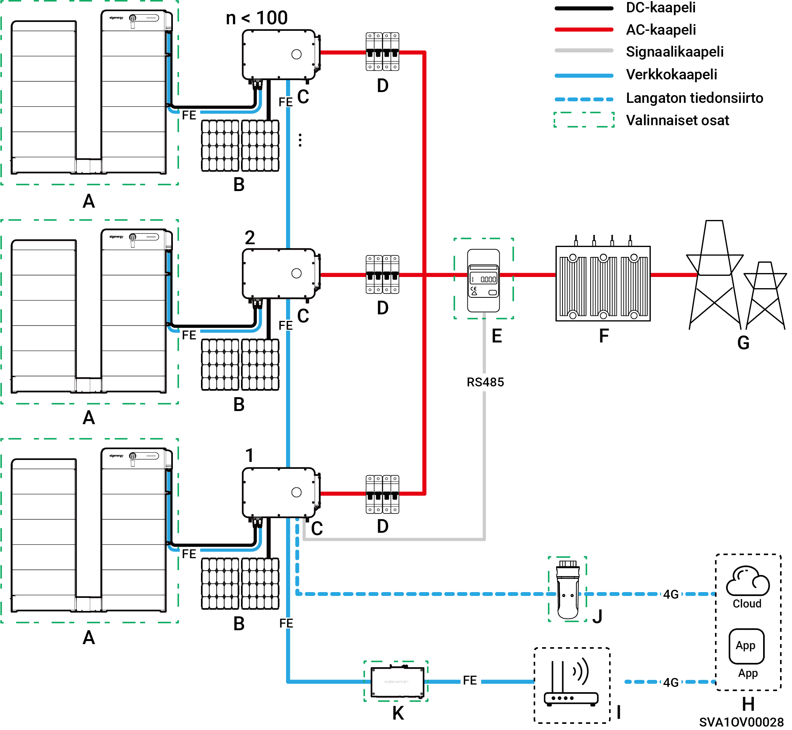
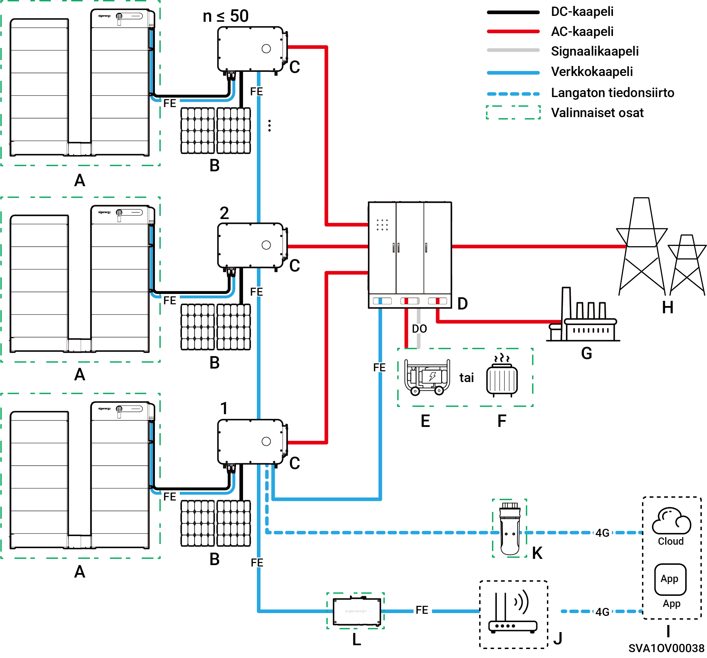
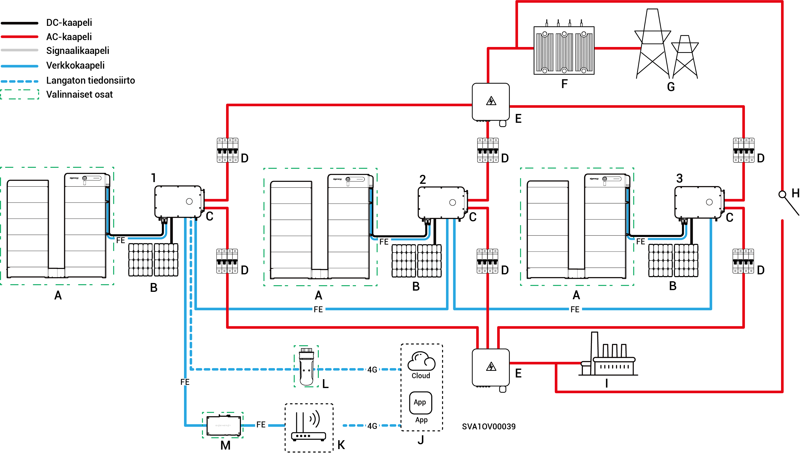

# Järjestelmän johdotuksen esittely

* Tuotteitamme voidaan käyttää verkkoon kytketyissä C\&I-aurinkosähköjärjestelmissä. Verkkoon kytketty aurinkosähköjärjestelmä koostuu PV-sarjoista, inverttereistä, jakelupaneeleista ja muista komponenteista.
* C\&I PV-varastointijärjestelmät varastoivat pääasiassa PV-paneelien tuottamaa tasavirtaa akkuyksiköihin. Ne voivat myös muuntaa virtaa sekä PV-paneeleista että akkuyksiköistä vaihtovirraksi kuormien syöttämiseksi tai verkkoon syöttämiseksi.
* Off-grid-aurinkojärjestelmissä invertterin on kyettävä käsittelemään koko kuormateho. Vaikka inverttereillä on lyhytaikainen ylikuormituskestävyys hetkellisten ylikuormitustarpeiden (kuten moottorin käynnistyksen) kattamiseksi, näiden rajojen ylittäminen laukaisee suojakatkaisun. Lisäksi korkeat ympäristön lämpötilat heikentävät invertterin tehoa. Jos heikentynyt lähtöteho jää pysyvästi kuorman vaatimusten alapuolelle, tämä käynnistää myös suojakatkaisut.
* Järjestelmän suunnitteluehdotukset:

1. Ylikuormituksen yhteensovitus: Varmista, että kuorman käynnistysteho ja -kesto pysyvät invertterin lyhytaikaisen ylikuormituskyvyn alapuolella.
2. Teholuokan mukautus: Jatkuvan kuorman käyttötehon on oltava pienempi kuin invertterin todellinen lähtöteho ympäristön äärilämpötiloissa.
3. Ympäristöolosuhteiden kompensointi: Ota huomioon korkeuden ja auringon säteilyn aiheuttama tehon heikentyminen; varaa riittävä suunnittelumarginaali.

### Varavoiman ulkopuolinen **johdotuskaavio (inverttereiden lukumäärä < 100)**

<figure><figcaption></figcaption></figure>

<table data-header-hidden><thead><tr><th width="150.1112060546875" valign="top"></th><th width="123.6666259765625" valign="top"></th><th width="119.888916015625" valign="top"></th><th width="190.111083984375" valign="top"></th><th valign="top"></th></tr></thead><tbody><tr><td valign="top">A. Akku</td><td valign="top">B. PV-paneeli</td><td valign="top">C. Invertteri</td><td valign="top">D. AC-kytkin (riippuu invertterin tehosta)</td><td valign="top">E. Tehoanturi</td></tr><tr><td valign="top">F. Laatikkomuotoinen ala-asema</td><td valign="top">G. Sähköverkko</td><td valign="top">H. mySigen</td><td valign="top">I. Reititin</td><td valign="top">J. CommMod</td></tr><tr><td valign="top">K. CommBridge</td><td valign="top"></td><td valign="top"></td><td valign="top"></td><td valign="top"></td></tr></tbody></table>



* <mark style="color:blue;">Jokaisessa invertterissä on oltava AC-kytkin, eikä useita inverttereitä saa liittää samaan AC-kytkimeen samanaikaisesti.</mark>
* <mark style="color:blue;">Jokaisen invertteriin liitetyn AC-kytkimen (D) nimellisjännitteen</mark> <mark style="color:blue;">on oltava ≥ 500 V AC. Suositellut nimellisvirran tekniset tiedot ovat seuraavat:</mark>
* <mark style="color:blue;">Inverttereille, joiden teho on 50 kW tai 60 kW: nimellisvirta on 125 A</mark>
* <mark style="color:blue;">Inverttereille, joiden teho on 75 kW tai 80 kW: nimellisvirta on 160 A</mark>
* <mark style="color:blue;">Inverttereille, joiden teho on 99,9 kW tai 100 kW: nimellisvirta on 200 A</mark>
* <mark style="color:blue;">Inverttereille, joiden teho on 110 kW tai 125 kW: nimellisvirta on 250 A</mark>
* <mark style="color:blue;">On suositeltavaa käyttää Fast Ethernet- ja WLAN-verkkoja inverttereiden kanssa tapahtuvaan tiedonsiirtoon. Kun CommModin</mark> <mark style="color:blue;">(J)</mark> <mark style="color:blue;">vapaa 4G-liikenne loppuu, käyttäjien on vaihdettava SIM-kortti.</mark>

### Varavoiman verkkokaavio (kun HYB-malli on määritetty ulkoisella Gatewayllä, inverttereitä ≤ 50 yksikköä)

<figure><figcaption></figcaption></figure>

<table data-header-hidden><thead><tr><th valign="middle"></th><th width="161.2222900390625" valign="middle"></th><th valign="middle"></th><th valign="middle"></th><th valign="middle"></th><th data-hidden></th></tr></thead><tbody><tr><td valign="middle">A. Akku</td><td valign="middle">B. PV-paneeli</td><td valign="middle">C. Invertteri</td><td valign="middle">D. Gateway</td><td valign="middle">E. Generaattori</td><td></td></tr><tr><td valign="middle">F. Älykäs kuorma</td><td valign="middle">G. Varakuorma</td><td valign="middle">H. Sähköverkko</td><td valign="middle">I. mySigen</td><td valign="middle">J. Reititin</td><td></td></tr><tr><td valign="middle">K. CommMod</td><td valign="middle">L. CommBridge</td><td valign="middle"></td><td valign="middle"></td><td valign="middle"></td><td></td></tr></tbody></table>



* <mark style="color:blue;">Varaenergialähteenä pitkäaikaisessa verkosta irrotetussa käytössä generaattori (E) voi toimia yhdessä Gatewayn (D) kanssa ja tarjota sujuvan siirtymisen aurinkosähkön, varastoinnin ja dieselvoiman tuotannon välillä.</mark>
* <mark style="color:blue;">On suositeltavaa käyttää Fast Ethernet- ja WLAN-verkkoja inverttereiden kanssa tapahtuvaan tiedonsiirtoon. Kun CommModin</mark> <mark style="color:blue;">(K)</mark> <mark style="color:blue;">vapaa 4G-liikenne loppuu, käyttäjien on vaihdettava SIM-kortti.</mark>

### Varavoiman johdotuskaavio (kun HYB-malli on määritetty sisäisellä Gatewayllä, ≤ 3 yksikköä)

<figure><figcaption></figcaption></figure>

<table data-header-hidden><thead><tr><th valign="middle"></th><th valign="middle"></th><th width="159" valign="middle"></th><th width="147" valign="middle"></th><th valign="middle"></th></tr></thead><tbody><tr><td valign="middle">A. Akku</td><td valign="middle">B. PV-paneeli</td><td valign="middle">C. Invertteri</td><td valign="middle">D. AC-kytkin (riippuu invertterin tehosta)</td><td valign="middle">E. Yhdistelmäpaneeli</td></tr><tr><td valign="middle">F. Kotelomuotoinen ala-asema</td><td valign="middle">G. Sähköverkko</td><td valign="middle">H. Manuaalinen ohjauskytkin</td><td valign="middle">I. Varakuorma</td><td valign="middle">J. mySigen</td></tr><tr><td valign="middle">K. Reititin</td><td valign="middle">L. CommMod</td><td valign="middle">M. CommBridge</td><td valign="middle"></td><td valign="middle"></td></tr></tbody></table>



* <mark style="color:blue;">Useita inverttereitä ei voi kytkeä samaan AC-kytkimeen samanaikaisesti.</mark>
* <mark style="color:blue;">Jokaisessa varavoimakuormaan liitetyssä invertterissä on käytettävä AC-kytkintä (D), jonka nimellisjännite on ≥ 500 V AC. Suositellut nimellisvirran tekniset tiedot ovat seuraavat:</mark>
* <mark style="color:blue;">Inverttereille, joiden teho on 50 kW: nimellisvirta on 100 A</mark>
* <mark style="color:blue;">Inverttereille, joiden teho on 60 kW: nimellisvirta on 125 A</mark>
* <mark style="color:blue;">Inverttereille, joiden teho on 80 kW: nimellisvirta on 160 A</mark>
* <mark style="color:blue;">Inverttereille, joiden teho on 99,9 kW tai 100 kW: nimellisvirta on 200 A</mark>
* <mark style="color:blue;">Inverttereille, joiden teho on 110 kW: nimellisvirta on 250 A</mark>
* <mark style="color:blue;">Jokaisen sähköverkkoon liitetyn invertterin on käytettävä AC-kytkintä ( D), jonka nimellisjännite on ≥ 500 V AC. Suositellut nimellisvirran tekniset tiedot ovat seuraavat:</mark>
* <mark style="color:blue;">Inverttereille, joiden teho on 50 kW: nimellisvirta on 200 A</mark>
* <mark style="color:blue;">Inverttereille, joiden teho on 60 kW: nimellisvirta on 250 A</mark>
* <mark style="color:blue;">Inverttereille, joiden teho on 80–110 kW: nimellisvirta on 315 A</mark>
* <mark style="color:blue;">On suositeltavaa käyttää Fast Ethernet- ja WLAN-verkkoja inverttereiden kanssa tapahtuvaan tiedonsiirtoon. Kun CommModin (L) vapaa 4G-liikenne loppuu, käyttäjien on vaihdettava SIM-kortti.</mark>
