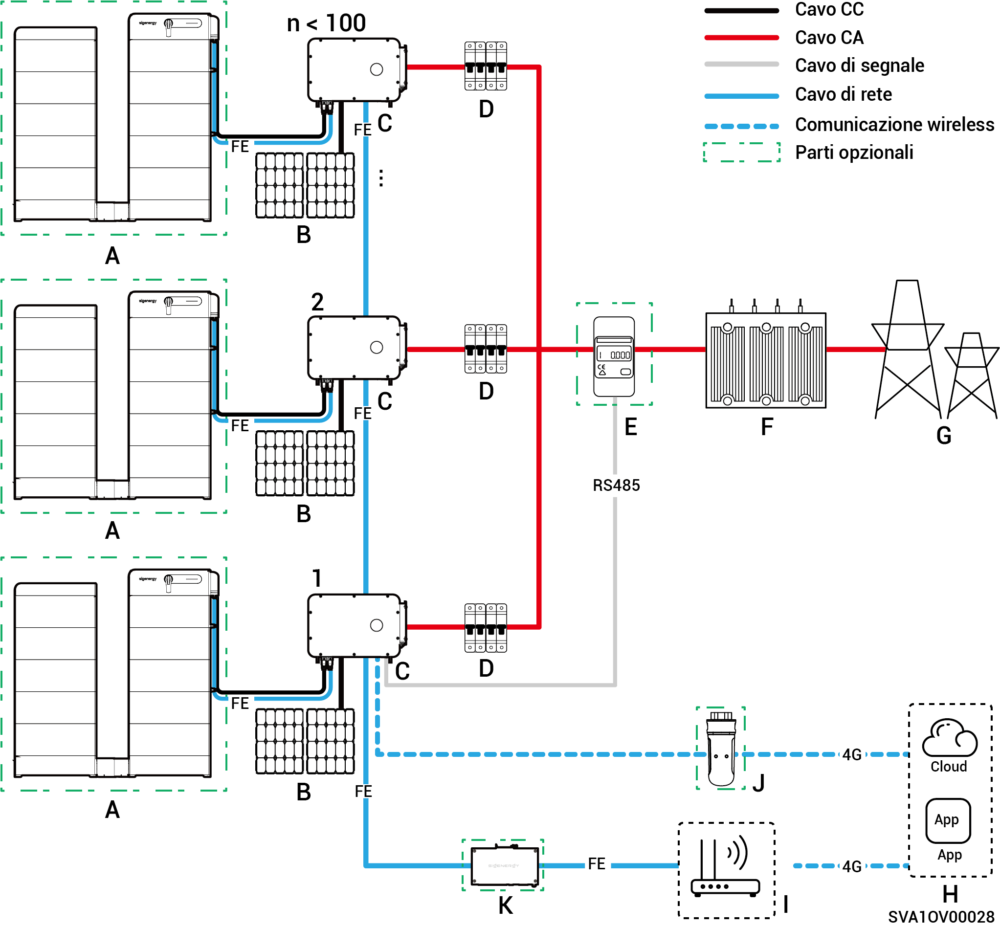
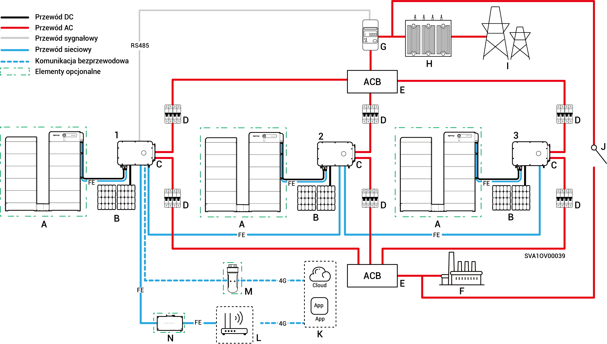

# Introduzione al cablaggio del sistema

* I nostri prodotti possono essere utilizzati in sistemi solari C\&I connessi alla rete. L'impianto fotovoltaico connesso alla rete è composto da stringhe FV, inverter, quadri di distribuzione e altri componenti.
* I sistemi di accumulo fotovoltaico C\&I immagazzinano principalmente la corrente continua generata dai pannelli fotovoltaici nei pacchi batteria. Possono inoltre convertire l'energia proveniente sia dai pannelli fotovoltaici sia dai pacchi batteria in corrente alternata, per alimentare i carichi o immetterla in rete.
* Nei sistemi fotovoltaici off-grid l'inverter deve gestire l'intera potenza del carico. Sebbene gli inverter possiedano capacità di sovraccarico a breve termine per far fronte a richieste transitorie (ad esempio l'avviamento di un motore), il superamento di questi limiti provoca un arresto di protezione. Inoltre, le elevate temperature ambientali causano il declassamento della potenza dell'inverter. Se la potenza di uscita declassata rimane costantemente al di sotto dei requisiti di carico, ciò attiverà anch'esso un arresto di protezione.
  * Suggerimenti per la progettazione del sistema:
    1. Dimensionamento del sovraccarico: Garantire che la potenza e la durata di avviamento del carico restino al di sotto della capacità di sovraccarico a breve termine dell'inverter.
    2. Adattamento della potenza nominale: La potenza continua del carico deve essere inferiore alla potenza di uscita effettiva dell'inverter in condizioni di temperatura ambientale estreme.
    3. Compensazione ambientale: Considerare gli effetti del declassamento di potenza dovuti all'altitudine e all'irraggiamento solare; fornire un margine di progettazione adeguato.

### **Schema di cablaggio** senza backup **(numero di inverter < 100)**

<figure><figcaption></figcaption></figure>

<table data-header-hidden><thead><tr><th width="156" valign="top"></th><th width="133.6666259765625" valign="top"></th><th width="114" valign="top"></th><th width="183.77783203125" valign="top"></th><th valign="top"></th></tr></thead><tbody><tr><td valign="top">A. Batteria</td><td valign="top">B. Pannello fotovoltaico</td><td valign="top">C. Inverter</td><td valign="top">D. Interruttore CA (Dipende dalla potenza dell'inverter)</td><td valign="top">E. Sensore di potenza</td></tr><tr><td valign="top">F. Sottostazione a scatola</td><td valign="top">G. Rete elettrica</td><td valign="top">H. mySigen</td><td valign="top">I. Router</td><td valign="top">J. CommMod</td></tr><tr><td valign="top">K. CommBridge</td><td valign="top"></td><td valign="top"></td><td valign="top"></td><td valign="top"></td></tr></tbody></table>



* <mark style="color:blue;">Ciascun inverter deve essere dotato di un interruttore CA e non è possibile collegare più inverter a un interruttore CA allo stesso tempo.</mark>
* <mark style="color:blue;">La tensione nominale dell'interruttore CA</mark> <mark style="color:blue;">(D) collegato a ciascun inverter deve essere almeno 500 Vc.a. Le specifiche consigliate per la corrente nominale sono le seguenti:</mark>
  * <mark style="color:blue;">Per inverter con potenza nominale di 50 kW o 60 kW: la corrente nominale è di 125 A</mark>
  * <mark style="color:blue;">Per inverter con potenza nominale di 75 kW o 80 kW: la corrente nominale è di 160 A</mark>
  * <mark style="color:blue;">Per inverter con potenza nominale di 99,9 kW o 100 kW: la corrente nominale è di 200 A</mark>
  * <mark style="color:blue;">Per inverter con potenza nominale di 110 kW o 125 kW: la corrente nominale è di 250 A</mark>
* <mark style="color:blue;">Si consiglia di utilizzare Fast Ethernet e una WLAN per la comunicazione con gli inverter. Quando il traffico 4G gratuito di CommMod</mark> <mark style="color:blue;">(J)</mark> <mark style="color:blue;">si esaurisce, l'utente deve sostituire la scheda SIM.</mark>

### Schema di rete dell'alimentazione di backup (Quando il modello HYB è configurato con un gateway esterno, Inverter ≤ 50 unità)

<figure><figcaption></figcaption></figure>

<table data-header-hidden><thead><tr><th valign="middle"></th><th width="161.2222900390625" valign="middle"></th><th valign="middle"></th><th valign="middle"></th><th valign="middle"></th><th data-hidden></th></tr></thead><tbody><tr><td valign="middle">A. Batteria</td><td valign="middle">B. Pannello fotovoltaico</td><td valign="middle">C. Inverter</td><td valign="middle">D. Gateway</td><td valign="middle">E. Generatore</td><td></td></tr><tr><td valign="middle">F. Carico intelligente</td><td valign="middle">G. Carico di backup</td><td valign="middle">H. Rete elettrica</td><td valign="middle">I. mySigen</td><td valign="middle">J. Router</td><td></td></tr><tr><td valign="middle">K. CommMod</td><td valign="middle">L. CommBridge</td><td valign="middle"></td><td valign="middle"></td><td valign="middle"></td><td></td></tr></tbody></table>



* <mark style="color:blue;">Il generatore (E), come fonte di energia di backup per applicazioni off-grid a lungo termine, può lavorare in tandem con il gateway (D) per offrire un passaggio agevole tra fotovoltaico, accumulo e generazione diesel.</mark>
* <mark style="color:blue;">Si consiglia di utilizzare Fast Ethernet e una WLAN per la comunicazione con gli inverter. Quando il traffico 4G gratuito di CommMod</mark> <mark style="color:blue;">(K)</mark> <mark style="color:blue;">si esaurisce, l'utente deve sostituire la scheda SIM.</mark>

### Schema di cablaggio per alimentazione di backup (Quando il modello HYB è configurato con un gateway interno, ≤ 3 unità)

<figure><figcaption></figcaption></figure>

<table data-header-hidden><thead><tr><th valign="middle"></th><th valign="middle"></th><th width="159" valign="middle"></th><th width="147" valign="top"></th><th valign="top"></th></tr></thead><tbody><tr><td valign="middle">A. Batteria</td><td valign="middle">B. Pannello fotovoltaico</td><td valign="middle">C. Inverter</td><td valign="top">D. Interruttore AC (Dipende dalla potenza dell'inverter)</td><td valign="top">E. Pannello di Combinazione</td></tr><tr><td valign="middle">F. Carico di backup</td><td valign="middle">G. Sensore di potenza</td><td valign="middle">H. Sottostazione a scatola</td><td valign="top">I. Rete elettrica</td><td valign="top">J. Interruttore di controllo manuale</td></tr><tr><td valign="middle">K. mySigen</td><td valign="middle">L. Router</td><td valign="middle">M. CommMod</td><td valign="top">N. CommBridge</td><td valign="top"></td></tr></tbody></table>



* <mark style="color:blue;">Non è possibile collegare più inverter a un interruttore CA allo stesso tempo.</mark>
* <mark style="color:blue;">Ogni inverter collegato al carico di backup deve utilizzare un interruttore CA (D) con una tensione nominale di almeno 500 Vc.a. Le specifiche consigliate per la corrente nominale sono le seguenti:</mark>
  * <mark style="color:blue;">Per gli inverter con una potenza nominale di 50 kW: la corrente nominale è di 100 A</mark>
  * <mark style="color:blue;">Per gli inverter con una potenza nominale di 60 kW: la corrente nominale è di 125 A</mark>
  * <mark style="color:blue;">Per gli inverter con una potenza nominale di 80 kW: la corrente nominale è di 160 A</mark>
  * <mark style="color:blue;">Per inverter con potenza nominale di 99,9 kW o 100 kW: la corrente nominale è di 200 A</mark>
  * <mark style="color:blue;">Per gli inverter con una potenza nominale di 110 kW: la corrente nominale è di 250 A</mark>
* <mark style="color:blue;">Ogni inverter collegato alla rete elettrica deve utilizzare un interruttore CA (D) con una tensione nominale di almeno 500 Vc.a. Le specifiche consigliate per la corrente nominale sono le seguenti:</mark>
  * <mark style="color:blue;">Per gli inverter con una potenza nominale di 50 kW: la corrente nominale è di 200 A</mark>
  * <mark style="color:blue;">Per gli inverter con una potenza nominale di 60 kW: la corrente nominale è di 250 A</mark>
  * <mark style="color:blue;">Per gli inverter con una potenza nominale compresa tra gli 80 kW e i 110 kW: la corrente nominale è di 315 A</mark>
* <mark style="color:blue;">Si consiglia di utilizzare Fast Ethernet e una WLAN per la comunicazione con gli inverter. Quando il traffico 4G gratuito di CommMod (L) si esaurisce, l'utente deve sostituire la scheda SIM.</mark>
