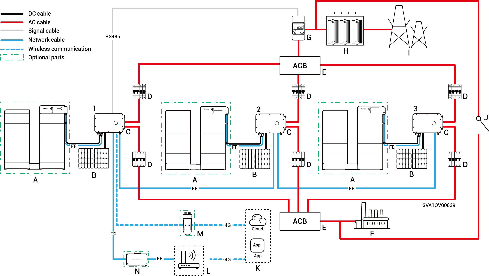

# System wiring introduction

* Our products can be used in C\&I on-grid solar systems. The on-grid solar system consists of PV strings, inverters, distribution panels, and other components.
* C\&I PV storage systems primarily store direct current generated by PV panels in battery packs. They can also convert power from both PV panels and battery packs into alternating current to supply loads or feed into the grid.
* In off-grid solar systems, the inverter must handle the entire load power.While inverters possess short-term overload capability to meet transient overload demands (for example, motor starting), exceeding these limits triggers a protective shutdown. Additionally, high ambient temperatures cause inverter power derating. If the derated output power persistently falls below load requirements, this will also activate protective shutdowns.
  * System Design Suggestions:
    1. Overload Matching: Ensure load starting power/duration remains below the inverter's short-term overload capability.
    2. Power Rating Adaptation: Continuous load operating power must be lower than the inverter's actual output power under extreme ambient temperatures.
    3. Environmental Compensation: Account for power derating effects from altitude and solar irradiance; provide sufficient design margin.

### Non-backup **wiring diagram (number of inverters < 100)**

<figure><figcaption></figcaption></figure>

<table data-header-hidden><thead><tr><th width="169" valign="top"></th><th width="133.6666259765625" valign="top"></th><th width="121" valign="top"></th><th width="156.77783203125" valign="top"></th><th valign="top"></th></tr></thead><tbody><tr><td valign="top">A. Battery</td><td valign="top">B. PV panel</td><td valign="top">C. Inverter</td><td valign="top">D. AC Switch (Depends on load power)</td><td valign="top">E. Power sensor</td></tr><tr><td valign="top">F. Box-type substation</td><td valign="top">G. Power grid</td><td valign="top">H. mySigen</td><td valign="top">I. Router</td><td valign="top">J. CommMod</td></tr><tr><td valign="top">K. CommBridge</td><td valign="top"></td><td valign="top"></td><td valign="top"></td><td valign="top"></td></tr></tbody></table>



* <mark style="color:blue;">Each inverter must be equipped with an AC switch, and multiple inverters cannot be connected to one AC switch at the same time.</mark>
* <mark style="color:blue;">The rated voltage of the AC switch</mark> <mark style="color:blue;">(D) co</mark><mark style="color:blue;">nnected to each inverter must be ≥ 500 Va.c., The recommended specifications for the rated current are as follows:</mark>
  * <mark style="color:blue;">For inverters with a power rating of 50 kW or 60 kW: rated current is 125 A</mark>
  * <mark style="color:blue;">For inverters with a power rating of 75 kW or 80 kW: rated current is 160 A</mark>
  * <mark style="color:blue;">For inverters with a power rating of 99.9 kW or 100 kW: rated current is 200 A</mark>
  * <mark style="color:blue;">For inverters with a power rating of 110 kW or 125 kW: rated current is 250 A</mark>
* <mark style="color:blue;">It is recommended to use Fast Ethernet and WLAN for communication with inverters. When free 4G traffic of CommMod</mark> <mark style="color:blue;">(J)</mark> <mark style="color:blue;">runs out, users must replace an SIM card.</mark>

### Backup Power Networking Diagram (When HYB model is configure with an external Gateway, Inverters ≤ 50 units)

<figure><figcaption></figcaption></figure>

<table data-header-hidden><thead><tr><th valign="middle"></th><th width="161.2222900390625" valign="middle"></th><th valign="middle"></th><th valign="middle"></th><th valign="middle"></th><th data-hidden></th></tr></thead><tbody><tr><td valign="middle">A. Battery</td><td valign="middle">B. PV panel</td><td valign="middle">C. Inverter </td><td valign="middle">D. Gateway</td><td valign="middle">E. Generator</td><td></td></tr><tr><td valign="middle">F. Smart load</td><td valign="middle">G. Backup load</td><td valign="middle">H. Power grid</td><td valign="middle">I. mySigen</td><td valign="middle">J. Router</td><td></td></tr><tr><td valign="middle">K. CommMod</td><td valign="middle">L. CommBridge</td><td valign="middle"></td><td valign="middle"></td><td valign="middle"></td><td></td></tr></tbody></table>



* <mark style="color:blue;">As a backup energy source for long-term off-grid applications, the generator (E) can work in tandem with the Gateway (D) to provide a smooth transition between PV, storage and diesel generation.</mark>
* <mark style="color:blue;">It is recommended to use Fast Ethernet and WLAN for communication with inverters. When free 4G traffic of CommMod</mark> <mark style="color:blue;">(K)</mark> <mark style="color:blue;">runs out, users must replace an SIM card.</mark>

### Backup wiring diagram (When HYB model is configure with an internal Gateway, ≤ 3 Units)

<figure><figcaption></figcaption></figure>

<table data-header-hidden><thead><tr><th valign="middle"></th><th valign="middle"></th><th width="159" valign="middle"></th><th width="147" valign="top"></th><th valign="top"></th></tr></thead><tbody><tr><td valign="middle">A. Battery</td><td valign="middle">B. PV panel</td><td valign="middle">C. Inverter</td><td valign="top">D. AC Switch (Depends on load power)</td><td valign="top">E. Combiner panel</td></tr><tr><td valign="middle">F. Backup load</td><td valign="middle">G. Power sensor</td><td valign="middle">H. Box-type substation</td><td valign="top">I. Power grid</td><td valign="top">J. Manual control switch</td></tr><tr><td valign="middle">K.mySigen</td><td valign="middle">L. Router</td><td valign="middle">M. CommMod</td><td valign="top">N. CommBridge</td><td valign="top"></td></tr></tbody></table>



* <mark style="color:blue;">Multiple inverters cannot be connected to one AC switch at the same time.</mark>
* <mark style="color:blue;">Every inverter connected to the backup load must use an AC switch  (D) with a rated voltage of ≥500V a.c. The recommended rated current specifications are as follows:</mark>
  * <mark style="color:blue;">For inverters with a power rating of 50 kW: rated current is 100 A</mark>
  * <mark style="color:blue;">For inverters with a power rating of 60 kW: rated current is 125 A</mark>
  * <mark style="color:blue;">For inverters with a power rating of 80 kW: rated current is 160 A</mark>
  * <mark style="color:blue;">For inverters with a power rating of 99.9 kW or 100 kW: rated current is 200 A</mark>
  * <mark style="color:blue;">For inverters with a power rating of 110 kW: rated current is 250 A</mark>
* <mark style="color:blue;">Every inverter connected to the power grid must use an AC switch ( D) with a rated voltage of ≥500V a.c. The recommended rated current specifications are as follows:</mark>
  * <mark style="color:blue;">For inverters with a power rating of 50 kW: rated current is 200 A</mark>
  * <mark style="color:blue;">For inverters with a power rating of 60 kW: rated current is 250 A</mark>
  * <mark style="color:blue;">For inverters with a power rating of 80 kW to 110 kW: rated current is 315 A</mark>
* <mark style="color:blue;">It is recommended to use Fast Ethernet and WLAN for communication with inverters. When free 4G traffic of CommMod (L) runs out, users must replace an SIM card.</mark>
