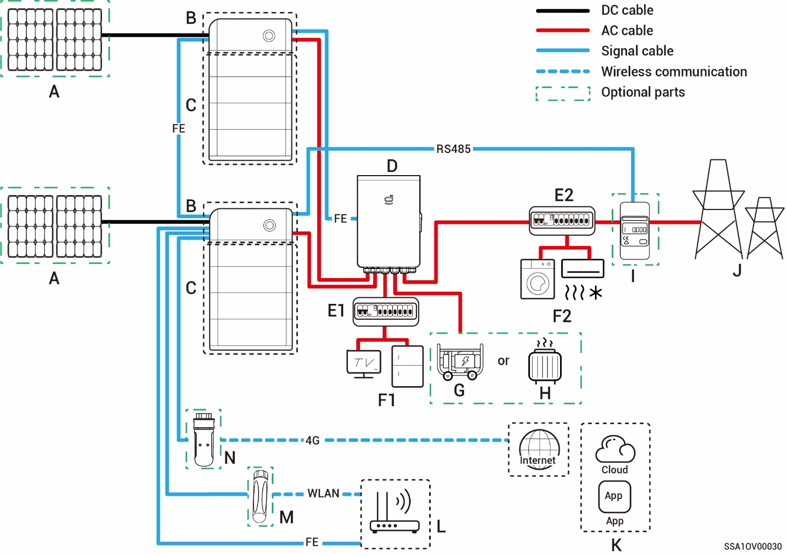
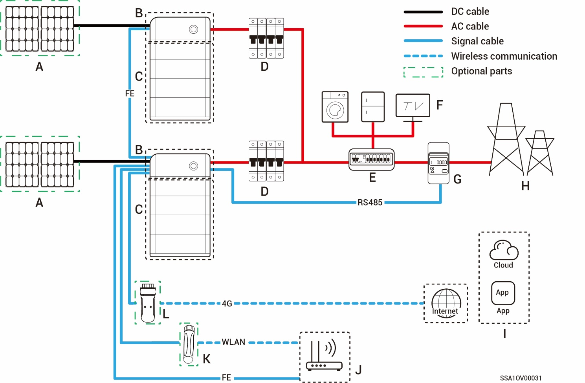

# Typical Networking Introduction

* SigenStor can be used for Home energy storage system. The Home energy storage system consists of photovoltaic panels\[Note], inverters, battery packs, master control switches, Gateway, loads, power grids, etc.
* The main function of Home energy storage system is to store the direct current generated by photovoltaic panels into battery packs. Or alternatively, the electricity in the photovoltaic system and the battery pack can be converted into alternating current for use by the load or incorporated into the grid.

Note: PV panels with functional grounding cable connected cannot be used.



<mark style="color:blue;">Under backup power networking, the duration of off-grid operation of the backup power load is related to the power supply capacity of the PV storage system. If there is an abnormality in the power supply of the PV storage system during off-grid operation (including but not limited to abnormal PV power generation, insufficient battery power, and abnormal power supplies to the diesel generator), the backup power load will still be unable to operate.</mark>

### **Networking Diagram (Whole Home Backup)**

| No.   | Description      | No.   | Description               | No.   | Description       |
| ----- | ---------------- | ----- | ------------------------- | ----- | ----------------- |
| **A** | PV panel         | **B** | SigenStor EC              | **C** | SigenStor BAT     |
| **D** | Gateway          | **E** | Backup Distribution panel | **F** | Backup Home loads |
| **G** | Diesel generator | **H** | Smart loads               | **I** | Power grid        |
| **J** | mySigen          | **K** | Router                    | **L** | Antenna           |
| **M** | CommMod          |       |                           |       |                   |



* <mark style="color:blue;">As a backup energy source for long-term off-grid applications, the diesel generator can work in tandem with the Gateway to provide a smooth transition between PV, storage and diesel power generation.</mark>
* <mark style="color:blue;">All the power equipment in the owner's home can be connected as smart loads. To ensure that this product maximizes the benefits to users, it is recommended that the high-power equipment be connected as smart loads (heat pumps, pool heaters, clothes dryers, immersion heaters, etc.), which can be cut off when the energy storage system has low power. Other low-power equipment are connected as home loads (lights, routers, etc.)</mark> <mark style="color:blue;">The maximum power for an immersion heater should be ≤ 17.6 kW/80 A.</mark>
* <mark style="color:blue;">It is recommended to use Fast Ethernet and WLAN for communication with inverters. If 4G communication is used, you must purchase Sigen CommMod separately. When free 4G traffic of CommMod runs out, users must top up their accounts or replace an SIM card.</mark>

### **Networking Diagram (Partial Home Backup)**

| No.    | Description       | No.    | Description               | No.    | Description                   |
| ------ | ----------------- | ------ | ------------------------- | ------ | ----------------------------- |
| **A**  | PV panel          | **B**  | SigenStor EC              | **C**  | SigenStor BAT                 |
| **D**  | Gateway           | **E1** | Backup Distribution panel | **E2** | Non-Backup Distribution panel |
| **F1** | Backup Home loads | **F2** | Non-Backup Home loads     | **G**  | Diesel Generator              |
| **H**  | Smart loads       | **I**  | Power sensor              | **J**  | Power grid                    |
| **K**  | mySigen           | **L**  | Router                    | **M**  | Antenna                       |
| **N**  | CommMod           |        |                           |        |                               |



* <mark style="color:blue;">As a backup energy source for long-term off-grid applications, the diesel generator can work in tandem with the Gateway to provide a smooth transition between PV, storage and diesel power generation.</mark>
* <mark style="color:blue;">All the power equipment in the owner's home can be connected as smart loads. To ensure that this product maximizes the benefits to users, it is recommended that the high-power equipment be connected as smart loads (heat pumps, pool heaters, clothes dryers, immersion heaters, etc.), which can be cut off when the energy storage system has low power. Other low-power equipment are connected as home loads (lights, routers, etc.)</mark> <mark style="color:blue;">The maximum power for an immersion heater should be ≤ 17.6 kW/80 A.</mark>
* <mark style="color:blue;">Power sensor has the function of data acquisition for grid connection points enables zero-power grid connection. For partial home backup, Power sensor does not need to be configured. For partial backup power and zero-power grid connection control networking, Power sensor is configured.</mark>
* <mark style="color:blue;">It is recommended to use Fast Ethernet and WLAN for communication with inverters. If 4G communication is used, you must purchase Sigen CommMod separately. When free 4G traffic of CommMod runs out, users must top up their accounts or replace an SIM card.</mark>

### **Networking Diagram (Non-backup Networking)**

| No.   | Description  | No.   | Description        | No.   | Description   |
| ----- | ------------ | ----- | ------------------ | ----- | ------------- |
| **A** | PV panel     | **B** | SigenStor EC       | **C** | SigenStor BAT |
| **D** | AC switch    | **E** | Distribution panel | **F** | Home loads    |
| **G** | Power sensor | **H** | Power grid         | **I** | mySigen       |
| **J** | Router       | **K** | Antenna            | **L** | CommMod       |



* <mark style="color:blue;">**SigenStor-(5S, 6S) Series:**</mark> <mark style="color:blue;">the rated voltage of the AC switch connected to each inverter should be ≥ 240 Va.c. and the rated current is 40 A.</mark>
* <mark style="color:blue;">**SigenStor-(5T–30T) Series:**</mark> <mark style="color:blue;">the rated voltage of the AC switch connected to each inverter should be ≥ 380 Va.c., and the rated current is recommended:</mark>
  * <mark style="color:blue;">SigenStor-5T Series: The rated current is 25 A</mark>
  * <mark style="color:blue;">SigenStor-(10T-15T) Series: The rated current is 32 A</mark>
  * <mark style="color:blue;">SigenStor-20T Series: The rated current is 40 A</mark>
  * <mark style="color:blue;">SigenStor-25T Series: The rated current is 50 A</mark>
  * <mark style="color:blue;">SigenStor-30T Series: The rated current is 63 A</mark>
* <mark style="color:blue;">It is recommended to use Fast Ethernet and WLAN for communication with inverters. If 4G communication is used, you must purchase Sigen CommMod separately. When free 4G traffic of CommMod runs out, users must top up their accounts or replace an SIM card.</mark>
* <mark style="color:blue;">**SigenStor-(5S, 6S) Series:**</mark> <mark style="color:blue;">the rated voltage of the AC switch of the distribution panel should be not less than 240 Va.c., and the rated current is recommended, that is, not less than the maximum output current of an inverter × the number of inverters in parallel connection × 1.25\[1].</mark>
* <mark style="color:blue;">**SigenStor-(5T–30T) Series:**</mark> <mark style="color:blue;">the rated voltage of the AC switch of the distribution panel should be not less than 380 Va.c., and the rated current is recommended, that is, not less than the maximum output current of an inverter × the number of inverters in parallel connection × 1.25\[1].</mark>

Note \[1]: The maximum output current of an inverter can be found in its respective data sheet.
