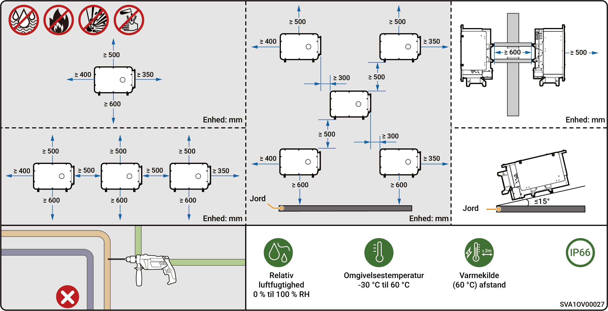
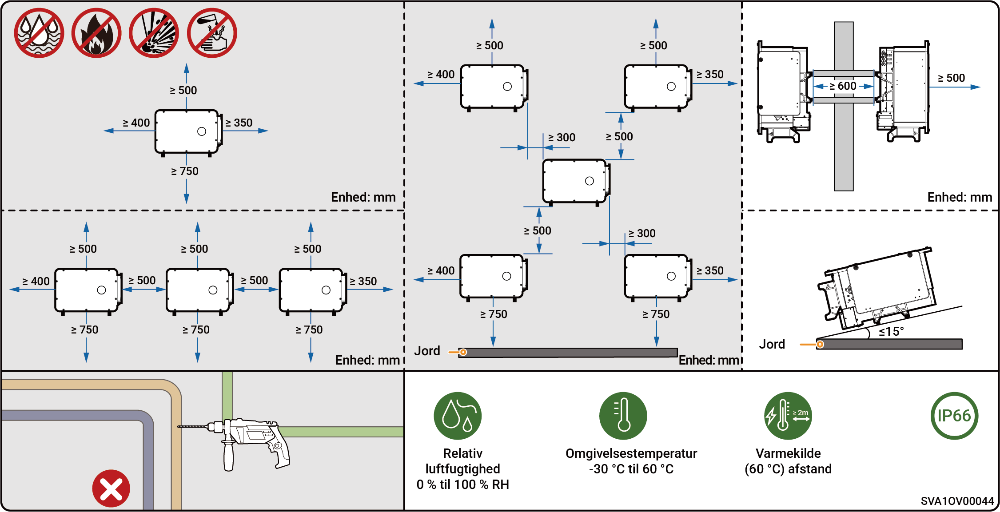
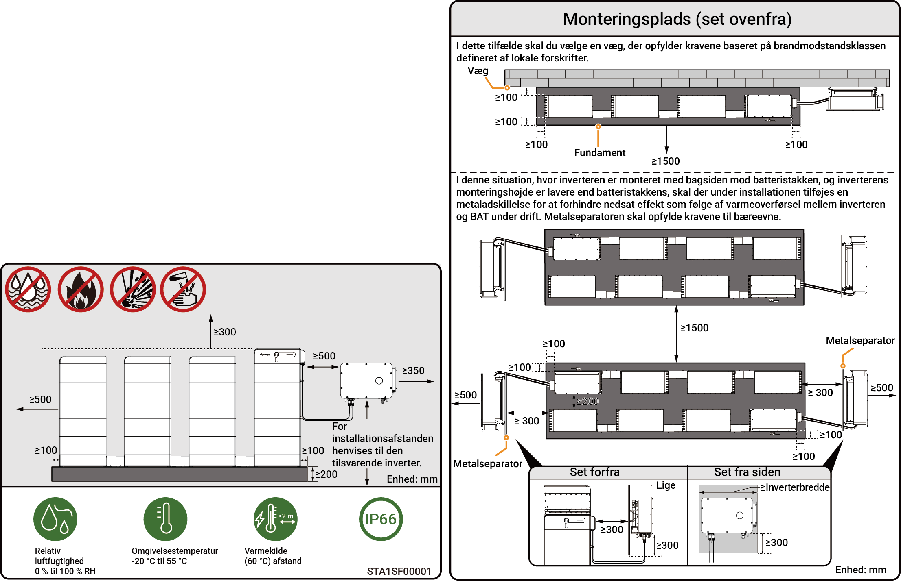

# Placeringskrav



* <mark style="color:blue;">Før installation af udstyret bedes du sørge for at læse følgende installationskrav omhyggeligt. Virksomheden er ikke ansvarlig for funktionsfejl eller skader, som opstår som følge af udstyrets drift, hvis installationskravene ikke overholdes, selv i tilfælde, der medfører personskade.</mark>
* <mark style="color:blue;">Under den faktiske installation skal valget af installationssted overholde lokale brandbekæmpelses-, miljøbeskyttelsesbestemmelser og andre relevante love. Den specifikke planlægning af installationsstedet skal være underlagt installatøren eller ingeniør-, købs- og konstruktionskontrakterne (EPC).</mark>

### **Installationsmiljøkrav**

* Installer ikke udstyret i et røgfyldt, brandfarligt eller eksplosivt miljø.
* Installer ikke udstyret i et miljø med ledende metalstøv eller magnetisk støv.
* Installer ikke udstyret i et miljø, der er udsat for skimmel og svamp.
* Undgå at udsætte udstyret for direkte sollys, regn, stillestående vand, sne eller støv. Installer udstyret på et beskyttet sted. Træf forebyggende foranstaltninger i betjeningsområder, der er udsat for naturkatastrofer som oversvømmelser, jordskred, jordskælv og tyfoner.
* Installer ikke udstyret i et miljø med kraftig elektromagnetisk interferens.
* Temperaturen og luftfugtigheden i installationsmiljøet skal leve op til udstyrets krav.
* Udstyret skal installeres i et område, der er mindst 500 m væk fra korrosionskilder, som kan forårsage salt- eller syreskader (korrosionskilder omfatter, men er ikke begrænset til, kystområder, termiske kraftværker, kemikaliefabrikker, smelteværker, kulkraftværker, gummifabrikker og galvaniseringsanlæg).
* I områder med gode marine forhold (f.eks. Norge, hvor saltholdigheden tæt på kysten er ≤ 28 psu), kan monteringsafstanden for enheden fra kystlinjen passende lempes til ≥ 200 m.
* Hvis enhedens udvendige overflade er beskadiget, skal enheden males snarest muligt.

### **Krav til installationssted**

* Vip ikke udstyret, og placer det ikke på hovedet. Sørg for, at udstyret installeres vandret.
* Installer ikke udstyret på et sted med brandfare eller, hvor der er risiko for fugt.
* Installer ikke udstyret i et lukket, dårligt ventileret område uden brandbeskyttelsesforanstaltninger og med vanskelig adgang for brandvæsenet.
* Installer ikke udstyret under vandkilder, herunder men ikke begrænset til vandrør og udluftningsvinduer til aircondition, hvor der kan forekomme kondens eller vandskade. Ellers kan væske trænge ind i udstyret og forårsage kortslutning.
* Installer ikke udstyret i mobile scenarier såsom autocampere, krydstogtskibe og tog.
* Udstyret bliver varmt, når det er i drift. Hvis udstyret installeres indendørs, skal der sikres god ventilation, og indendørstemperaturen må ikke stige med mere end 3 °C, mens udstyret er i drift. Ellers vil udstyret blive nedgraderet.
* Udstyret genererer varme, når det er i drift. Installer ikke udstyret i områder, der let kan nås af varmespredningsflader.
* Det anbefales at installere udstyret et sted, hvor du nemt kan få adgang til, installere, betjene, vedligeholde det og se indikatorstatus.
* Omskiftningen mellem nettilsluttet og frakoblet drift støjer. Det anbefales, at udstyret installeres nær AC-fordelertavlen, væk fra opholdsområdet.
* Den anbefalede længde for AC-kablet mellem inverteren og den opstrøms transformer er ≤ 600 meter. Hvis længden overstiger 600 meter, kan det påvirke den parallelle drift af inverterne. Kontakt Sigenergy for yderligere rådgivning.

### **Krav til installationsbase**

* Installer ikke udstyret på en brandfarlig base.
* Installationsbasen skal opfylde kravene til bæreevne og skal være fri for ugunstige geologiske forhold, herunder men ikke begrænset til gummimembraner og blød jord. Massive murstens- og betonstrukturer samt betonvægge anbefales.
* Installationsbasen skal være plan, og installationsområdet skal leve op til kravene til installationspladsen.
* Der må ikke være nogen VVS- eller elektriske installationer inde i monteringsbasen for at undgå potentielle borefarer under installation af udstyret.
* Hvis udstyret er installeret et offentligt sted uden for arbejds- og opholdsområder (såsom parkeringspladser, stationer, fabrikker osv.), bør der installeres et beskyttelsesnet udenfor udstyret og opsættes sikkerhedsadvarselsskilte for isolation. Tillad ikke uvedkommende personer at nærme sig inverteren for at undgå personskade eller skade på ejendom forårsaget af utilsigtet berøring fra ikke-professionelt personale eller andre årsager under udstyrets drift.



* <mark style="color:blue;">For at sikre optimal ydeevne af enheden anbefales det, at installationsafstanden mellem enheden og omkringliggende forhindringer planlægges efter diagrammet. Hvis installationsstedet er godt ventileret, kan den optimale løsning implementeres baseret på de faktiske forhold.</mark>
* <mark style="color:blue;">For at lette efterfølgende vedligeholdelse (såsom rutinetjek eller demontering af blæseren) anbefales det, at der reserveres en friplads på mindst 400 mm på venstre side af enheden.</mark>

### Installationsscenarie kun med solceller (modeller kun med solceller (PV) og HYA)

<figure><figcaption></figcaption></figure>

### Installationsscenarie kun med solceller (PV) (HYB-modeller)

<figure><figcaption></figcaption></figure>



* <mark style="color:blue;">For at sikre optimal ydeevne af enheden anbefales det, at installationsafstanden mellem enheden og omkringliggende forhindringer planlægges efter diagrammet. Hvis installationsstedet er godt ventileret, kan den optimale løsning implementeres baseret på de faktiske forhold.</mark>
* <mark style="color:blue;">For at sikre uhindret adgang for installationsværktøj (såsom løfteudstyr eller gaffeltruck) anbefales det, at der reserveres en friplads på mindst 1500 mm foran batteriklyngen, hvilket kan justeres ud fra de faktiske forhold.</mark>
* <mark style="color:blue;">Efter installationen skal du sikre, at der ikke ophobes vand i bunden af enheden, og om nødvendigt tilføje afløbskanaler.</mark>

### Installationsscenario med PV-lagring

<figure><figcaption></figcaption></figure>
