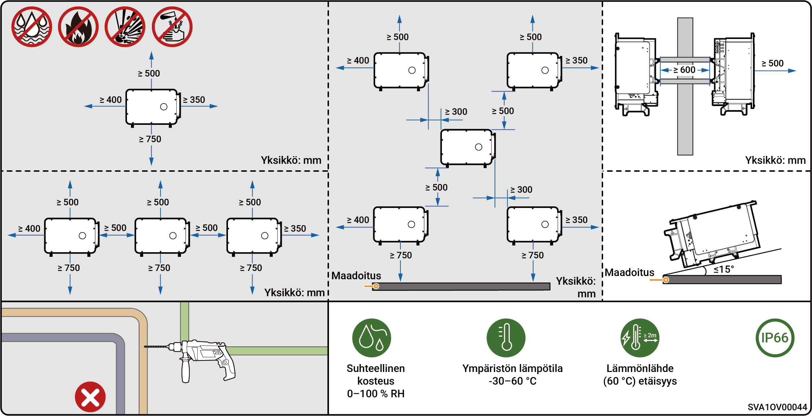
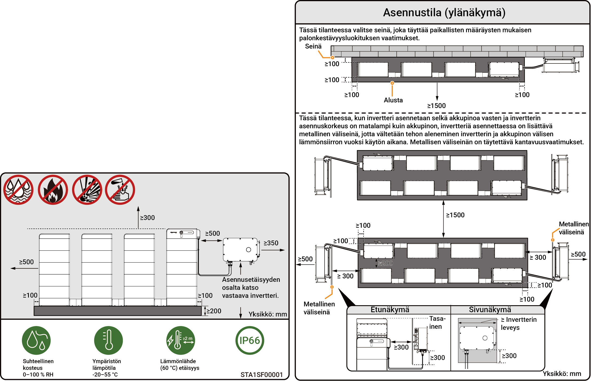

# Sijaintivaatimukset



* <mark style="color:blue;">Ennen laitteen asentamista lue huolellisesti seuraavat asennusvaatimukset. Yritys ei ole vastuussa laitteen toiminnasta johtuvista toimintahäiriöistä tai vahingoista, jos asennusvaatimuksia ei ole noudatettu, edes niissä tapauksissa, jotka johtavat henkilövahinkoihin.</mark>
* <mark style="color:blue;">Varsinaisen asennuksen aikana asennuspaikan valinnantulee täyttää paikalliset palontorjunta- ja ympäristönsuojelumääräykset ja muut asiaankuuluvat lait. Asennuspaikan tarkka suunnittelu on tehtävä asennus- tai suunnittelu-, hankinta- ja rakentamissopimusten (EPC) mukaisesti.</mark>

### **Asennusympäristövaatimukset**

* Älä asenna laitetta savuiseen, syttyvään tai räjähdysherkkään ympäristöön.
* Älä asenna laitetta ympäristöön, jossa on johtavaa metallipölyä tai magneettista pölyä.
* Älä asenna laitetta ympäristöön, joka on altis homeelle ja sienille.
* Vältä altistamasta laitetta suoralle auringonpaisteelle, sateelle, seisovalle vedelle, lumelle tai pölylle. Asenna laitteisto suojattuun paikkaan. Ryhdy ennaltaehkäiseviin toimenpiteisiin alueilla, jotka ovat alttiita luonnonkatastrofeille, kuten tulville, mutavyöryille, maanjäristyksille ja taifuuneille.
* Älä asenna laitetta ympäristöön, jossa on voimakkaita sähkömagneettisia häiriöitä.
* Asennusympäristön lämpötilan ja kosteuden on vastattava laitteen vaatimuksia.
* Laite tulee asentaa vähintään 500 metrin etäisyydelle korroosiolähteistä, jotka voivat aiheuttaa suola- tai happovaurioita (korroosiolähteitä ovat, näihin kuitenkaan rajoittumatta, merenranta-alueet, lämpövoimalaitokset, kemianlaitokset, sulatot, hiililaitokset, kumitehtaat ja galvanoimislaitokset).
* Alueilla, joilla on hyvät meriolosuhteet (kuten Norjassa, jossa rannikon lähellä oleva suolapitoisuus on ≤ 28 psu), laitteen asennusetäisyys rannikosta voi olla ≥ 200 m.
* Jos laitteen ulkopinta on vaurioitunut, maalaa laite uudelleen ajoissa.

### **Asennuspaikkavaatimukset**

* Älä kallista laitetta tai aseta sitä ylösalaisin. Varmista, että laite on asennettu vaakasuoraan.
* Älä asenna laitetta palovaaralliseen tai kosteaan paikkaan.
* Älä asenna laitetta suljettuun, huonosti tuulettuvaan tilaan, jossa ei ole paloturvallisuustoimia ja johon palomiehet eivät pääse.
* Älä asenna laitetta vesilähteiden alle, mukaan lukien mutta ei rajoittuen vesiputkiin ja ilmastointilaitteen poistoikkunoihin, joissa voi esiintyä kondensaatiota tai vesivuotoja. Muuten neste saattaa päästä laitteeseen ja aiheuttaa oikosulun.
* Älä asenna laitetta liikkuviin kohteisiin, kuten matkailuautoihin, risteilyaluksiin tai juniin.
* Laite on kuuma käytön aikana. Jos laite asennetaan sisätiloihin, varmista hyvä ilmanvaihto ja vältä merkittävää, yli 3 °C:n lämpötilan nousua laitteen käytön aikana. Muuten laitteen teho heikkenee.
* Laite tuottaa lämpöä käytön aikana. Älä asenna laitetta paikkoihin, jotka ovat lähellä lämpöä haihduttavia pintoja.
* Suositellaan asentamaan laite paikkaan, jossa siihen on helppo päästä käsiksi, asentaa, käyttää, huoltaa ja jossa merkkivalojen tila on helposti nähtävissä.
* On-grid/off-grid-vaihto aiheuttaa melua. Laite suositellaan asennettavaksi AC-jakokeskuksen lähelle, pois lepoalueelta.
* Suositeltu pituus AC-kaapelille invertterin ja ylävirran muuntajan välillä on ≤ 600 metriä. Jos pituus ylittää 600 m, se saattaa vaikuttaa inverttereiden rinnakkaiskäyttöön. Ota yhteyttä Sigenergyyn lisäohjeiden saamiseksi.

### **Asennusalustan vaatimukset**

* Älä asenna laitetta syttyvälle alustalle.
* Asennusalustan on täytettävä kantavuusvaatimukset ja sen on oltava vapaa haitallisista geologisista olosuhteista, mukaan lukien, mutta ei rajoittuen, kumirouhealusta tai pehmeä maaperä. Suositellaan kiinteitä tiili-betonirakenteita ja betoniseiniä.
* Asennusalustan tulee olla tasainen, ja asennusalueen tulee täyttää asennustilavaatimukset.
* Asennusalustan sisällä ei saa olla putki- tai sähköasennuksia, jotta vältetään mahdolliset porausvaarat laitteen asennuksen aikana.
* Jos laite asennetaan julkiselle alueelle, joka ei ole työ- tai asuinalue (esim. parkkipaikat, asemat, tehtaat jne.), asenna laitteen ulkopuolelle suojaverkko ja pystytä eristystä osoittavat varoituskyltit. Älä salli ulkopuolisten henkilöiden lähestyä invertteriä, jotta vältetään henkilövahingot tai omaisuusvahingot, joita voi aiheutua ei-ammattilaisten tahattomasta kosketuksesta tai muista syistä laitteen käytön aikana.



* <mark style="color:blue;">Jotta laitteen optimaalinen suorituskyky varmistetaan, suositellaan, että laitteen ja ympäröivien esteiden välinen asennusetäisyys suunnitellaan kaavion mukaisesti. Jos asennuspaikka on hyvin tuulettuva, optimaalinen ratkaisu voidaan ottaa käyttöön todellisten olosuhteiden perusteella.</mark>
* <mark style="color:blue;">Jatkohuollon (esim. rutiinitarkastus tai tuulettimen purkaminen) helpottamiseksi suositellaan, että laitteen vasemmalle puolelle jätetään vähintään 400 mm:n vapaa tila.</mark>

### Pelkästään PV:n asennus (pelkästään PV ja HYA-mallit)

<figure><figcaption></figcaption></figure>

### Pelkästään PV:n asennus (HYB-mallit)

<figure><figcaption></figcaption></figure>



* <mark style="color:blue;">Jotta laitteen optimaalinen suorituskyky varmistetaan, suositellaan, että laitteen ja ympäröivien esteiden välinen asennusetäisyys suunnitellaan kaavion mukaisesti. Jos asennuspaikka on hyvin tuulettuva, optimaalinen ratkaisu voidaan ottaa käyttöön todellisten olosuhteiden perusteella.</mark>
* <mark style="color:blue;">Asennustyökalujen (esim. nostovälineiden tai haarukkatrukkien) esteettömän pääsyn varmistamiseksi suositellaan, että akkuryhmän eteen varataan vähintään 1500 mm:n vapaa tila; tätä voidaan säätää todellisten olosuhteiden mukaan.</mark>
* <mark style="color:blue;">Asennuksen jälkeen varmista, ettei laitteen pohjalle kerry vettä, ja lisää tarvittaessa vedenpoistokanavia.</mark>

### PV:n varastointijärjestelmän asennus

<figure><figcaption></figcaption></figure>
