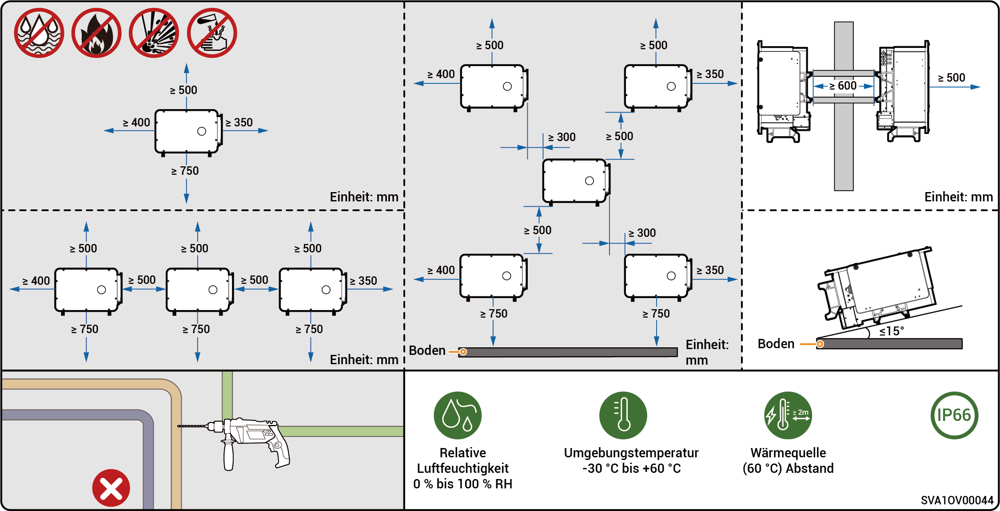
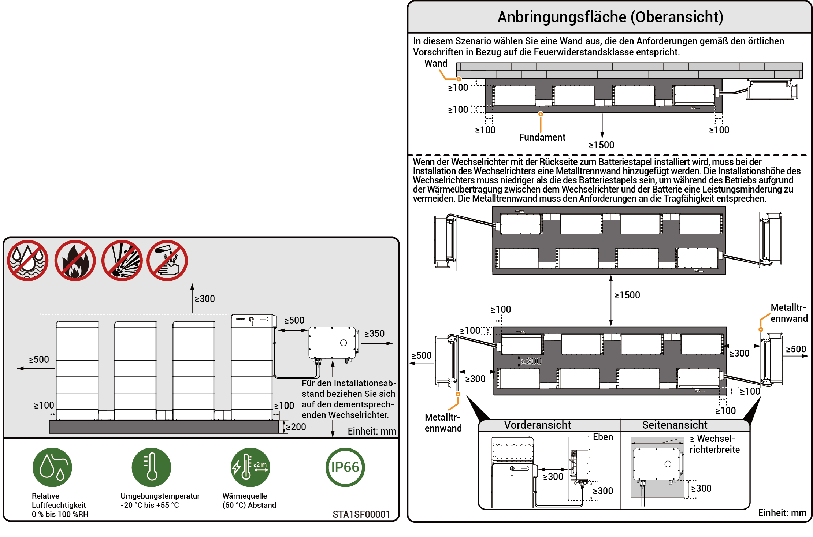

# Anforderungen an den Standort



* <mark style="color:blue;">Bevor Sie das Gerät installieren, lesen Sie bitte die nachfolgenden Installationsanforderungen sorgfältig durch. Das Unternehmen haftet nicht für Funktionsstörungen oder Schäden aufgrund des Gerätebetriebs, verursacht durch die Nichtbefolgung der Installationsvorschriften, auch nicht in Fällen, die zu Zwischenfällen mit Personenschäden führen.</mark>
* <mark style="color:blue;">Die Auswahl des Installationsstandorts sollte während der tatsächlichen Installation den örtlichen Brand- und Umweltschutzrichtlinien sowie weitere dementsprechende Gesetze beachten. Die spezifische Planung des Installationsstandorts sollte den Verträgen mit dem Installations-, Ingenieurs-, Beschaffungs- oder Bauunternehmen (EPC) entsprechen.</mark>

### **Anforderungen an die Installationsumgebung**

* Installieren Sie das Produkt nicht in rauchigen, entzündlichen oder explosionsgefährdeten Umgebungen.
* Installieren Sie das Gerät nicht in einer Umgebung mit leitfähigem Metallstaub oder magnetischem Staub.
* Installieren Sie das Gerät nicht in einer Umgebung, die für Schimmel und Pilze anfällig ist.
* Setzen Sie das Produkt nicht direktem Sonnenlicht, Regen, stehendem Wasser, Schnee oder Staub aus. Installieren Sie das Produkt an einem geschützten Ort. Ergreifen Sie Schutzmaßnahmen in Betriebsumgebungen, die für Naturkatastrophen wie Überschwemmungen, Schlammlawinen, Erdbeben und Taifune anfällig sind.
* Installieren Sie das Produkt nicht in einer Umgebung mit starken elektromagnetischen Störungen.
* Die Temperatur und die Luftfeuchtigkeit der Installationsumgebung sollten den Geräteanforderungen entsprechen.
* Das Produkt sollte in einem Bereich installiert werden, der mindestens 500 m von Korrosionsquellen entfernt ist, die zu Salz- oder Säureschäden führen können (zu den Korrosionsquellen gehören u. a. Meeresküsten, Wärmekraftwerke, chemische Anlagen, Schmelzwerke, Kohleanlagen, Gummifabriken und Galvanisierungsanlagen).
* In Gebieten mit guter Meeresumgebung (wie z. B. Norwegen, wo die küstennahe Salinität ≤ 28 psu beträgt) kann der Montageabstand des Geräts zur Küstenlinie angemessen auf ≥ 200 m gelockert werden.\
  Wenn die Außenoberfläche des Geräts beschädigt ist, lackieren Sie das Gerät bitte zeitnah neu.

### **Anforderungen an den Installationsstandort**

* Das Gerät nicht neigen oder auf den Kopf stellen. Stellen Sie sicher, dass das Gerät horizontal installiert wird.
* Installieren Sie das Gerät nicht an einem feuergefährdeten oder feuchtigkeitsanfälligen Ort.
* Installieren Sie das Gerät nicht an einem geschlossenen, schlecht belüfteten Ort ohne Brandschutzmaßnahmen und mit erschwertem Zugang für die Feuerwehr.
* Installieren Sie das Gerät nicht unter Wasserquellen, einschließlich jedoch nicht beschränkt auf Wasserleitungen und Auslassfenster der Klimaanlage, an denen Kondensat oder Wasser austreten kann. Ansonsten kann Flüssigkeit in das Gerät eintreten und einen Kurzschluss verursachen.
* Installieren Sie das Produkt nicht in mobilen Szenarien wie Wohnmobile, Kreuzfahrtschiffe und Züge.
* Das Gerät wird während des Betriebs heiß. Wenn das Gerät in einem Innenraum aufgestellt wird, sorgen Sie bitte für gute Innenraumbelüftung und vermeiden Sie während des Gerätebetriebs im Innenraum erhebliche Temperaturanstiege um mehr als 3 °C. Ist dies nicht der Fall, wird die Leistung des Gerätes reduziert.
* Das Gerät erzeugt während des Betriebs Hitze. Um eine bessere Wärmeabgabe sicherzustellen, stellen Sie bitte das Gerät nicht in der Nähe von Wärmeableitungsflächen auf.
* Es wird empfohlen, das Gerät so zu installieren, dass es gut zugänglich, leicht zu bedienen und zu warten ist und dass die Statusanzeigen gut sichtbar sind.
* Die Umschaltung vom netzgebundenen zum netzunabhängigen Betrieb verursacht Geräusche. Es wird empfohlen, das Gerät in der Nähe eines Klimaanlagen-Verteilerkastens zu installieren, fern von Ruhebereichen.
* Die empfohlene Länge des AC-Stromkabels zwischen dem Wechselrichter und dem vorgeschalteten Transformator sollte ≤ 600 Meter betragen. Wenn die Länge 600 Meter überschreitet, kann dies Auswirkungen auf den Parallelbetrieb der Wechselrichter haben. Bitte Sigenergy für weiteren Rat kontaktieren.

### **Anforderungen an die Installationsbasis**

* Installieren Sie das Gerät nicht auf einem brennbaren Untergrund.
* Die Installationsbasis muss den lasttragenden Anforderungen entsprechen und sollte frei von nachteiligen geologischen Zuständen sein, einschließlich jedoch nicht beschränkt auf Gummiboden und weichen Boden. Empfohlen wird eine stabile Ziegel-Beton-Struktur oder Betonwände.
* Der Installationsuntergrund sollte flach sein und der Installationsbereich sollte die Anforderungen an den Installationsraum erfüllen.
* Innerhalb des Installationsuntergrunds sollten sich keine Rohrleitungen oder elektrischen Leitungen befinden, um während der Geräteinstallation mögliche Gefahren beim Bohren zu vermeiden.
* Wenn das Geröt an einem öffentlichen Ort (z. B. Parkplätze, Stationen, Fabriken usw.) installiert wird, installieren Sie bitte ein Schutznetz außerhalb des Geräts und stellen Sie zur Abschirmung Warnschilder auf. Lassen Sie keine unbefugte Person sich dem Wechselrichter nähern, um Verletzungen und Eigentumsverlust durch versehentlichen Kontakt duch Laien oder aus anderen Gründen während des Gerätebetriebs zu vermeiden.



* <mark style="color:$primary;">Um die optimale Leistung des Geräts zu gewährleisten, wird empfohlen, den Montageabstand zwischen dem Gerät und umgebenden Hindernissen gemäß der Zeichnung zu planen. Wenn der Aufstellort gut belüftet ist, kann die optimale Lösung basierend auf den tatsächlichen Gegebenheiten umgesetzt werden.</mark>
* <mark style="color:$primary;">Um nachfolgende Wartungsarbeiten (wie Routinekontrollen oder den Austausch des Lüfters) zu erleichtern, wird empfohlen, links vom Gerät einen Freiraum von mindestens 400 mm vorzusehen.</mark>

### Nur PV-Installationsszenario

<figure><figcaption></figcaption></figure>

### PV-Speicherinstallationsszenario

<figure><figcaption></figcaption></figure>



* <mark style="color:$primary;">Um die optimale Leistung des Geräts zu gewährleisten, wird empfohlen, den Montageabstand zwischen dem Gerät und umgebenden Hindernissen anhand der Zeichnung zu planen. Wenn der Aufstellort gut belüftet ist, kann die optimale Lösung basierend auf den tatsächlichen Gegebenheiten umgesetzt werden.</mark>
* <mark style="color:$primary;">Um einen uneingeschränkten Zugang für Montagewerkzeuge (wie Hebezeuge oder Gabelstapler) zu gewährleisten, wird empfohlen, vor dem Batteriecluster einen Freiraum von mindestens 1500 mm vorzusehen, der an die tatsächlichen Gegebenheiten angepasst werden kann.</mark>
* <mark style="color:$primary;">Stellen Sie nach der Installation sicher, dass sich am Boden des Geräts kein Wasser ansammelt, und fügen Sie falls erforderlich Entwässerungskanäle hinzu.</mark>

### PV-Speicher-Installationsszenario

<figure><figcaption></figcaption></figure>
