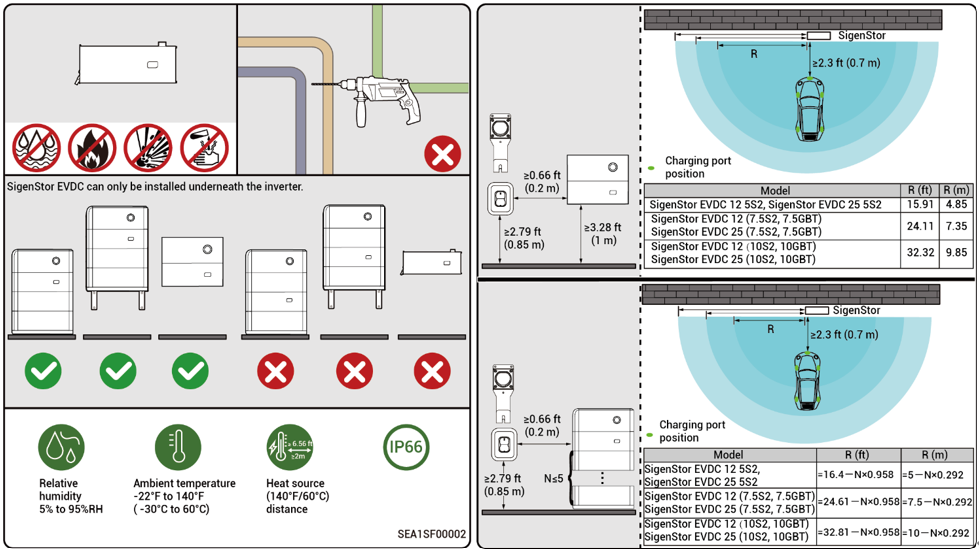

# Location Requirements



* <mark style="color:blue;">The warranty applies when the equipment has been installed properly for its intended use and in accordance with the operating instructions.</mark>
* <mark style="color:blue;">During actual installation, the selection of installation location should comply with local firefighting, environmental protection regulations, and other relevant laws. The specific installation location planning should be subject to the installer or engineering, procurement, and construction (EPC) contracts.</mark>

### **Installation Environment Requirements**

* Do not install the equipment in smoky, flammable, or explosive environment.
* Avoid exposing the equipment to direct sunlight, rain, standing water, snow, or dust. It is suggested to install the equipment in a sheltered place. Take preventive measures in operating areas prone to natural disasters such as floods, mudslides, earthquakes, and typhoons.
* Do not install the equipment in an environment with strong electromagnetic interference.
* The temperature and humidity of the installation environment should meet equipment requirements.
* The equipment should be installed in an area that is at least 1640.42 ft (500 m) away from corrosion sources that may result in salt damage or acid damage. Corrosion sources include but are not limited to seaside, thermal power plants, chemical plants, smelters, coal plants, rubber plants, and electroplating plants.

### **Installation Position Requirements**

* Do not tilt the equipment or place it upside down. Ensure that the equipment is horizontally installed.
* Do not install the equipment in places easily touched by children.
* Do not install the equipment in a place with fire hazards or is prone to moisturizing.
* The equipment produces sound when it is operating. Please install the equipment in a place with appropriate distance at which there is no impact to daily work and life.
* Do not install the equipment in a sealed, poorly ventilated location without fire protection measures and inaccessible for firefighters.
* The equipment is hot when it is operating. If the equipment is installed indoors, please ensure good indoor ventilation and avoid significant indoor temperature rise by more than 37.4°F (3℃) while the equipment is operating. Otherwise, the equipment will be derated.
* Do not install the equipment in mobile scenarios such as recreational vehicles, cruise ships, and trains.
* It is recommended to install the equipment in a location where you can easily access, install, operate, and maintain it, and view the indicator status.
* Do not place the equipment in the vehicle passage when installed in a garage to avoid collisions.
* Install the equipment near the parking space. Refer to the figure for the installation distance.

### **Mounting surface**

* Do not install the equipment on a flammable base.
* The installation base should meet the load-bearing requirement. Solid brick-concrete structures, concrete walls, and floors are recommended.
* The installation base should be flat, and the installation area should meet the installation space requirements.
* No plumbing or electrical alignments are allowed inside the installation base to avoid potential drilling hazards during equipment installation.

<figure><figcaption></figcaption></figure>



<mark style="color:blue;">There will be errors in the actual distance under different installation environments, and the</mark> <mark style="color:blue;">figure is for reference only.</mark>
