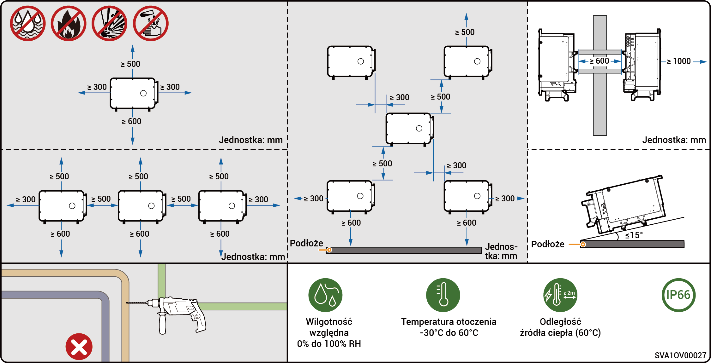
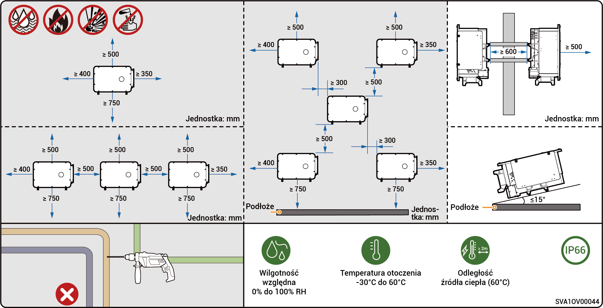

# Wymagania w miejscu użytkowania



* <mark style="color:blue;">Przed zainstalowaniem sprzętu prosimy o dokładne zapoznanie się z poniższymi wymaganiami dotyczącymi instalacji. Firma nie ponosi odpowiedzialności za jakiekolwiek nieprawidłowości w funkcjonowaniu lub szkody powstałe na skutek eksploatacji sprzętu, jeśli nie zostaną spełnione wymagania instalacyjne, nawet w przypadkach prowadzących do wypadków zagrażających bezpieczeństwu ludzi.</mark>
* <mark style="color:blue;">Podczas instalacji należy wybrać miejsce montażu zgodne z miejscowymi przepisami przeciwpożarowymi, związanymi z ochroną środowiska i innymi. Wybór miejsca instalacji powinien być zgodny z umową zawartą z instalatorem lub umową w zakresie inżynierii, zaopatrzenia i budownictwa (EPC).</mark>

### **Wymagania w środowisku instalacji**

* Nie instalować urządzenia w miejscu zadymionym, środowisku zapalnym lub zagrożonym wybuchem.
* Nie instalować urządzenia w środowisku, w którym występuje przewodzący prąd pył metaliczny lub pył magnetyczny.
* Nie instalować urządzenia w środowisku podatnym na rozwój pleśni i grzybów.
* Chronić urządzenie przed bezpośrednim działaniem promieni słonecznych, deszczu, stojącej wody, śniegu lub kurzu. Zainstalować w miejscu osłoniętym. Zastosować środki zapobiegawcze na obszarach pracy narażonych na klęski żywiołowe, takie jak powodzie, lawiny błotne, trzęsienia ziemi i tajfuny.
* Nie instalować urządzenia w środowisku, w którym występują silne zakłócenia elektromagnetyczne.
* Temperatura i wilgotność środowiska instalacji powinny odpowiadać wymaganiom określonym dla sprzętu.
* Urządzenie powinno być zainstalowane w obszarze oddalonym o co najmniej 500 m od źródeł korozji, które mogą powodować uszkodzenia solne lub kwasowe (źródła korozji obejmują między innymi obszary wybrzeża, elektrowni cieplnych, zakładów chemicznych, hut, elektrowni węglowych, gumowni i galwanizerni).
* W obszarach o korzystnych warunkach morskich (np. Norwegia, gdzie przybrzeżne zasolenie wynosi ≤ 28 psu) odległość montażową urządzenia od linii brzegowej można odpowiednio zwiększyć do ≥ 200 m.
* Jeśli zewnętrzna powierzchnia urządzenia ulegnie uszkodzeniu, należy ją niezwłocznie pomalować ponownie.

### **Wymagania dotyczące miejsca instalacji**

* Nie przechylać urządzenia ani nie umieszczać go do góry dnem. Upewnić się, że sprzęt jest zainstalowany poziomo.
* Nie instalować w miejscu, w którym występuje zagrożenie pożarowe lub gdzie urządzenie jest narażone na działanie wilgoci.
* Nie należy instalować urządzenia w słabo wentylowanym miejscu bez zabezpieczeń przeciwpożarowych i o utrudnionym dostępie dla straży pożarnej.
* Nie instalować urządzenia pod źródłami wody, w tym między innymi pod rurami wodociągowymi i oknami wylotowymi klimatyzatorów, gdzie może dojść do wycieku skroplin lub wody. W przeciwnym razie ciecz może przedostać się do urządzenia i spowodować zwarcie.
* Nie instalować w środowiskach mobilnych, takich jak kampery, statki wycieczkowe i pociągi.
* Podczas pracy urządzenie jest gorące. Gdy urządzenie jest montowane wewnątrz, należy zapewnić dobrą wentylację i unikać znacznych wzrostów temperatury w pomieszczeniu o więcej niż 3°C w czasie pracy urządzenia. W przeciwnym razie klasyfikacja urządzenia jest obniżana.
* Podczas pracy urządzenie wytwarza ciepło. Nie instalować urządzenia w miejscach, w których jest łatwy dostęp do powierzchni odprowadzających ciepło.
* Zaleca się zainstalowanie urządzenia w miejscu, w którym zapewniony będzie łatwy dostęp, obsługa, konserwacja i podgląd stanu wskaźników.
* Przełączaniu pomiędzy trybem sieciowym/wyspowym towarzyszy hałas. Zaleca się, aby urządzenie było instalowane w pobliżu skrzynki rozdzielczej prądu przemiennego, z dala od strefy odpoczynku.
* Zalecana długość przewodu AC między falownikiem a transformatorem poprzedzającym powinna wynosić ≤ 600 metrów. Przekroczenie 600 metrów może mieć wpływ na pracę równoległą falowników. W celu uzyskania dalszych informacji prosimy o kontakt z firmą Sigenergy.

### **Wymagania dotyczące podłoża montażowego**

* Nie instalować urządzenia na podłożu łatwopalnym.
* Podłoże montażowe musi spełniać wymagania dotyczące nośności i nie powinno być narażone na niekorzystne warunki geologiczne, w tym, między innymi, ziemię kompozytową z domieszką gumy i miękką ziemię. Zalecana jest lita konstrukcja ceglano-betonowa i betonowe ściany.
* Podstawa montażowa powinna być płaska, a obszar instalacji powinien spełniać wymagania dotyczące przestrzeni instalacyjnej.
* Wewnątrz podstawy montażowej nie powinny znajdować się żadne instalacje kanalizacyjno-wodociągowe ani elektryczne, aby uniknąć potencjalnych zagrożeń związanych z wierceniem podczas instalacji sprzętu.
* Jeśli urządzenie jest instalowane w miejscu publicznym innym niż miejsce pracy i zamieszkania (takim jak parking, stacja, fabryka itp.), należy zainstalować siatkę ochronną na zewnątrz urządzenia i ustawić znaki ostrzegawcze w celu odizolowania. Nie należy pozwalać osobom postronnym zbliżać się do falownika podczas pracy urządzenia, aby uniknąć obrażeń ciała lub strat materialnych spowodowanych przypadkowym dotknięciem lub z innych przyczyn.



* Aby zapewnić optymalne działanie urządzenia, sugeruje się zaplanowanie odległości montażowej między urządzeniem a otaczającymi przeszkodami w oparciu o schemat. Jeżeli miejsce instalacji jest dobrze wentylowane, rozwiązanie optymalne może zostać wdrożone w zależności od warunków rzeczywistych.
* W celu ułatwienia późniejszych prac serwisowych (jak rutynowa kontrola lub demontaż wentylatora) zaleca się zachowanie odstępu co najmniej 400 mm z lewej strony urządzenia.

### Scenariusz instalacji wyłącznie PV (modele tylko PV i HYA)

<figure><figcaption></figcaption></figure>

### Scenariusz instalacji wyłącznie PV (modele HYB)

<figure><figcaption></figcaption></figure>



* Aby zapewnić optymalne działanie urządzenia, zaleca się zaplanowanie odległości montażowej między urządzeniem a otaczającymi przeszkodami z uwzględnieniem załączonego schematu. Jeżeli miejsce instalacji charakteryzuje się dobrą wentylacją, rozwiązanie optymalne może zostać wdrożone w zależności od warunków rzeczywistych.
* W celu zapewnienia swobodnego dostępu dla narzędzi montażowych (takich jak urządzenia dźwigowe lub wózki widłowe) zaleca się zachowanie co najmniej 1500 mm wolnej przestrzeni przed zespołem baterii, przy czym wartość tę można dostosować do warunków rzeczywistych.
* Po instalacji należy upewnić się, że u podstawy urządzenia nie gromadzi się woda, a w razie potrzeby zapewnić odpływy drenarskie.

### Scenariusz instalacji PV-magazynowanie energii

<figure><figcaption></figcaption></figure>
