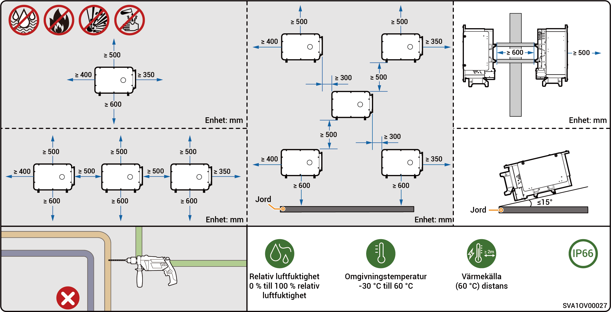
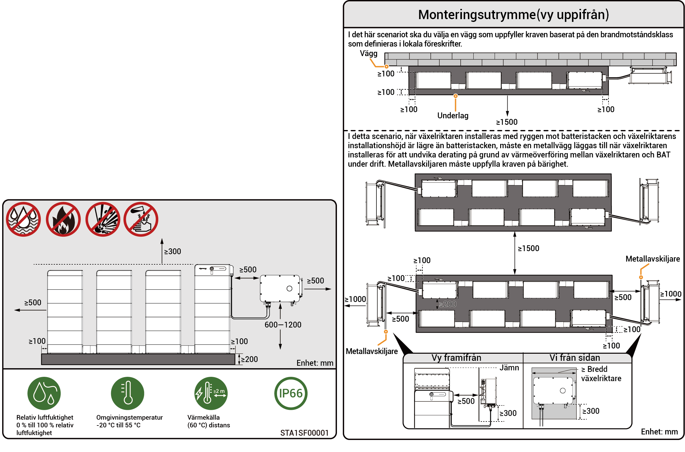

# Krav på plats



* <mark style="color:blue;">Läs noggrant igenom följande installationskrav innan du installerar utrustningen. Företaget avsäger sig allt ansvar för funktionsfel eller skador som uppkommer till följd av drift av utrustningen där installationskraven inte har uppfyllts, inklusive fall där säkerhetsincidenter har skett.</mark>
* <mark style="color:blue;">Under den faktiska installationen ska valet av installationsplats överensstämma med lokala bestämmelser om brandbekämpning, miljöskydd och andra relevanta lagar. Planeringen av den specifika installationsplatsen bör vara föremål för installatörens eller EPC-avtal (Engineering, Procurement and Construction).</mark>

### **Krav på installationsomgivning**

* Installera inte utrustningen i rökiga, brandfarliga eller explosiva omgivningar.
* Utrustningen får inte installeras i en miljö med ledande metalldamm eller magnetiskt damm.
* Utrustningen får inte installeras i en miljö som är benägen att drabbas av mögel och svamp.
* Undvik att utsätta utrustningen för direkt solljus, regn, vattensamling, snö eller damm. Installera utrustningen på en skyddad plats. Vidta förebyggande åtgärder i områden som är utsatta för naturkatastrofer såsom översvämningar, lerskred, jordbävningar och orkaner.
* Installera inte utrustningen där starka elektromagnetiska störningar förekommer.
* Temperaturen och luftfuktigheten i installationsmiljön ska uppfylla utrustningens krav.
* Utrustningen bör installeras på en plats som ligger minst 500 m från korrosionskällor som kan orsaka saltskador eller syraskador (korrosionskällor innefattar men är inte begränsade till havsstränder, värmekraftverk, kemiska anläggningar, smältverk, kolverk, gummiverkstäder och galvaniseringsanläggningar).
* I områden med god havsmiljö (t.ex. Norge, där nära kusten salthalten är ≤ 28 psu) kan monteringsavståndet för enheten från kustlinjen lämpligen ökas till ≥ 200 m.
* Om enhetens yttre yta är skadad, måla om enheten i tid.

### **Krav på installationsplats**

* Luta inte utrustningen och placera den inte upp och ned. Kontrollera att utrustningen installeras horisontellt.
* Installera inte utrustningen på en plats där brandrisk förekommer eller som är utsatt för fukt.
* Installera inte utrustningen på sluten, dåligt ventilerad plats som saknar brandskyddsåtgärder och är svår att nå för brandmän.
* Utrustningen får inte installeras under vattenkällor, inklusive men inte begränsat till vattenledningar och luftkonditioneringens utloppsfönster, där kondensat eller vattenläckage kan uppstå. Annars kan vätska tränga in i utrustningen och orsaka kortslutning.
* Installera inte utrustningen i rörliga enheter som fritidsfordon, kryssningsfartyg eller tåg.
* Utrustningen blir varm under drift. Om utrustningen monteras inomhus ska du se till att ventilationen inomhus är bra och undvika att inomhustemperaturen stiger med mer än 3 °C när utrustningen är i drift. Annars kommer utrustningens effekt att minskas.
* Utrustningen genererar värme under drift. Utrustningen får inte installeras på platser där det är lätt att komma åt värmeavledande ytor.
* Vi rekommenderar att utrustningen installeras på en plats där den är lätt att komma åt, installera, sköta och underhålla och där indikatorerna är lätta att läsa av.
* Övergången mellan on-grid/off-grid avger ljud. Vi rekommenderar att utrustningen installeras nära växelströmsdistributionsboxen, en bit bort från viloplatsen.
* Den rekommenderade längden för växelströmskabeln mellan växelriktaren och transformatorn uppströms bör vara ≤ 600 meter. Om längden överstiger 600 meter kan det påverka växelriktarnas parallelldrift. Kontakta Sigenergy för ytterligare råd.

### **Krav för installationsbas**

* Installera inte utrustningen på brandfarligt underlag.
* Installationsunderlaget ska uppfylla kraven på lasttålighet och vara fri från ogynnsamma geologiska förhållanden, inklusive men inte begränsat till gummijord och mjuk jord. Solida tegel- och betongkonstruktioner och betongväggar rekommenderas.
* Installationsunderlaget ska vara plant och installationsområdet ska uppfylla kraven på installationsutrymme.
* Inga rör- eller elinstallationer får finnas inom installationsbasen för att undvika potentiella borrningsrisker under installationen av utrustningen.
* Om utrustningen installeras på en allmän plats som inte är en arbets- eller bostadsplats (t.ex. parkeringsplatser, stationer, fabriker etc.), ska man installera ett skyddsnät utanför utrustningen och sätta upp varningsskyltar för isolering. Låt inte obehörig personal komma i närheten av växelriktaren för att undvika personskador eller egendomsförluster som orsakas av oavsiktlig kontakt av icke-professionell personal eller andra orsaker under drift av utrustningen.



* <mark style="color:blue;">För att säkerställa enhetens optimala prestanda föreslås att monteringsavståndet mellan enheten och omgivande hinder planeras med hänvisning till diagrammet. Om installationsplatsen är välventilerad kan den optimala lösningen implementeras baserat på faktiska förhållanden.</mark>
* <mark style="color:blue;">För att underlätta efterföljande underhåll (som rutininspektion eller demontering av fläkten) föreslås att ett frigång på minst 400 mm reserveras på enhetens vänstra sida.</mark>

### Installationsscenario endast PV (modellerna PV-only och HYA)

<figure><figcaption></figcaption></figure>

### Installationsscenario endast PV (modellerna HYB)

<figure><figcaption></figcaption></figure>



* <mark style="color:blue;">För att säkerställa enhetens optimala prestanda rekommenderas att monteringsavståndet mellan enheten och omgivande hinder planeras med hjälp av diagrammet. Om installationsplatsen är välventilerad kan den optimala lösningen implementeras baserat på faktiska förhållanden.</mark>
* <mark style="color:blue;">För att säkerställa fri tillgång för installationsverktyg (såsom lyftverktyg eller gaffeltruckar) rekommenderas att ett frigång på minst 1500 mm reserveras framför batteriklavarna, vilket kan justeras baserat på faktiska förhållanden.</mark>
* <mark style="color:blue;">Efter installationen, se till att det inte finns någon vattenansamling i botten av enheten, och lägg till dräneringskanaler vid behov.</mark>

### Installationsscenario PV-lagring

<figure><figcaption></figcaption></figure>
