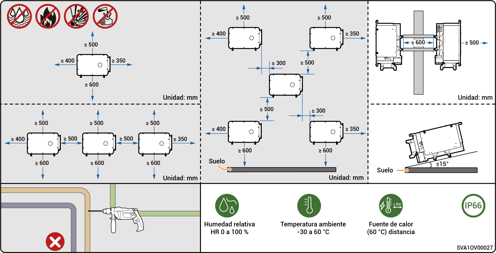
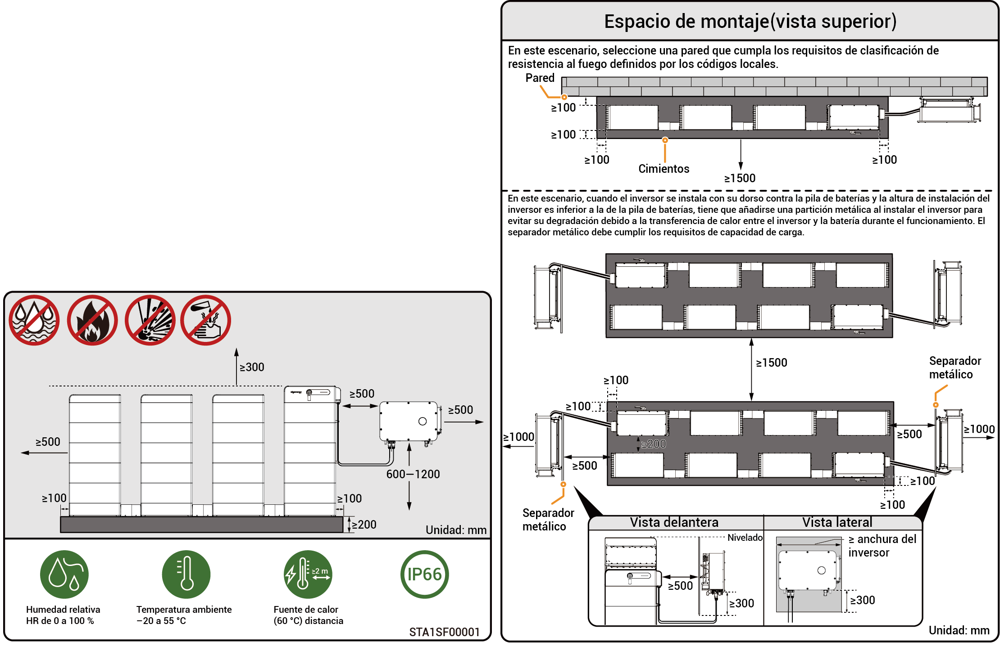

# Requisitos de ubicación



* <mark style="color:blue;">Antes de instalar este equipo, asegúrese de leer atentamente los requisitos de instalación siguientes. La empresa no será responsable de ninguna anomalía funcional ni daño resultante del funcionamiento del equipo si no se respetan los requisitos de instalación, incluso en casos que provoquen daños personales.</mark>
* <mark style="color:blue;">Durante la instalación real, la selección del lugar de instalación debe cumplir las regulaciones de prevención de incendios y ambientales, así como las demás leyes pertinentes. La planificación de la ubicación de la instalación concreta debe establecerse en los contratos del instalador o de ingeniería, abastecimiento y construcción.</mark>

### **Requisitos ambientales de instalación**

* No instale el equipo en un ambiente con humo, inflamable ni explosivo.
* No instale el equipo en un entorno con polvo de metal conductor o polvo magnético.
* No instale el equipo en un entorno con tendencia al moho o a los hongos.
* Evite exponer el equipo a la radiación solar directa, lluvia, agua estancada, nieve o polvo. Instale el equipo en un lugar protegido. Tome medidas preventivas en zonas con tendencia a desastres naturales como inundaciones, corrimientos, terremotos o huracanes.
* No instale el equipo en un entorno con interferencias electromagnéticas fuertes.
* La temperatura y humedad del entorno de instalación deben cumplir los requisitos de los equipos.
* El equipo debe instalarse en una zona distante 500 m como mínimo de fuentes de corrosión que pudieran provocar daños por sal o ácido (como costa, centrales eléctricas térmicas, plantas químicas, fundiciones, plantas de carbón, plantas de caucho o plantas de electrorrecubrimiento).
* En áreas con buenos entornos marinos (como Noruega, donde la salinidad costera es ≤ 28 psu), la distancia de montaje del dispositivo desde la línea de costa puede relajarse adecuadamente a ≥ 200 m.
* Si la superficie exterior del dispositivo está dañada, repinte el dispositivo a tiempo.

### **Requisitos de ubicación para la instalación**

* No incline el equipo ni lo coloque boca abajo. Asegúrese de que el equipo esté instalado horizontalmente.
* No instale el equipo en lugares con riesgo de incendio ni con tendencia a la humedad.
* No instale el equipo en un lugar cerrado y poco ventilado, sin medidas de protección contra incendios y con un acceso difícil para los bomberos.
* No instale el equipo bajo fuentes de agua, incluidas, entre otras, tuberías de agua y ventanas de salida de aires acondicionados, en las que pueden producirse condensación o fugas de agua. Si se hace, podría entrar agua en el equipo y provocar cortocircuitos.
* No instale el equipo en escenarios móviles como autocaravanas, cruceros o trenes.
* Cuando está en funcionamiento, el equipo se calienta. Si el equipo se instala en un interior, asegure una buena ventilación y evite un aumento de la temperatura del interior superior a 3 °C mientras el equipo está en marcha. En caso contrario el equipo funcionará en modo degradado.
* El equipo genera calor mientras está en funcionamiento. No instale el equipo en áreas en que pueda entrar fácilmente en contacto con superficies de disipación de calor.
* Se recomienda instalar el equipo en un lugar al que pueda acceder fácilmente para instalarlo, utilizarlo, mantenerlo y ver el estado de los indicadores.
* La conmutación conectado/desconectado de red produce ruido. Se recomienda instalar el equipo cerca de la caja de distribución de CA, lejos de la zona de descanso.
* La longitud recomendada del cable de CA entre el inversor y el transformador aguas arriba debe ser ≤ 600 metros. Si la longitud supera los 600 metros puede afectar la funcionamiento en paralelo de los inversores. Póngase en contacto con Sigenergy para que le asesoremos.

### **Requisitos de base para la instalación**

* No instale el equipo sobre una base inflamable.
* La base para la instalación debe cumplir los requisitos de soporte de cargas y no presentar condiciones geológicas adversas, incluyendo, entre otras, suelos de goma o suelos blandos. Son recomendables estructuras macizas de ladrillo y hormigón y paredes de hormigón.
* La base de instalación debe ser plana y la zona de instalación debe cumplir los requisitos de espacio de instalación.
* Durante la instalación del equipo no deben haber líneas de agua ni eléctricas dentro de la base de instalación para evitar riesgos de perforación.
* Si se instala el equipo en un lugar público distinto de zonas de trabajo o vivienda (como aparcamientos, estaciones, fábricas, etc.), instale una red protectora en el exterior del equipo y coloque señales de advertencia de seguridad para aislarlo. Para evitar lesiones personales o pérdidas materiales provocadas por contactos accidentales de personal no profesional u otras razones, no permita que nadie no implicado se acerque al inversor durante el funcionamiento del equipo.



* <mark style="color:blue;">Para garantizar un rendimiento óptimo del dispositivo, se sugiere planificar la distancia de instalación entre el dispositivo y los obstáculos circundantes con referencia al diagrama. Si el lugar de instalación está bien ventilado, se puede implementar la solución óptima en función de las condiciones reales.</mark>
* <mark style="color:blue;">Para facilitar el mantenimiento posterior (como la inspección rutinaria o el desmontaje del ventilador), se sugiere reservar un espacio libre de al menos 400 mm en el lado izquierdo del dispositivo.</mark>

### Escenario de instalación solo PV (modelos PV-only y HYA)

<figure><figcaption></figcaption></figure>

### Escenario de instalación solo PV (modelos HYB)

<figure><figcaption></figcaption></figure>



* <mark style="color:blue;">Para garantizar un rendimiento óptimo del dispositivo, se sugiere planificar la distancia de instalación entre el dispositivo y los obstáculos circundantes con referencia al diagrama. Si el lugar de instalación está bien ventilado, se puede implementar la solución óptima en función de las condiciones reales.</mark>
* <mark style="color:blue;">Para garantizar un acceso sin obstáculos para las herramientas de instalación (como herramientas de elevación o carretillas elevadoras), se sugiere reservar un espacio libre de al menos 1500 mm frente a la agrupación de baterías, el cual puede ajustarse según las condiciones reales.</mark>
* <mark style="color:blue;">Después de la instalación, asegúrese de que no se acumule agua en la parte inferior del dispositivo y, si es necesario, agregue canales de drenaje.</mark>

### Escenario de instalación PV-storage

<figure><figcaption></figcaption></figure>
