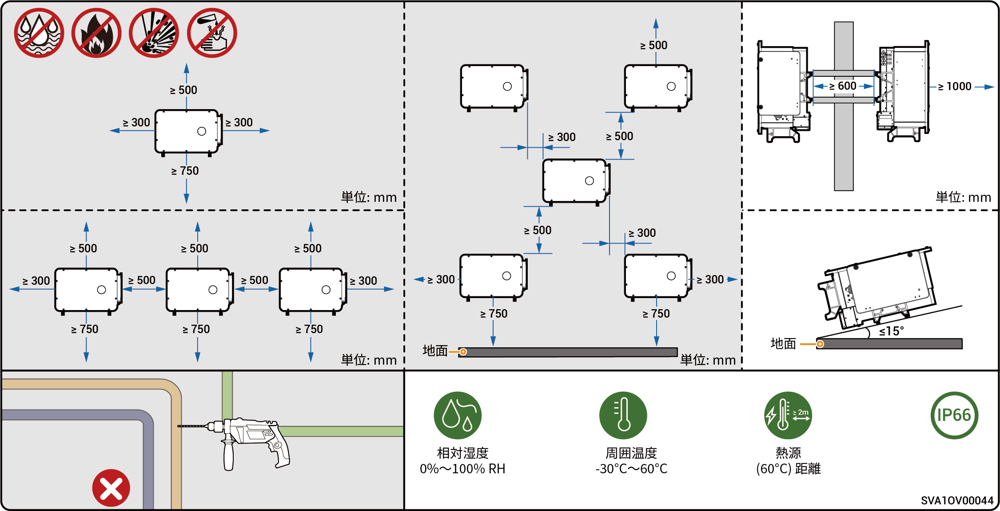
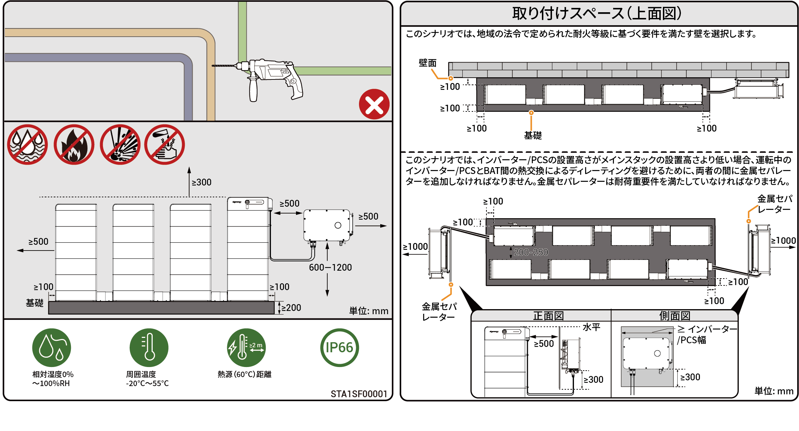

# 場所の要件



* <mark style="color:blue;">機器を設置する前に、以下の設置要件をよくお読みください。設置要件を守らなかった場合、機器の操作に起因する異常や破損について、たとえ人身事故の原因となった場合でも、当社は一切責任を負いません。</mark>
* <mark style="color:blue;">実際の設置の際、設置場所の選定は地域の消防法、環境保護法、その他の関連法規に従う必要があります。具体的な設置場所の計画は、取付業者またはEPC (設計、調達、建設) 契約に従うものとします。</mark>

### **設置環境の要件**

* 本機は、煙の多い環境、可燃性環境、爆発性環境に設置しないでください。
* 導電性金属粉や磁性粉が浮遊する環境には設置しないでください。
* カビや菌が発生しやすい環境には設置しないでください。
* 本機を、直射日光、雨、たまり水、雪、塵埃にさらさないでください。本機は保護されている場所に設置してください。洪水、土砂崩れ、地震、台風などの自然災害が発生しやすい動作環境では、予防措置を講じてください。
* 強い電磁妨害のある環境には設置しないでください。
* 設置環境の温度と湿度が本機の条件を満たしている必要があります。
* 本機は、塩害や酸害を発生させうる腐食源から500 m以上離れた場所に設置してください (腐食源として、海辺、火力発電所、化学工場、製錬所、石炭工場、ゴム工場、電気メッキ工場が挙げられるが、これだけに限定されない)。

### **設置場所の要件**

* 機器を傾けたり、逆さまに置いたりしないでください。機器が水平になるように設置してください。
* 火災の危険がある場所や湿気の多い場所には設置しないでください。
* 防火対策が施されておらず、消防士が入り込めない換気の悪い密閉環境に設置しないでください。
* 水道管やエアコンの吹き出し口など、結露や漏水の可能性がある場所を含め、水源の下には機器を設置しないでください。液体が機器に侵入して短絡を引き起こす恐れがあります。
* RV、クルーズ船、電車などの移動体には設置しないでください。
* 動作中は本機が高温になります。屋内に設置する場合は、本機の動作中に室内温度が3°C以上上昇しないように、室内の換気を良くしてください。さもないと、機器の定格出力が低下します。
* 動作中、本機は熱を発生させます。放熱面に容易に手が届く場所には本機を設置しないでください。
* 簡単にアクセス・設置・操作・保守でき、インジケーターの状態が確認できる場所に設置するよう推奨されます。
* オングリッドとオフグリッド切り替え時に雑音が発生します。休憩室から離れた交流配電盤の近くに設置するようお勧めします。
* インバーターと上流の変圧器間のACケーブルの長さは、600メートル以下に収めることを推奨します。長さが600メートルを超える場合、インバータの並列運転に影響を与える可能性があります。さらなる詳細については、Sigenergyまでお問い合わせください。

### **設置ベースの要件**

* 可燃性ベースの上に設置しないでください。
* 耐荷重要件を満たす場所に設置し、軟土や軟弱地盤など地質条件の悪い場所には設置してください。丈夫な煉瓦、コンクリート構造、コンクリートの壁が推奨されます。
* 設置ベースが平らで、設置面積が設置スペース要件を満たしている必要があります。
* 機器設置時の穿孔による危険を避けるため、設置ベースの中には配管や配線があってはなりません。
* 職場や住宅地以外の公共場所（駐車場、駅、工場など）に設置する場合、人が近づけないように、機器の外側に保護ネットを張り安全警告標識を設置してください。機器の操作中に、部外者が誤って接触するなどの理由で人身事故や施設破損が発生しないように、人がインバーターに近づけないようにしてください。

### **PVのみの設置シナリオ**

<figure><figcaption></figcaption></figure>

### **PVと蓄電の設置シナリオ**

<figure><figcaption></figcaption></figure>

<figure><figcaption></figcaption></figure>
