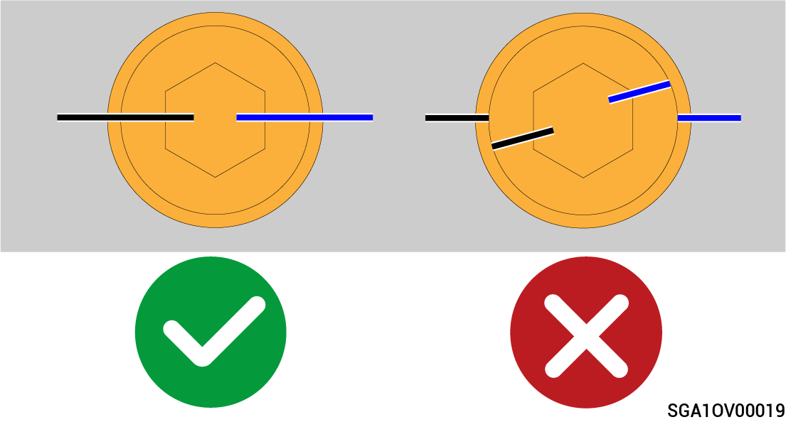
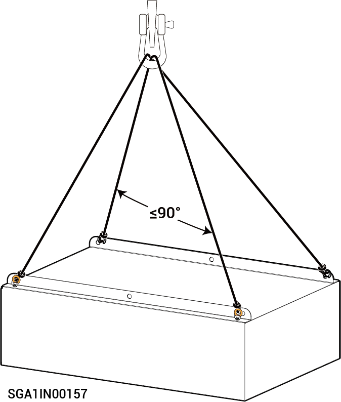

# Equipment Installation



* <mark style="color:orange;">Before installing the equipment, check whether the screws installed before delivery are secured. Before delivery, the tightened screws are marked with lines. If the marks are misaligned, the screws are loose. Tighten the screws again.</mark>

<figure><figcaption></figcaption></figure>

* <mark style="color:orange;">Get well prepared for the bearing load when handling the equipment to prevent it from falling and causing injury.</mark>

### **Ladder Safety**

* Do not use ladders if you are not well-trained or instructed.
* Do not use unqualified ladders, including but not limited to damaged, broken, deformed, or temporary ladders.
* Do not use a ladder that does not meet the load-bearing requirements.
* Use wooden or fiberglass ladders when you climb up for electrical operations.
* A straight ladder must be set at a gradient of 60° to 70°.
* Do not throw objects from heights when operating on a ladder.
* We recommend that you designate a person to monitor when operating on a ladder.
* Lock the door when using a ladder at the entrance of the passageway.

### Lifting safety

* Personnel performing lifting operations must undergo relevant training and be qualified before they can take up their posts.
* Temporary warning signs or fences must be erected in the lifting area for isolation.
* The foundation for lifting operations must meet the load-bearing requirements of the crane.
* Before lifting, ensure that the lifting tools are firmly fixed to a fixed object or wall that meets the load-bearing standards.
* During lifting, it is strictly forbidden to walk under the boom or the lifting object.
* During lifting, do not drag the wire rope or lifting equipment, and do not use hard objects to hit.
* During the lifting process, ensure that the angle between the two slings is no greater than 90°, as shown in the figure below.

<figure><figcaption></figcaption></figure>

### **Drilling Safety**

* Do not drill holes on the equipment.
* Wear safety goggles and protective gloves when drilling holes.
* Do not place the equipment near drilling positions to prevent debris from falling into the equipment.
* Clean up any debris promptly after drilling.
