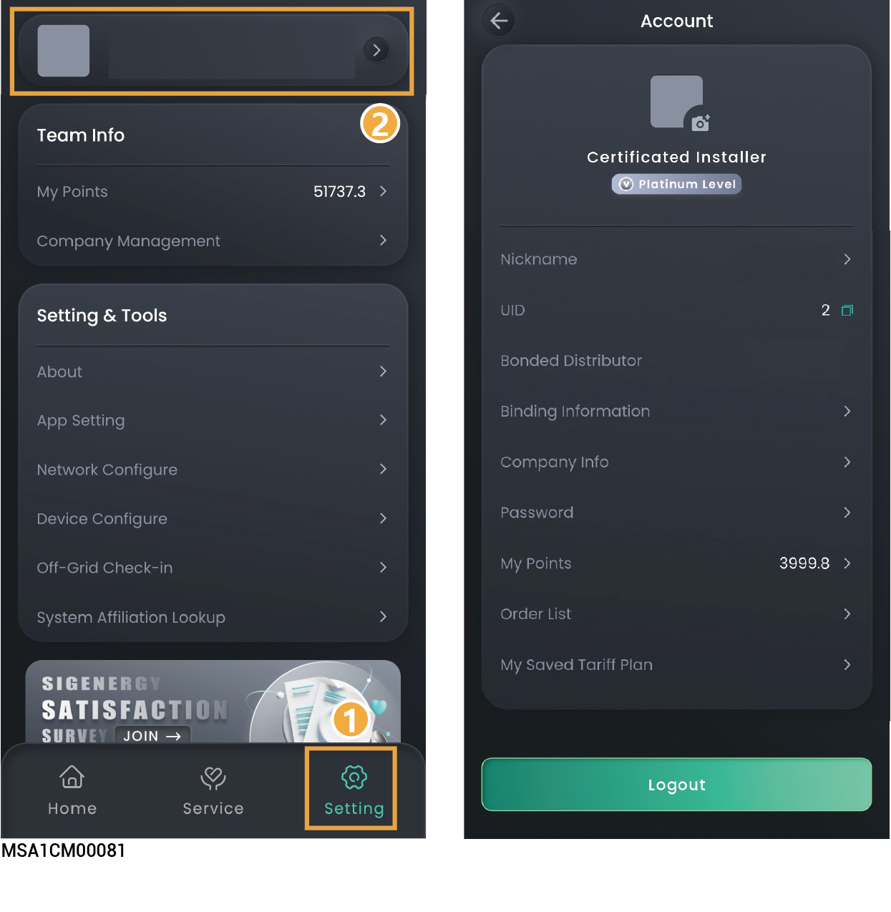
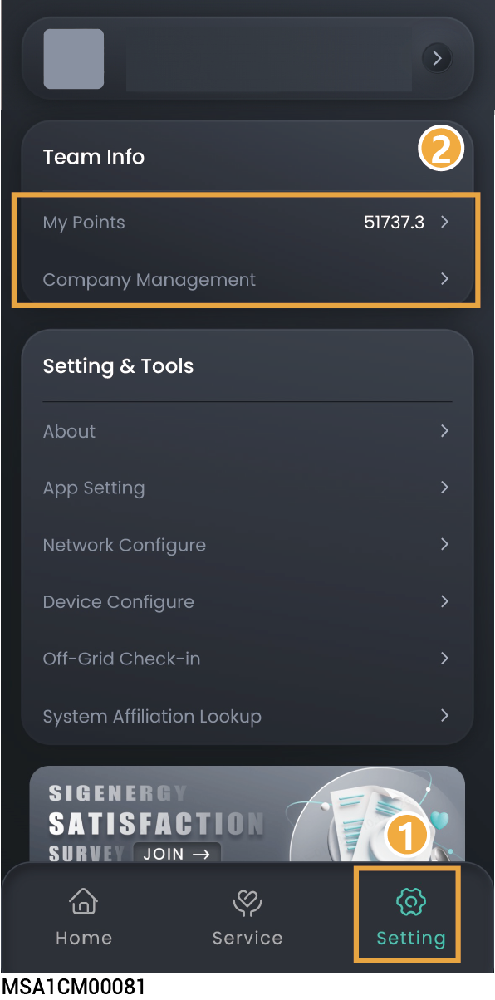

# Account and Team Info Setting

## Account

<figure><figcaption></figcaption></figure>

<table><thead><tr><th width="84.54541015625" align="center" valign="middle">No.</th><th width="200.0909423828125" valign="middle">Parameter name</th><th valign="top">Description</th></tr></thead><tbody><tr><td align="center" valign="middle">1</td><td valign="middle">Nickname</td><td valign="top">Click to modify Account Nickname.</td></tr><tr><td align="center" valign="middle">2</td><td valign="middle">UID</td><td valign="top">Click to copy the installer's personal User Identification.</td></tr><tr><td align="center" valign="middle">3</td><td valign="middle">Bonded Distributor</td><td valign="top">Click to view bound distributor information.</td></tr><tr><td align="center" valign="middle">4</td><td valign="middle">Binding Information</td><td valign="top">Click to change account binding information, for example, email address.</td></tr><tr><td align="center" valign="middle">5</td><td valign="middle">Company Info</td><td valign="top">Click to view company information.</td></tr><tr><td align="center" valign="middle">6</td><td valign="middle">Password</td><td valign="top">Click to change "Password."</td></tr><tr><td align="center" valign="middle">7</td><td valign="middle">My Points</td><td valign="top">Click to view installer's personal points details.</td></tr><tr><td align="center" valign="middle">8</td><td valign="middle">Order List</td><td valign="top">Select to access purchase order details.</td></tr><tr><td align="center" valign="middle">9</td><td valign="middle">My Saved Tariff Plan</td><td valign="top">Click to view electricity price configuration - Apply the same pricing to multiple power stations.</td></tr></tbody></table>

## Team Info



This parameter is only visible to installer administrators/company accounts.

<figure><figcaption></figcaption></figure>

<table><thead><tr><th width="70" align="center" valign="middle">No.</th><th width="200.0909423828125" valign="middle">Parameter name</th><th valign="top">Description</th></tr></thead><tbody><tr><td align="center" valign="middle">1</td><td valign="middle">My Points</td><td valign="top">Click to view the company's total points details and redeem rewards using points.</td></tr><tr><td align="center" valign="middle">2</td><td valign="middle">Company Management</td><td valign="top"><ul><li>If the installer company account number wants to grant permissions to other installers to view and set up your power station, or if you want to view and set up the power stations of other installers, click this parameter to set up.</li><li><strong>Authorize other installers</strong>: Join the team with invitation code. You can join only one team.</li><li><strong>View other installers</strong>: Copy "My Invitation Code" to the invitee and invite him to join your team.</li></ul></td></tr></tbody></table>
