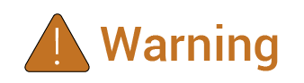

# Overview

### **Introduction**

This document describes how to use the mySigen App.

### **Readers**

This document is intended for:

* Professionally trained and qualified installers
* Technical support engineer

### **Sign Definition**

The following signs may be used in the document to indicate security precautions or key information. Before installation and operation, familiarize yourself with signs and their definitions.

<table><thead><tr><th width="180">Signs</th><th width="575">Definition</th></tr></thead><tbody><tr><td></td><td>Danger. Failure to comply will result in death or serious personal injury.</td></tr><tr><td></td><td>Warning. Failure to comply will result in serious personal injury or property damage.</td></tr><tr><td></td><td>Caution. Failure to comply will result in property damage.</td></tr><tr><td></td><td>Important or key information, and supplementary operation tips.</td></tr></tbody></table>
