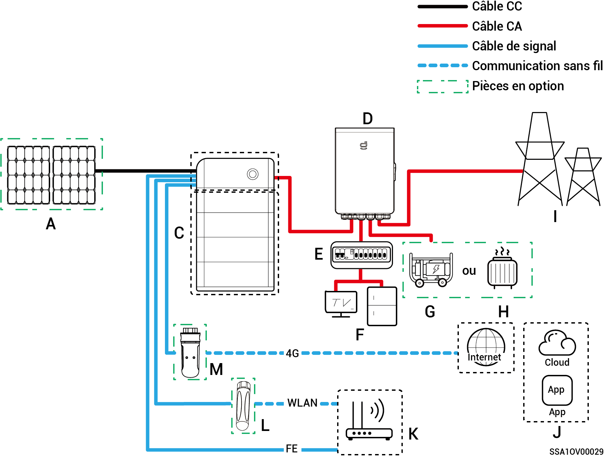
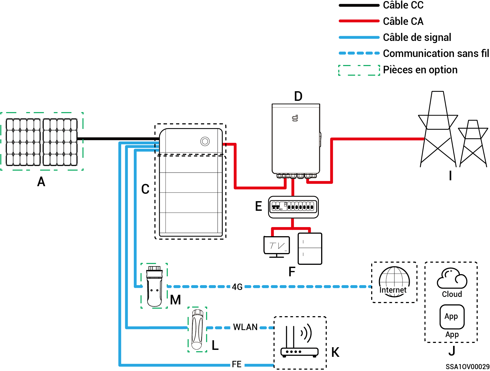
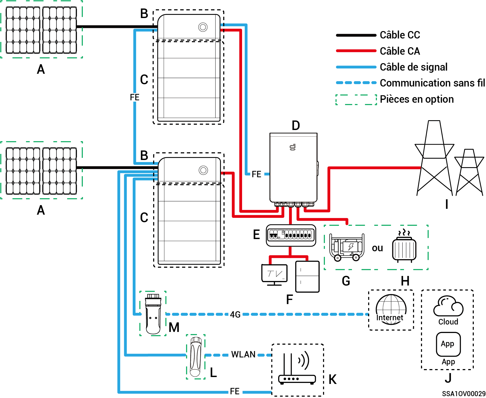
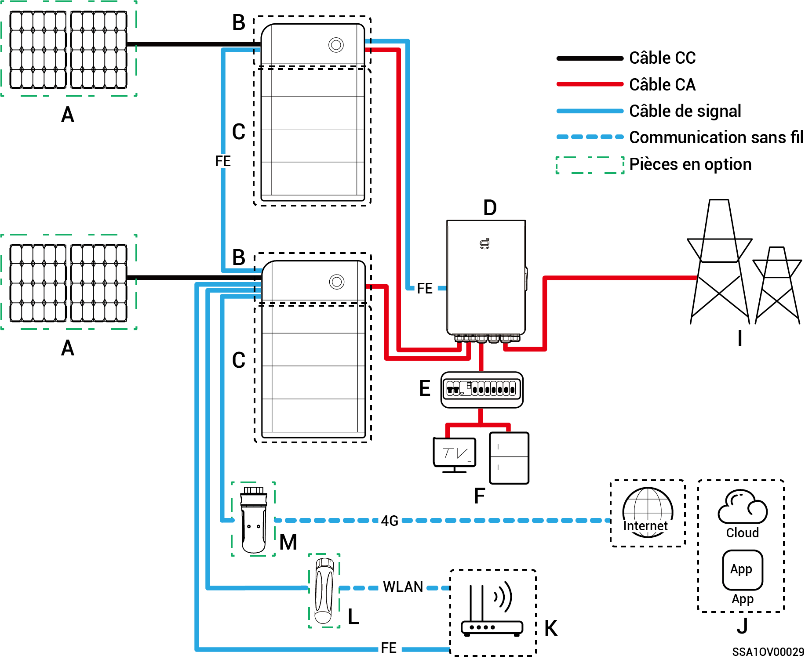
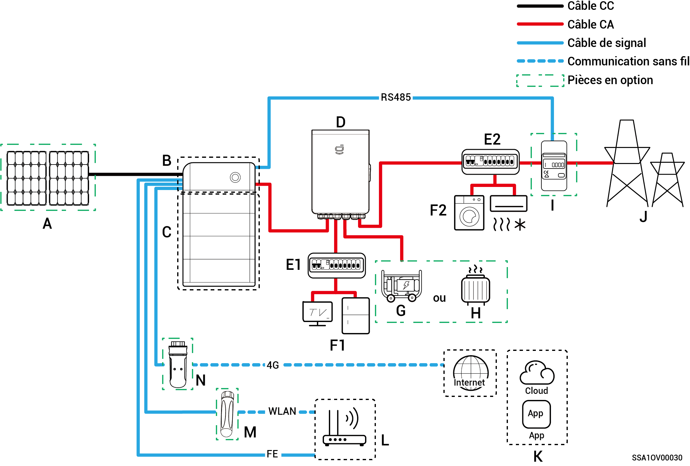
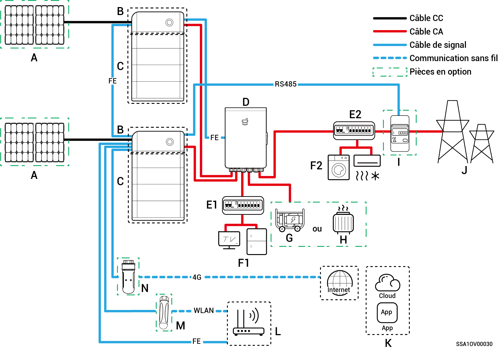
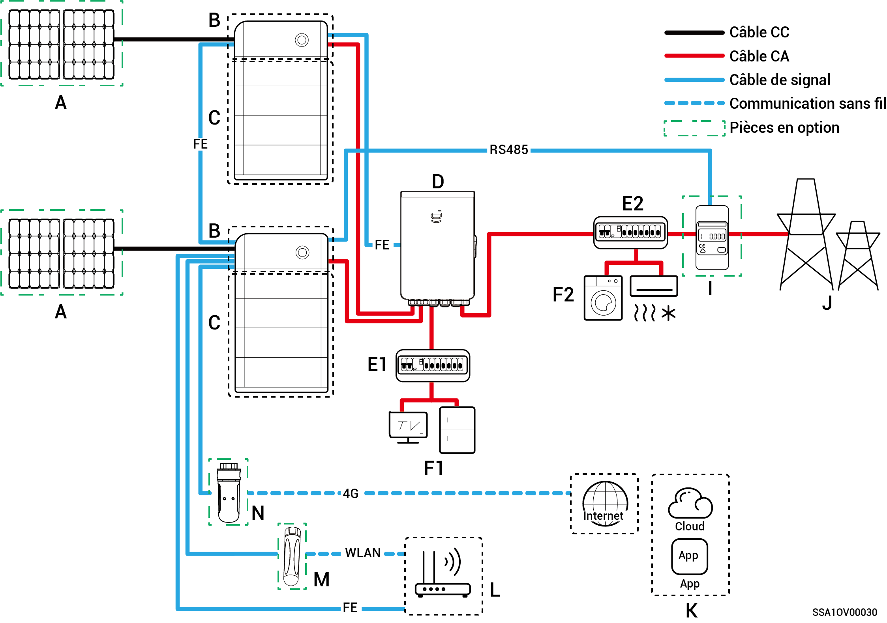

# Introduction au câblage du système

* Ce produit est adapté aux scénarios de mise en réseau des systèmes d'alimentation de secours domestique. Il doit être utilisé avec les panneaux photovoltaïques, les onduleurs, les blocs-batteries, les interrupteurs de commande principaux, les charges, les générateurs et le réseau électrique.
* En cas de panne du réseau électrique, le système de stockage d'énergie domestique passe en mode de fonctionnement hors réseau. Dès que le réseau électrique reprend son fonctionnement normal, le système de stockage d'énergie domestique repasse en mode en réseau. Cette solution permet de passer sans interruption du système de stockage photovoltaïque au générateur.



* <mark style="color:blue;">En cas de mise en réseau de l'alimentation de secours, la durée du fonctionnement hors réseau de la charge de l'alimentation de secours dépend de la capacité d'alimentation du système de stockage photovoltaïque. En cas d'anomalie dans l'alimentation électrique du système de stockage photovoltaïque pendant le fonctionnement hors réseau (y compris, mais sans s'y limiter, une production anormale d'électricité photovoltaïque, une alimentation insuffisante de la batterie et une alimentation anormale du générateur), la charge de l'alimentation de secours demeurera dans l'incapacité de fonctionner.</mark>
* <mark style="color:blue;">Le schéma de mise en réseau prend l'exemple de deux onduleurs. Le nombre d'onduleurs qu'il est possible de connecter dépend des spécifications du Gateway. Pour plus d'informations, reportez-vous au tableau 2-1.</mark>

**Tableau 2-1**

<table><thead><tr><th width="75">N°</th><th>Modèle</th><th>Nombre d'onduleurs qu'il est possible de connecter</th></tr></thead><tbody><tr><td><strong>1</strong></td><td>Sigen Gateway HomeMax SP</td><td>3 unités</td></tr><tr><td><strong>2</strong></td><td>Gateway Home SP</td><td>1 unité</td></tr><tr><td><strong>3</strong></td><td>Gateway Home SP 12K</td><td>2 unités</td></tr><tr><td><strong>4</strong></td><td>Sigen Gateway SP AU</td><td>2 unités</td></tr><tr><td><strong>5</strong></td><td>Sigen Gateway HomeMax TP</td><td>2 unités</td></tr><tr><td><strong>6</strong></td><td>Sigen Gateway Home TP</td><td>1 unité</td></tr><tr><td><strong>7</strong></td><td>Sigen Gateway TP AU</td><td>2 unités</td></tr><tr><td><strong>8</strong></td><td>Sigen Gateway HomeMax TP CN</td><td>2 unités</td></tr><tr><td><strong>9</strong></td><td>Sigen Gateway Home TP 30K</td><td>1 unité</td></tr><tr><td><strong>10</strong></td><td>Sigen Gateway Home TP 30K CN</td><td>1 unité</td></tr></tbody></table>

### Schéma de câblage complet d'un système de secours domestique

**Onduleur simple (Le Gateway est équipé d'un disjoncteur pour la connexion de la charge intelligente/du générateur diesel.)**

**Onduleur simple (Le Gateway n'est pas équipé d'un disjoncteur pour la connexion de la charge intelligente/du générateur diesel.)**

**Plusieurs onduleurs (Le Gateway est équipé d'un disjoncteur pour la connexion de la charge intelligente/du générateur diesel.)**

**Plusieurs onduleurs (Le Gateway n'est pas équipé d'un disjoncteur pour la connexion de la charge intelligente/du générateur diesel.)**

<table><thead><tr><th width="81">N°</th><th>Description</th><th width="78">N°</th><th>Description</th><th>N°</th><th>Description</th></tr></thead><tbody><tr><td><strong>A</strong></td><td>Panneau photovoltaïque</td><td><strong>B</strong></td><td>SigenStor EC/SigenStor AC/Sigen Hybrid</td><td><strong>C</strong></td><td>SigenStor BAT</td></tr><tr><td><strong>D</strong></td><td>Gateway</td><td><strong>E</strong></td><td>Tableau de distribution de secours</td><td><strong>F</strong></td><td>Circuit de secours pour électroménager</td></tr><tr><td><strong>G</strong></td><td>Circuit de secours pour électroménager</td><td><strong>H</strong></td><td>Charges intelligentes</td><td><strong>I</strong></td><td>Réseau électrique</td></tr><tr><td><strong>J</strong></td><td>mySigen</td><td><strong>K</strong></td><td>Routeur</td><td><strong>L</strong></td><td>Antenne</td></tr><tr><td><strong>M</strong></td><td>CommMod</td><td></td><td></td><td></td><td></td></tr></tbody></table>



* <mark style="color:blue;">Si B est Sigen Hybrid, C est facultatif.</mark>
* <mark style="color:blue;">Si F (circuit de secours pour électroménager) subit une fuite, un risque d'électrocution est possible. Afin d'éviter ce risque, un disjoncteur différentiel doit être installé entre D (Gateway) et F (circuit de secours pour électroménager).</mark>
* <mark style="color:blue;">En tant que source d'énergie de secours pour les applications hors réseau à long terme, le générateur diesel peut fonctionner conjointement au Gateway pour assurer une transition progressive entre le système photovoltaïque, le stockage et le générateur diesel.</mark>
* <mark style="color:blue;">Tous les équipements électriques de la maison du propriétaire peuvent être connectés en tant que charges intelligentes. Afin de garantir que ce produit offre un maximum d'avantages aux utilisateurs, nous recommandons que les équipements à forte consommation soient connectés en tant que charges intelligentes (pompes à chaleur, chauffe-piscines, sèche-linges, etc.), celles-ci pouvant être coupées lorsque le système de stockage d'énergie présente une faible charge. Les autres équipements à faible consommation sont connectés en tant que charges domestiques (lampes, routeurs, etc.).</mark>
* <mark style="color:blue;">Il est recommandé d'utiliser les communications Ethernet rapide et WLAN avec les onduleurs. Dès que le trafic 4G gratuit de CommMod est épuisé, les utilisateurs doivent changer de carte SIM.</mark>

### **Schéma de câblage partiel du système de secours domestique**

**Onduleur simple (Le Gateway est équipé d'un disjoncteur pour la connexion de la charge intelligente/du générateur diesel.)**

**Onduleur simple (Le Gateway n'est pas équipé d'un disjoncteur pour la connexion de la charge intelligente/du générateur diesel.)**

**Plusieurs onduleurs (Le Gateway est équipé d'un disjoncteur pour la connexion de la charge intelligente/du générateur diesel.)**

**Plusieurs onduleurs (Le Gateway n'est pas équipé d'un disjoncteur pour la connexion de la charge intelligente/du générateur diesel.)**

| N°     | Description                            | N°     | Description                              | N°     | Description                          |
| ------ | -------------------------------------- | ------ | ---------------------------------------- | ------ | ------------------------------------ |
| **A**  | Panneau photovoltaïque                 | **B**  | SigenStor EC/SigenStor AC/Sigen Hybrid   | **C**  | SigenStor BAT                        |
| **D**  | Gateway                                | **E1** | Tableau de distribution de secours       | **E2** | Tableau de distribution sans secours |
| **F1** | Circuit de secours pour électroménager | **F2** | Circuit sans secours pour électroménager | **G**  | Générateur diesel                    |
| **H**  | Charges intelligentes                  | **I**  | Capteur de puissance                     | **J**  | Réseau électrique                    |
| **K**  | mySigen                                | **L**  | Routeur                                  | **M**  | Antenne                              |
| **N**  | CommMod                                |        |                                          |        |                                      |



* <mark style="color:blue;">Si B est Sigen Hybrid, C est facultatif.</mark>
* <mark style="color:blue;">Si le tableau de distribution sans secours (E2) est doté d'une protection contre les fuites, il est recommandé que le courant de fonctionnement résiduel nominal soit supérieur ou égal au nombre d'onduleurs × 100 mA.</mark>
* <mark style="color:blue;">Si F1 (circuit de secours pour électroménager) subit une fuite, un risque d'électrocution est possible. Afin d'éviter ce risque, un disjoncteur différentiel doit être installé entre D (Gateway) et F1 (circuit de secours pour électroménager).</mark>
* <mark style="color:blue;">En tant que source d'énergie de secours pour les applications hors réseau à long terme, le générateur diesel peut fonctionner conjointement au Gateway pour assurer une transition progressive entre le système photovoltaïque, le stockage et le générateur diesel.</mark>
* <mark style="color:blue;">Tous les équipements électriques de la maison du propriétaire peuvent être connectés en tant que charges intelligentes. Afin de garantir que ce produit offre un maximum d'avantages aux utilisateurs, nous recommandons que les équipements à forte consommation soient connectés en tant que charges intelligentes (pompes à chaleur, chauffe-piscines, sèche-linges, etc.), celles-ci pouvant être coupées lorsque le système de stockage d'énergie présente une faible charge. Les autres équipements à faible consommation sont connectés en tant que charges domestiques (lampes, routeurs, etc.).</mark>
* <mark style="color:blue;">Le capteur de puissance a une fonction d'acquisition de données pour les points de connexion au réseau, ce qui permet une connexion au réseau électrique sans consommation d'énergie. Pour le câblage partiel du système</mark> <mark style="color:blue;">de secours, le capteur de puissance n'a pas besoin d'être configuré. Pour le câblage partiel de l'alimentation de secours et du système de contrôle de connexion au réseau électrique sans consommation d'énergie, le capteur de puissance est configuré.</mark>
* <mark style="color:blue;">Il est recommandé d'utiliser les communications Ethernet rapide et WLAN avec les onduleurs. Dès que le trafic 4G gratuit de CommMod est épuisé, les utilisateurs doivent changer de carte SIM.</mark>
