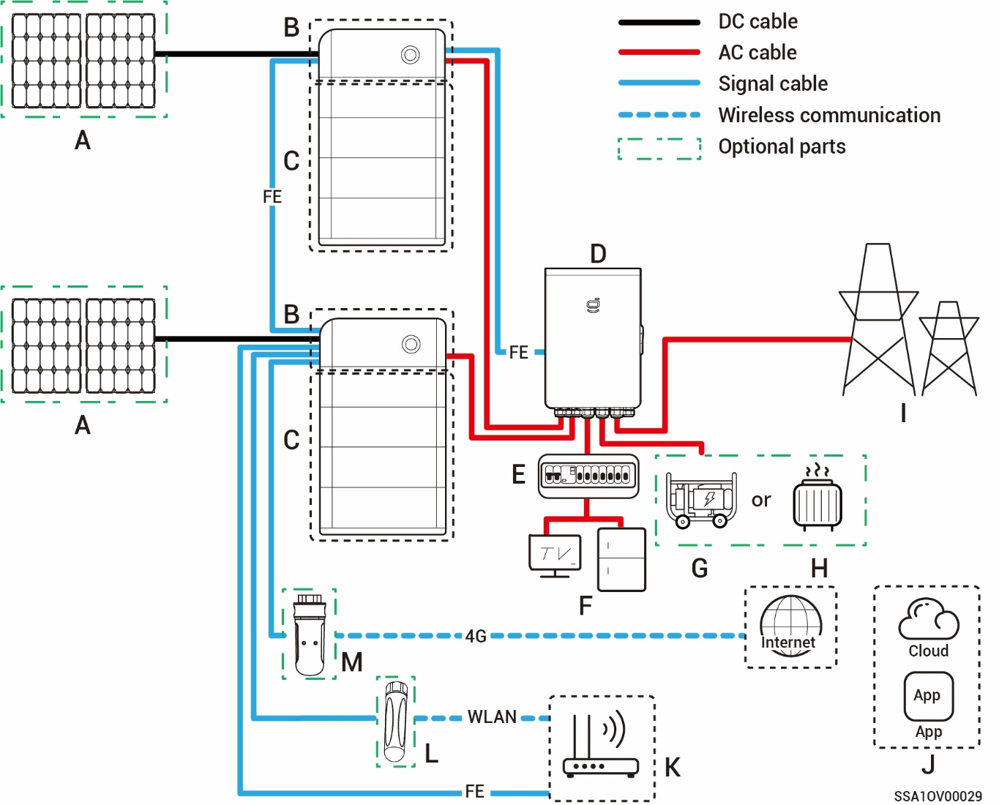
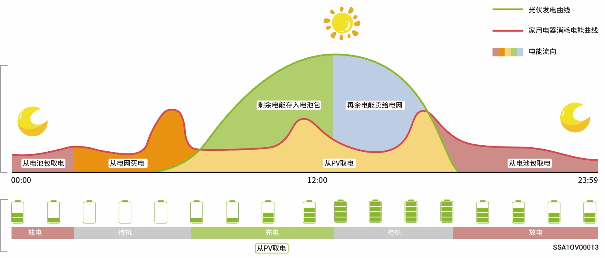
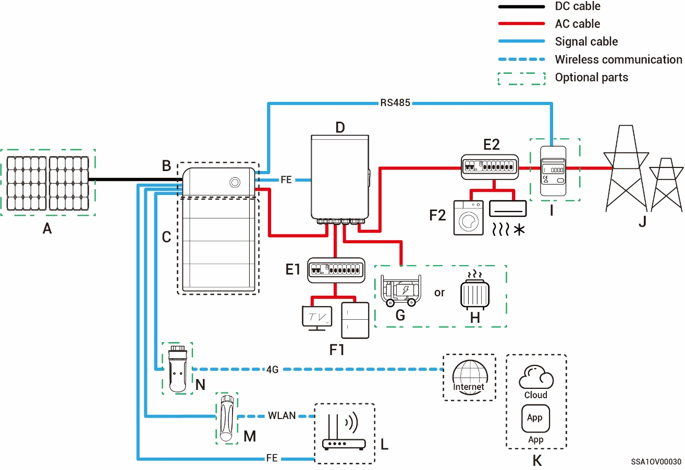
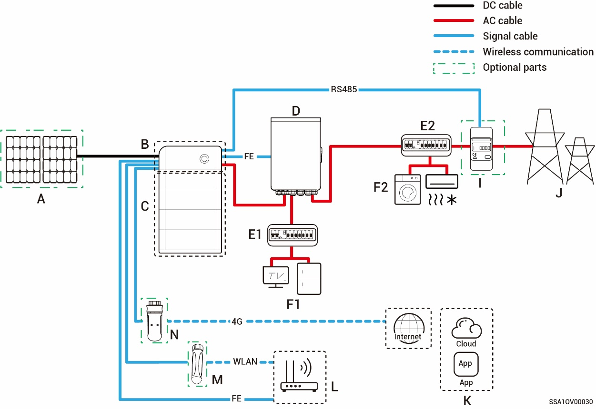
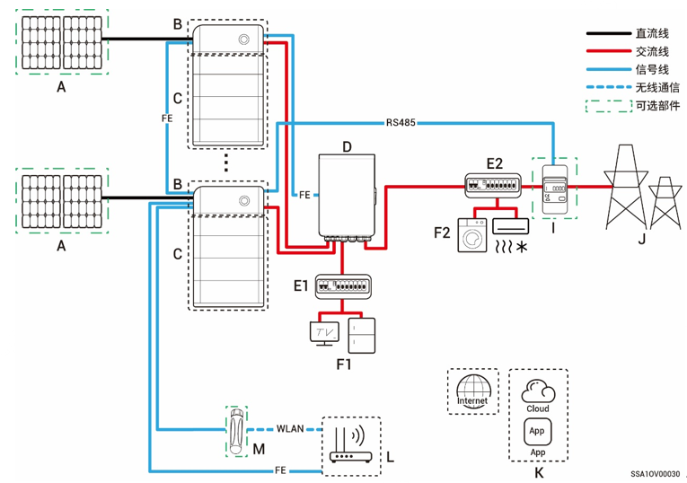

# Introduction to system wiring

* This product is applicable to household backup power system networking scenarios. It must be used in conjunction with PV panels, inverters, battery packs, main control switches, loads, generators, and power grid.
* In the event of a power outage, the household energy storage system switches to off-grid operation mode. After the power grid resumes normal operation, the household energy storage system switches back to on-grid mode. This achieves a seamless switchover between PV storage and Generator.



* <mark style="color:blue;">Under backup power networking, the duration of off-grid operation of the backup power load is related to the power supply capacity of the PV storage system. If there is an abnormality in the power supply of the PV storage system during off-grid operation (including but not limited to abnormal PV power generation, insufficient battery power, and abnormal power supplies to the Generator), the backup power load will still be unable to operate.</mark>
* <mark style="color:blue;">The networking diagram takes two inverters as an example. The number of inverters that can be connected depends on the Gateway specification. For more information, see Table 2-1.</mark>

**Table 2-1**

<table><thead><tr><th width="51.25" align="center">S/N</th><th>Model</th><th valign="top">Number of Inverters that can be connected</th></tr></thead><tbody><tr><td align="center"><strong>1</strong></td><td>Sigen Gateway HomeMax SP</td><td valign="top">3 units</td></tr><tr><td align="center"><strong>2</strong></td><td>Gateway Home SP</td><td valign="top">1 unit</td></tr><tr><td align="center"><strong>3</strong></td><td>Gateway Home SP 12K</td><td valign="top">2 units</td></tr><tr><td align="center"><strong>4</strong></td><td>Sigen Gateway SP AU</td><td valign="top">2 units</td></tr><tr><td align="center"><strong>5</strong></td><td>Sigen Gateway HomeMax SP LA</td><td valign="top">2 units</td></tr><tr><td align="center"><strong>6</strong></td><td>Sigen Gateway HomeMax TP</td><td valign="top">2 units</td></tr><tr><td align="center"><strong>7</strong></td><td>Sigen Gateway Home TP</td><td valign="top">1 unit</td></tr><tr><td align="center"><strong>8</strong></td><td>Sigen Gateway TP AU</td><td valign="top">2 units</td></tr><tr><td align="center"><strong>9</strong></td><td>Sigen Gateway HomeMax TP CN</td><td valign="top">2 units</td></tr><tr><td align="center"><strong>10</strong></td><td>Sigen Gateway Home TP 30K</td><td valign="top">1 unit</td></tr><tr><td align="center"><strong>11</strong></td><td>Sigen Gateway Home TP 30K CN</td><td valign="top">1 unit</td></tr><tr><td align="center"><strong>12</strong></td><td>Sigen Gateway HomePro TP</td><td valign="top">2 units</td></tr><tr><td align="center"><strong>13</strong></td><td>Sigen Gateway HomePro TP-L</td><td valign="top">2 units</td></tr><tr><td align="center"><strong>14</strong></td><td>Sigen Gateway Home SP AU</td><td valign="top">2 units</td></tr><tr><td align="center"><strong>15</strong></td><td>Sigen Gateway Home TP AU</td><td valign="top">2 units</td></tr><tr><td align="center"><strong>16</strong></td><td>Sigen Gateway HomePro SP</td><td valign="top">1 unit</td></tr></tbody></table>

### **Whole home backup system wiring diagram**

**Single inverter (Gateway has the circuit breaker for connecting smart load/diesel generator)**

**Single inverter (Gateway does not have the circuit breaker connected to the smart load/diesel generator)**

**Multiple inverters (Gateway has the circuit breaker for connecting smart load/diesel generator)**

**Multiple inverters (Gateway does not have the circuit breaker connected to the smart load/diesel generator)**

| No.   | Description            | No.   | Description               | No.   | Description            |
| ----- | ---------------------- | ----- | ------------------------- | ----- | ---------------------- |
| **A** | PV panel               | **B** | SigenStor EC/Sigen Hybrid | **C** | SigenStor BAT          |
| **D** | Gateway                | **E** | Backup Distribution panel | **F** | Backup Household loads |
| **G** | Backup Household loads | **H** | Smart loads               | **I** | Power grid             |
| **J** | mySigen                | **K** | Router                    | **L** | Antenna                |
| **M** | CommMod                |       |                           |       |                        |



* <mark style="color:blue;">If F (backup household load) experiences leakage, it may pose a risk of electric shock. In order to avoid this hazard, a residual current device (RCD) must be installed between the D (Gateway) and the F (backup household load).</mark>
* <mark style="color:blue;">As a backup energy source for long-term off-grid applications, thediesel generator can work in tandem with the Gateway to provide a smooth transition between PV, storage and diesel generation.</mark>
* <mark style="color:blue;">All the power equipment in the owner's home can be connected as smart loads. To ensure that this product maximizes the benefits to users, it is recommended that the high-power equipment be connected as smart loads (heat pumps, pool heaters, clothes dryers, etc.), which can be cut off when the energy storage system has low power. Other low-power equipment are connected as household loads (lights, routers, etc.)</mark>
* <mark style="color:blue;">It is recommended to use Fast Ethernet and WLAN for communication with inverters. When free 4G traffic of CommMod runs out, users must replace an SIM card.</mark>

### **Partial home backup system wiring diagram**

**Single inverter (Gateway has the circuit breaker for connecting smart load/diesel generator)**

**Single inverter (Gateway does not have the circuit breaker connected to the smart load/diesel generator)**

**Multiple inverters (Gateway has the circuit breaker for connecting smart load/diesel generator)**

**Multiple inverters (Gateway does not have the circuit breaker connected to the smart load/diesel generator)**

| No.    | Description            | No.    | Description                | No.    | Description                   |
| ------ | ---------------------- | ------ | -------------------------- | ------ | ----------------------------- |
| **A**  | PV panel               | **B**  | SigenStor EC/Sigen Hybrid  | **C**  | SigenStor BAT                 |
| **D**  | Gateway                | **E1** | Backup Distribution panel  | **E2** | Non-Backup Distribution panel |
| **F1** | Backup Household loads | **F2** | Non-Backup Household loads | **G**  | Diesel Generator              |
| **H**  | Smart loads            | **I**  | Power sensor               | **J**  | Power grid                    |
| **K**  | mySigen                | **L**  | Router                     | **M**  | Antenna                       |
| **N**  | CommMod                |        |                            |        |                               |



* <mark style="color:blue;">When B is SigenStor AC, A is not configured.</mark>
* <mark style="color:blue;">When B is Sigen Hybrid, C is optional.</mark>
* <mark style="color:blue;">If E2 (non-backup distribution panel) features leakage protection, it is recommended that the rated residual operating current be greater than or equal to the number of inverters × 100 mA.</mark>
* <mark style="color:blue;">If F1 (backup household load) experiences leakage, it may pose a risk of electric shock. In order to avoid this hazard, a residual current device (RCD) must be installed between the D (Gateway) and the F1 (backup household load).</mark>
* <mark style="color:blue;">As a backup energy source for long-term off-grid applications, the diesel generator can work in tandem with the Gateway to provide a smooth transition between PV, storage and diesel power generation.</mark>
* <mark style="color:blue;">All the power equipment in the owner's home can be connected as smart loads. To ensure that this product maximizes the benefits to users, it is recommended that the high-power equipment be connected as smart loads (heat pumps, pool heaters, clothes dryers, etc.), which can be cut off when the energy storage system has low power. Other low-power equipment are connected as household loads (lights, routers, etc.)</mark>
* <mark style="color:blue;">Power sensor has the function of data acquisition for grid connection points enables zero-power grid connection. For partial home backup</mark> <mark style="color:blue;">system wiring, Power sensor does not need to be configured. For partial backup power and zero-power grid connection control system wiring, Power sensor is configured.</mark>
* <mark style="color:blue;">It is recommended to use Fast Ethernet and WLAN for communication with inverters. When free 4G traffic of CommMod runs out, users must replace an SIM card.</mark>
