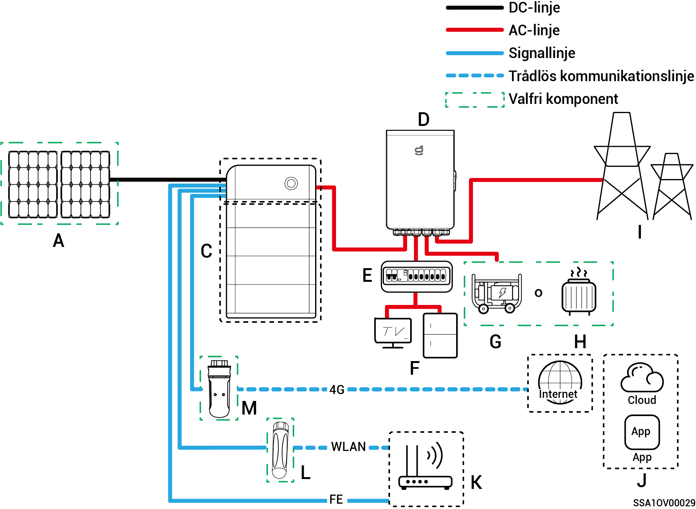
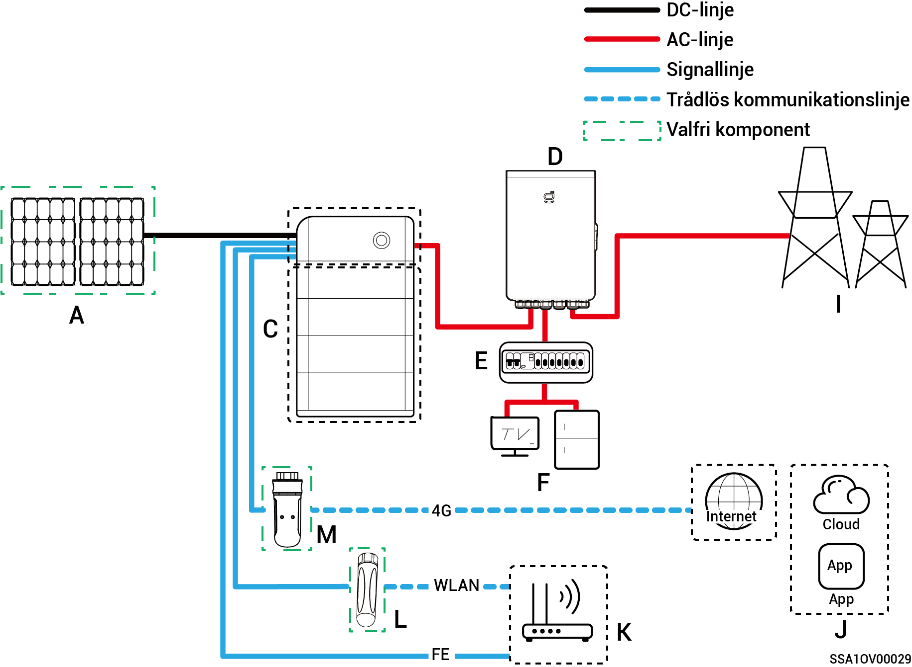
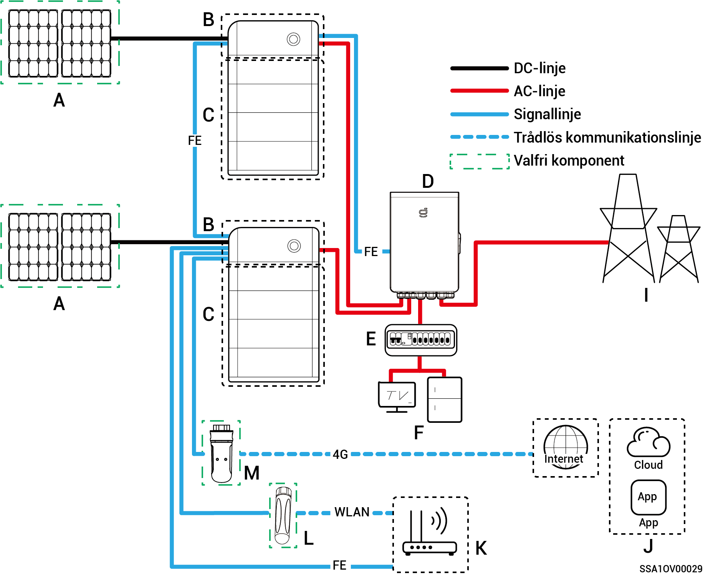
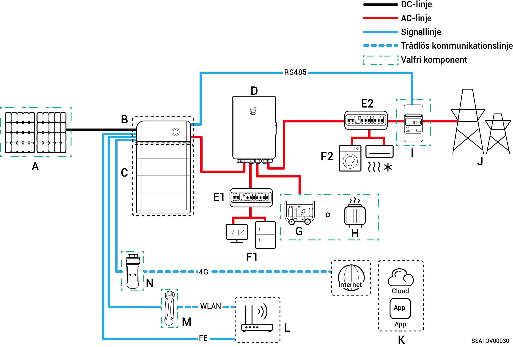
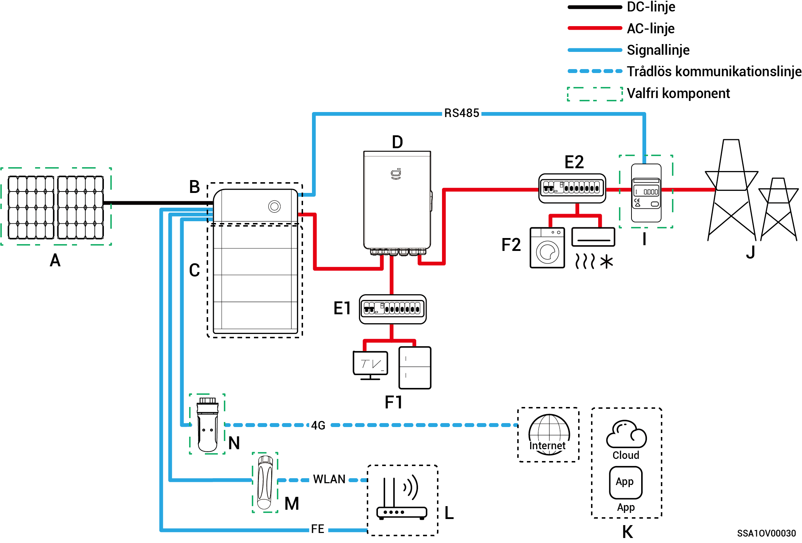
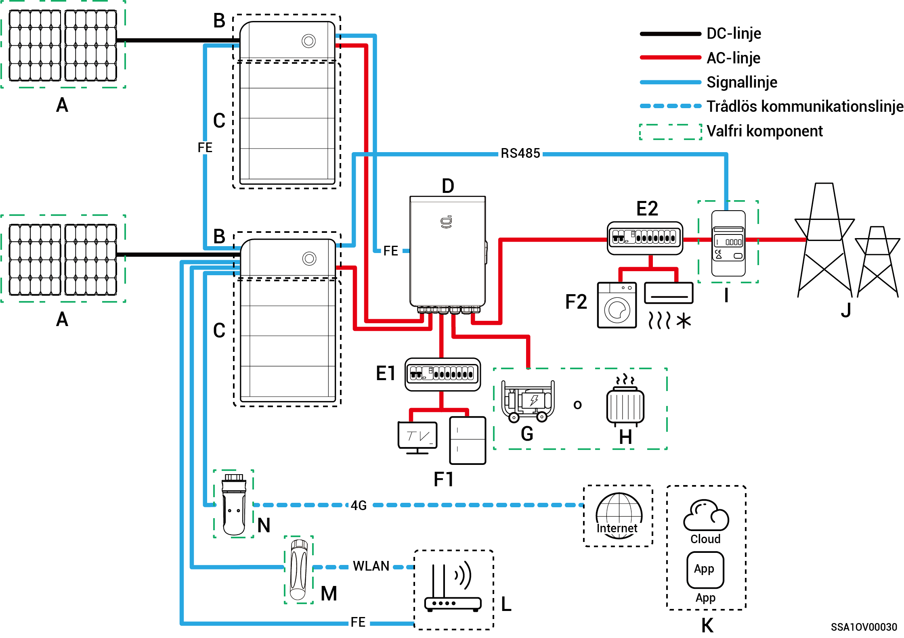
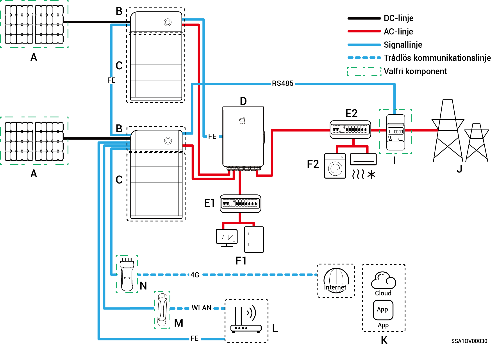

# Systemkoppling

* Denna produkt är avsedd för scenarion där nätverket används som reservkraftsystem i hushåll. Den ska användas tillsammans med solpaneler, växelriktare, batteripaket, huvudströmställare, generatorer och elnät.
* Vid strömavbrott växlar hushållets energilagringssystem till off grid-driftläge. När elnätet återgår till normal drift växlar hushållets energilagringssystem tillbaka till on grid-läge. På så sätt erhålls en sömlös övergång mellan solcellslagringen och generatorn.



* <mark style="color:blue;">Vid nätverksdrift med reservkraft är varaktigheten för off grid-drift av reserveffektlasten relaterad till solcellslagringssystemets strömförsörjningskapacitet. Vid avvikelse i solcellslagringssystemets strömförsörjning under off grid-drift (inklusive men inte begränsat till onormal strömgenerering från solpaneler, otillräcklig batterieffekt och onormal strömförsörjning till generatorn) kommer reserveffektlasten inte att kunna drivas.</mark>
* <mark style="color:blue;">Nätverksdiagrammet har två växelriktare som exempel. Antalet växelriktare som kan anslutas beror på Gateway-enhetens egenskaper. Se tabell 2-1 för vidare information.</mark>

**Tabell 2-1**

<table><thead><tr><th width="75">Siffra</th><th>Modell</th><th>Antal växelriktare som kan anslutas</th></tr></thead><tbody><tr><td><strong>1</strong></td><td>Sigen Gateway HomeMax SP</td><td>3 enheter</td></tr><tr><td><strong>2</strong></td><td>Gateway Home SP</td><td>1 enhet</td></tr><tr><td><strong>3</strong></td><td>Gateway Home SP 12K</td><td>2 enheter</td></tr><tr><td><strong>4</strong></td><td>Sigen Gateway SP AU</td><td>2 enheter</td></tr><tr><td><strong>5</strong></td><td>Sigen Gateway HomeMax TP</td><td>2 enheter</td></tr><tr><td><strong>6</strong></td><td>Sigen Gateway Home TP</td><td>1 enhet</td></tr><tr><td><strong>7</strong></td><td>Sigen Gateway TP AU</td><td>2 enheter</td></tr><tr><td><strong>8</strong></td><td>Sigen Gateway HomeMax TP CN</td><td>2 enheter</td></tr><tr><td><strong>9</strong></td><td>Sigen Gateway Home TP 30K</td><td>1 enhet</td></tr><tr><td><strong>10</strong></td><td>Sigen Gateway Home TP 30K CN</td><td>1 enhet</td></tr></tbody></table>

### Kopplingsschema för komplett hushållsreservsystem

**En växelriktare (Gateway räknar med kretsbrytare för anslutning av smart last/dieselgenerator)**

**En växelriktare (Gateway räknar inte med kretsbrytare ansluten till smart last/dieselgenerator)**

**Flera växelriktare (Gateway räknar med kretsbrytare för anslutning av smart last/dieselgenerator)**

**Flera växelriktare (Gateway räknar inte med kretsbrytare ansluten till smart last/dieselgenerator)**

<table><thead><tr><th width="81">Nr</th><th>Beskrivning</th><th width="78">Nr</th><th>Beskrivning</th><th>Nr</th><th>Beskrivning</th></tr></thead><tbody><tr><td><strong>A</strong></td><td>Solpanel</td><td><strong>B</strong></td><td>SigenStor EC/SigenStor AC/Sigen Hybrid</td><td><strong>C</strong></td><td>SigenStor BAT</td></tr><tr><td><strong>D</strong></td><td>Gateway</td><td><strong>E</strong></td><td>Strömfördelningspanel för reservkraft</td><td><strong>F</strong></td><td>Hushållslaster, reserv</td></tr><tr><td><strong>G</strong></td><td>Hushållslaster, reserv</td><td><strong>H</strong></td><td>Smarta laster</td><td><strong>I</strong></td><td>Elnät</td></tr><tr><td><strong>J</strong></td><td>mySigen</td><td><strong>K</strong></td><td>Router</td><td><strong>L</strong></td><td>Antenn</td></tr><tr><td><strong>M</strong></td><td>CommMod</td><td></td><td></td><td></td><td></td></tr></tbody></table>



* <mark style="color:blue;">Om B är Sigen Hybrid är C tillval.</mark>
* <mark style="color:blue;">Om F (hushållets reservlast) utsätts för läckage kan det innebära risk för elektriska stötar. För att undvika denna fara måste en jordfelsbrytare (RCD) installeras mellan D (Gateway) och F (hushållets reservlast).</mark>
* <mark style="color:blue;">Som reservkraftkälla för långvarig drift utan elnät kan dieselgeneratorn arbeta tillsammans med Gateway, för att ge mjuka övergångar mellan solceller, lagrad energi och kraft från dieselgeneratorn.</mark>
* <mark style="color:blue;">All elutrustning i ägarens hem kan anslutas som smarta laster. För att säkerställa att denna produkt maximerar nyttan för användarna rekommenderas att högeffektsutrustning ansluts som smarta laster (värmepumpar, poolvärmare, torktumlare etc.), som kan stängas av när energilagringssystemet har låg effekt. Annan lågeffektsutrustning ansluts som hushållslaster (lampor, routrar osv.).</mark>
* <mark style="color:blue;">Vi rekommenderar att du använder snabbt Ethernet och trådlöst nätverk för kommunikation med växelriktarna. När ingen 4G-surf eller CommMod finns måste användaren ersätta ett SIM-kort.</mark>

### **Kopplingsschema för partiellt hushållsreservsystem**

**En växelriktare (Gateway räknar med kretsbrytare för anslutning av smart last/dieselgenerator)**

**En växelriktare (Gateway räknar inte med kretsbrytare ansluten till smart last/dieselgenerator)**

**Flera växelriktare (Gateway räknar med kretsbrytare för anslutning av smart last/dieselgenerator)**

**Flera växelriktare (Gateway räknar inte med kretsbrytare ansluten till smart last/dieselgenerator)**

| Nr     | Beskrivning            | Nr     | Beskrivning                            | Nr     | Beskrivning                                              |
| ------ | ---------------------- | ------ | -------------------------------------- | ------ | -------------------------------------------------------- |
| **A**  | Solpanel               | **B**  | SigenStor EC/SigenStor AC/Sigen Hybrid | **C**  | SigenStor BAT                                            |
| **D**  | Gateway                | **E1** | Strömfördelningspanel för reservkraft  | **E2** | Strömfördelningspanel för delar som inte har reservkraft |
| **F1** | Hushållslaster, reserv | **F2** | Hushållslaster, ej reserv              | **G**  | Dieselgenerator                                          |
| **H**  | Smarta laster          | **I**  | Effektsensor                           | **J**  | Elnät                                                    |
| **K**  | mySigen                | **L**  | Router                                 | **M**  | Antenn                                                   |
| **N**  | CommMod                |        |                                        |        |                                                          |



* <mark style="color:blue;">Om B är Sigen Hybrid är C tillval.</mark>
* <mark style="color:blue;">Om E2 (strömfördelningspanelen som ej är reserv) är försedd med läckageskydd rekommenderas att använda en jordfelsbrytare för nominell restström vid drift större än eller lika med antalet växelriktare gånger 100 mA.</mark>
* <mark style="color:blue;">Om F1 (hushållets reservlast) utsätts för läckage kan det innebära risk för elektriska stötar. För att undvika denna fara måste en jordfelsbrytare (RCD) installeras mellan D (Gateway) och F1 (hushållets reservlast).</mark>
* <mark style="color:blue;">Som reservkraftkälla för långvarig drift utan elnät kan dieselgeneratorn arbeta tillsammans med Gateway, för att ge mjuka övergångar mellan solceller, lagrad energi och kraft från dieselgeneratorn.</mark>
* <mark style="color:blue;">All elutrustning i ägarens hem kan anslutas som smarta laster. För att säkerställa att denna produkt maximerar nyttan för användarna rekommenderas att högeffektsutrustning ansluts som smarta laster (värmepumpar, poolvärmare, torktumlare etc.), som kan stängas av när energilagringssystemet har låg effekt. Annan lågeffektsutrustning ansluts som hushållslaster (lampor, routrar osv.).</mark>
* <mark style="color:blue;">Effektsensorn används för datainsamling vid anslutningspunkten till elnätet och möjliggör anslutning till elnätet utan kraftleverans. Det inte nödvändigt att använda effektsensorn vid koppling av partiellt</mark> <mark style="color:blue;">hushållsreservsystem. Effektsensorn används vid koppling av styrsystemet för partiell reservkraft och anslutning till elnätet utan kraftleverans.</mark>
* <mark style="color:blue;">Vi rekommenderar att du använder snabbt Ethernet och trådlöst nätverk för kommunikation med växelriktarna. När ingen 4G-surf eller CommMod finns måste användaren ersätta ett SIM-kort.</mark>
