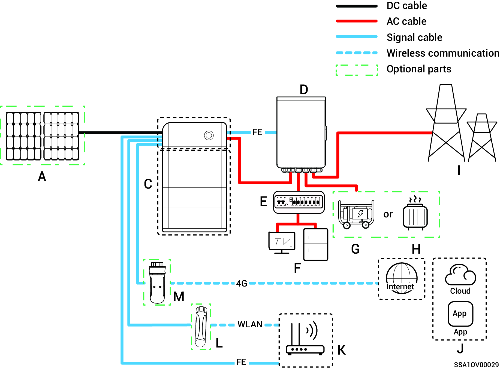
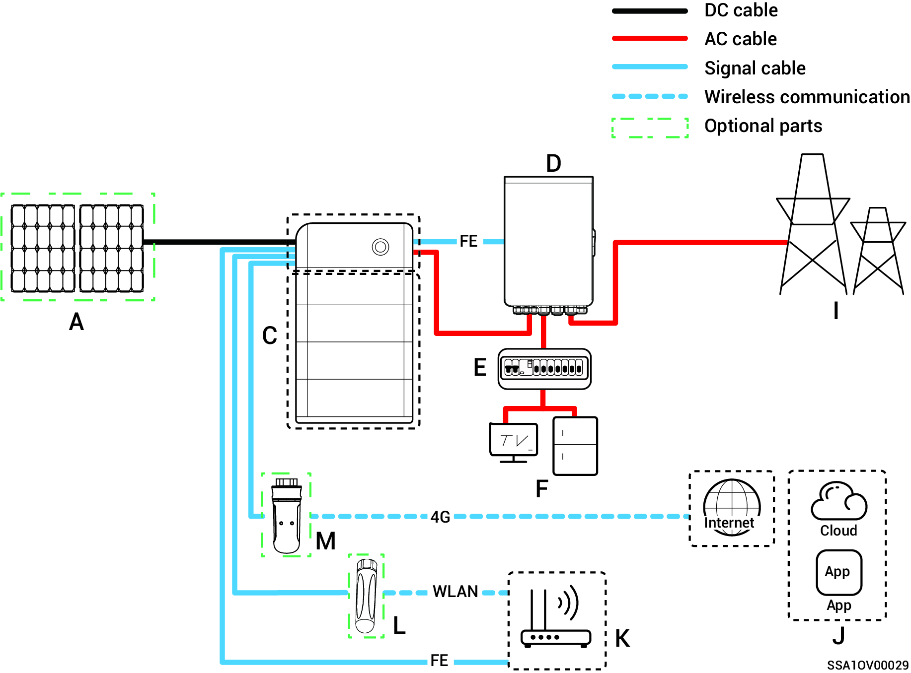
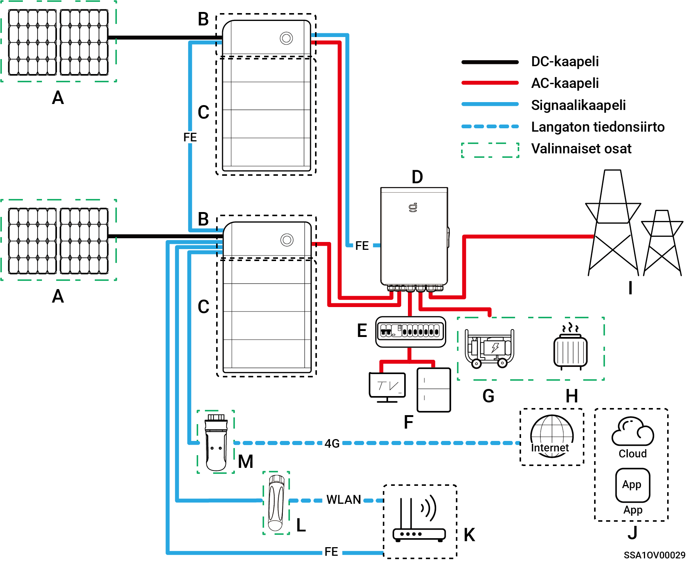
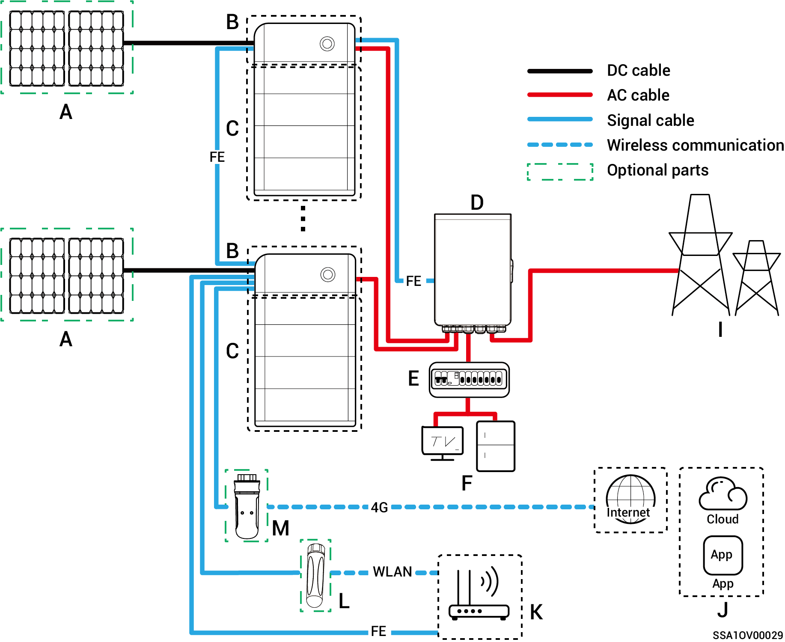
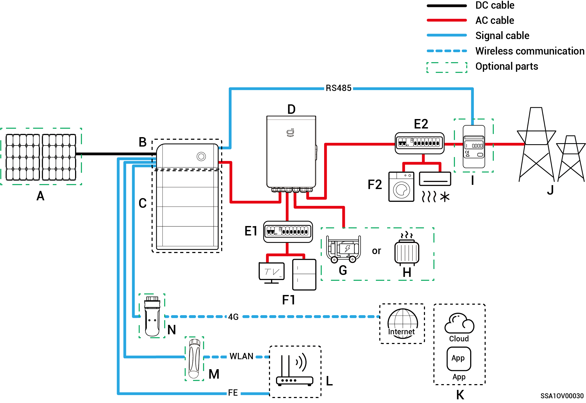
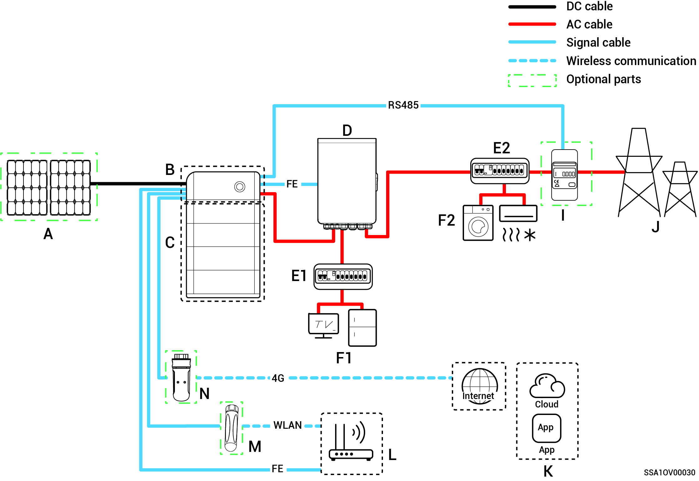
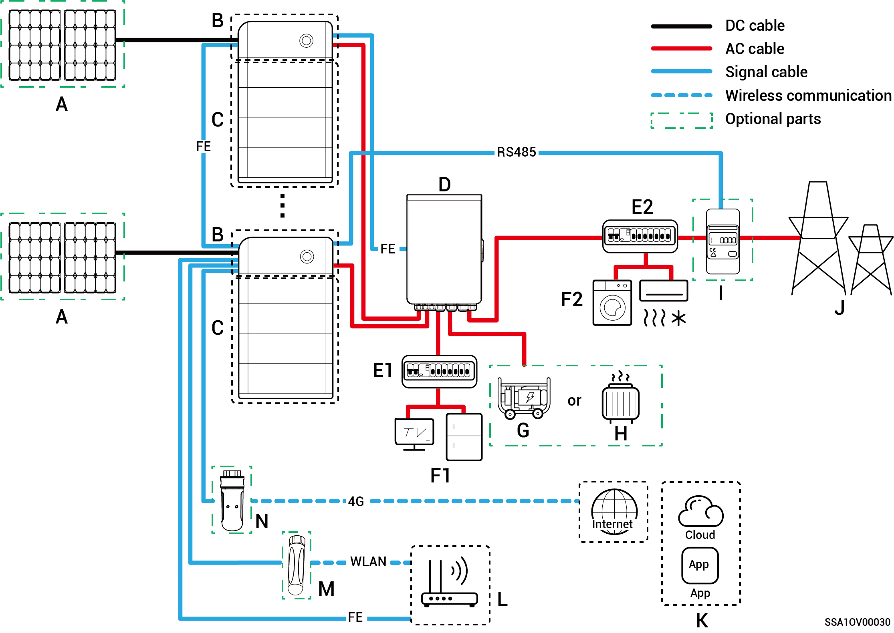
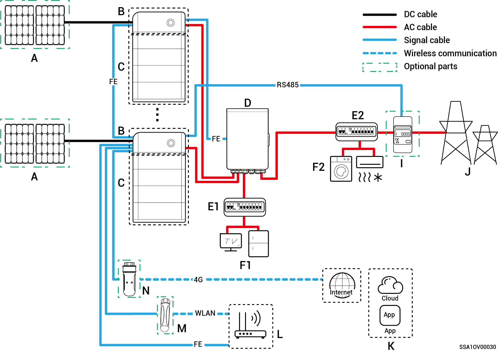

# Järjestelmän johdotuksen esittely

* Tämä tuote soveltuu kotitalouksien varavoimajärjestelmien verkottumisskenaarioihin. Sitä on käytettävä yhdessä aurinkopaneelien, inverttereiden, akkuyksiköiden, pääkytkimien, kuormien, generaattoreiden ja sähköverkon kanssa.
* Sähkökatkon sattuessa kotitalouden energian varastointijärjestelmä siirtyy off-grid-käyttötilaan. Kun sähköverkko palaa normaaliin toimintaan, kotitalouden energian varastointijärjestelmä vaihtaa takaisin on-grid-tilaan. Tämä mahdollistaa saumattoman vaihdon aurinkosähkövaraston ja generaattorin välillä.



* <mark style="color:blue;">Varavoiman verkottumisessa varavoimakuorman off-grid-käytön kesto riippuu aurinkosähkövarastojärjestelmän virransyöttökapasiteetista. Jos aurinkosähkövarastojärjestelmän virransyötössä ilmenee poikkeama off-grid-toiminnon aikana (mukaan lukien, mutta ei rajoittuen, poikkeava aurinkosähkön tuotanto, akun virran riittämättömyys ja generaattorin virransyötön poikkeama), varavoimakuorma ei silloin pysty toimimaan.</mark>
* <mark style="color:blue;">Verkkokaavio käyttää esimerkkinä kahta invertteriä. Liitettävien inverttereiden määrä riippuu Gatewayn teknisistä tiedoista. Lisätietoja löydät taulukosta 2-1.</mark>

**Taulukko 2-1**

<table><thead><tr><th width="75" align="center">S/N</th><th>Malli</th><th align="center">Liitett&auml;vien inverttereiden m&auml;&auml;r&auml;</th></tr></thead><tbody><tr><td align="center"><strong>1</strong></td><td>Sigen Gateway HomeMax SP</td><td align="center">3 yksikk&ouml;&auml;</td></tr><tr><td align="center"><strong>2</strong></td><td>Gateway Home SP</td><td align="center">1 yksikk&ouml;</td></tr><tr><td align="center"><strong>3</strong></td><td>Gateway Home SP 12K</td><td align="center">2 yksikk&ouml;&auml;</td></tr><tr><td align="center"><strong>4</strong></td><td>Sigen Gateway SP AU</td><td align="center">2 yksikk&ouml;&auml;</td></tr><tr><td align="center"><strong>5</strong></td><td>Sigen Gateway HomeMax SP LA</td><td align="center">2 yksikk&ouml;&auml;</td></tr><tr><td align="center"><strong>6</strong></td><td>Sigen Gateway Home SP AU</td><td align="center">2 yksikk&ouml;&auml;</td></tr><tr><td align="center"><strong>7</strong></td><td>Sigen Gateway HomePro SP</td><td align="center">1 yksikk&ouml;</td></tr><tr><td align="center"><strong>8</strong></td><td>Sigen Gateway HomeMax TP</td><td align="center">2 yksikk&ouml;&auml;</td></tr><tr><td align="center"><strong>9</strong></td><td>Sigen Gateway Home TP</td><td align="center">1 yksikk&ouml;</td></tr><tr><td align="center"><strong>10</strong></td><td>Sigen Gateway TP AU</td><td align="center">2 yksikk&ouml;&auml;</td></tr><tr><td align="center"><strong>11</strong></td><td>Sigen Gateway HomeMax TP CN</td><td align="center">2 yksikk&ouml;&auml;</td></tr><tr><td align="center"><strong>12</strong></td><td>Sigen Gateway Home TP 30K</td><td align="center">1 yksikk&ouml;</td></tr><tr><td align="center"><strong>13</strong></td><td>Sigen Gateway Home TP 30K CN</td><td align="center">1 yksikk&ouml;</td></tr><tr><td align="center"><strong>14</strong></td><td>Sigen Gateway HomePro TP</td><td align="center">2 yksikk&ouml;&auml;</td></tr><tr><td align="center"><strong>15</strong></td><td>Sigen Gateway HomePro TP-L</td><td align="center">2 yksikk&ouml;&auml;</td></tr><tr><td align="center"><strong>16</strong></td><td>Sigen Gateway Home TP AU</td><td align="center">2 yksikk&ouml;&auml;</td></tr></tbody></table>

### **Koko kodin varavoimajärjestelmän johdotuskaavio**

**Yksi invertteri (Gatewayssä on katkaisija liitettynä älykkääseen kuormaan / dieselgeneraattoriin)**

**Yksi invertteri (Gatewayssä ei ole katkaisijaa liitettynä älykkääseen kuormaan / dieselgeneraattoriin)**

**Useita inverttereitä (Gatewayssä on katkaisija liitettynä älykkääseen kuormaan / dieselgeneraattoriin)**

**Useita inverttereitä (Gatewayssä ei ole katkaisijaa liitettynä älykkääseen kuormaan / dieselgeneraattoriin)**

<table><thead><tr><th width="71" align="center">Nro</th><th>Kuvaus</th><th width="69.8182373046875" align="center">Nro</th><th>Kuvaus</th><th width="70.0908203125" align="center">Nro</th><th>Kuvaus</th></tr></thead><tbody><tr><td align="center"><strong>A</strong></td><td>Aurinkopaneeli</td><td align="center"><strong>B</strong></td><td>SigenStor EC / Sigen Hybrid</td><td align="center"><strong>C</strong></td><td>SigenStor BAT</td></tr><tr><td align="center"><strong>D</strong></td><td>Gateway</td><td align="center"><strong>E</strong></td><td>Varavoiman jakelupaneeli</td><td align="center"><strong>F</strong></td><td>Kotitalouskuormien varavoima</td></tr><tr><td align="center"><strong>G</strong></td><td>Kotitalouskuormien varavoima</td><td align="center"><strong>H</strong></td><td>&Auml;lykk&auml;&auml;t kuormat</td><td align="center"><strong>I</strong></td><td>S&auml;hk&ouml;verkko</td></tr><tr><td align="center"><strong>J</strong></td><td>mySigen</td><td align="center"><strong>K</strong></td><td>Reititin</td><td align="center"><strong>L</strong></td><td>Antenni</td></tr><tr><td align="center"><strong>M</strong></td><td>CommMod</td><td align="center"></td><td></td><td align="center"></td><td></td></tr></tbody></table>



* <mark style="color:blue;">Jos F (kotitalouskuorman varavoima) vuotaa, se voi aiheuttaa sähköiskuvaaran. Tämän vaaran välttämiseksi on asennettava vikavirtasuojakytkin (RCD) D:n (Gateway) ja F:n (kotitalouskuorman varavoiman) väliin.</mark>
* <mark style="color:blue;">Varaenergialähteenä pitkäaikaisessa poissa verkosta -käytössä dieselgeneraattori voi toimia yhdessä Gatewayn kanssa ja tarjota sujuvan siirtymisen aurinkosähkön, varastoinnin ja dieselsähköntuotannon välillä.</mark>
* <mark style="color:blue;">Kaikki kodin sähkölaitteet voidaan kytkeä älykkäinä kuormina. Jotta tämä tuote tarjoaisi käyttäjille mahdollisimman suuren hyödyn, on suositeltavaa kytkeä suuritehoiset laitteet älykkäiksi kuormiksi (lämpöpumput, uima-altaan lämmittimet, kuivausrummut jne.), jotka voidaan katkaista, kun energian varastointijärjestelmän teho on alhainen. Muut pienitehoiset laitteet kytketään kotitalouskuormana (valaisimet, reitittimet jne.)</mark>
* <mark style="color:blue;">On suositeltavaa käyttää Fast Ethernet- ja WLAN-verkkoja inverttereiden kanssa tapahtuvaan tiedonsiirtoon. Kun CommModin vapaa 4G-liikenne loppuu, käyttäjien on vaihdettava SIM-kortti.</mark>

### **Osittaisen kodin varavoimajärjestelmän johdotuskaavio**

**Yksi invertteri (Gatewayssä on katkaisija liitettynä älykkääseen kuormaan / dieselgeneraattoriin)**

**Yksi invertteri (Gatewayssä ei ole katkaisijaa liitettynä älykkääseen kuormaan / dieselgeneraattoriin)**

**Useita inverttereitä (Gatewayssä on katkaisija liitettynä älykkääseen kuormaan / dieselgeneraattoriin)**

**Useita inverttereitä (Gatewayssä ei ole katkaisijaa liitettynä älykkääseen kuormaan / dieselgeneraattoriin)**

<table><thead><tr><th width="71.6363525390625" align="center">Nro</th><th>Kuvaus</th><th width="71.3636474609375" align="center">Nro</th><th>Kuvaus</th><th width="71" align="center">Nro</th><th>Kuvaus</th></tr></thead><tbody><tr><td align="center"><strong>A</strong></td><td>Aurinkopaneeli</td><td align="center"><strong>B</strong></td><td>SigenStor EC / Sigen Hybrid</td><td align="center"><strong>C</strong></td><td>SigenStor BAT</td></tr><tr><td align="center"><strong>D</strong></td><td>Gateway</td><td align="center"><strong>E1</strong></td><td>Varavoiman jakelupaneeli</td><td align="center"><strong>E2</strong></td><td>Varavoimaj&auml;rjestelm&auml;&auml;n kuulumaton jakelupaneeli</td></tr><tr><td align="center"><strong>F1</strong></td><td>Kotitalouskuormien varavoima</td><td align="center"><strong>F2</strong></td><td>Varavoimaj&auml;rjestelm&auml;&auml;n kuulumattomat kotitalouskuormat</td><td align="center"><strong>G</strong></td><td>Dieselgeneraattori</td></tr><tr><td align="center"><strong>H</strong></td><td>&Auml;lykk&auml;&auml;t kuormat</td><td align="center"><strong>I</strong></td><td>Tehoanturi</td><td align="center"><strong>J</strong></td><td>S&auml;hk&ouml;verkko</td></tr><tr><td align="center"><strong>K</strong></td><td>mySigen</td><td align="center"><strong>L</strong></td><td>Reititin</td><td align="center"><strong>M</strong></td><td>Antenni</td></tr><tr><td align="center"><strong>N</strong></td><td>CommMod</td><td align="center"></td><td></td><td align="center"></td><td></td></tr></tbody></table>



* <mark style="color:blue;">Jos E2:ssa (varavoimajärjestelmään kuulumattomassa jakelupaneelissa) on vuotosuojaus, on suositeltavaa, että nimellinen jäännösvirta on suurempi tai yhtä suuri kuin invertterien lukumäärä × 100 mA.</mark>
* <mark style="color:blue;">Jos F1:ssä (kotitalouskuorman varavoimassa) on vuoto, se voi aiheuttaa sähköiskuvaaran. Tämän vaaran välttämiseksi on asennettava vikavirtasuojakytkin (RCD) D:n (Gateway) ja F1:n (kotitalouskuorman varavoiman) väliin.</mark>
* <mark style="color:blue;">Varaenergialähteenä pitkäaikaisessa poissa verkosta -käytössä dieselgeneraattori voi toimia yhdessä Gatewayn kanssa ja tarjota sujuvan siirtymisen aurinkosähkön, varastoinnin ja dieselsähköntuotannon välillä.</mark>
* <mark style="color:blue;">Kaikki kodin sähkölaitteet voidaan kytkeä älykkäinä kuormina. Jotta tämä tuote tarjoaisi käyttäjille mahdollisimman suuren hyödyn, on suositeltavaa kytkeä suuritehoiset laitteet älykkäiksi kuormiksi (lämpöpumput, uima-altaan lämmittimet, kuivausrummut jne.), jotka voidaan katkaista, kun energian varastointijärjestelmän teho on alhainen. Muut pienitehoiset laitteet kytketään kotitalouskuormana (valaisimet, reitittimet jne.)</mark>
* <mark style="color:blue;">Tehoanturi kerää tietoja verkon liitäntäpisteistä ja mahdollistaa nollatehoisen verkkoliitännän. Osittaisen kodin varavoimajärjestelmän</mark> <mark style="color:blue;">johdotusta varten tehoanturia ei tarvitse määrittää. Osittaisen varavoiman ja nollatehoisen verkkoliitännän ohjausjärjestelmän johdotuksessa tehoanturi on määritettävä.</mark>
* <mark style="color:blue;">On suositeltavaa käyttää Fast Ethernet- ja WLAN-verkkoja inverttereiden kanssa tapahtuvaan tiedonsiirtoon. Kun CommModin vapaa 4G-liikenne loppuu, käyttäjien on vaihdettava SIM-kortti.</mark>
