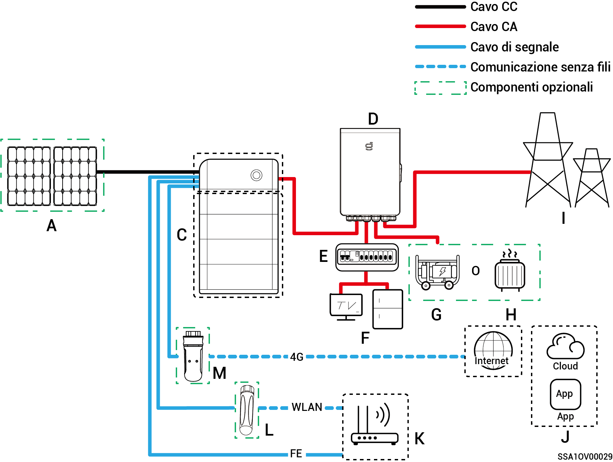
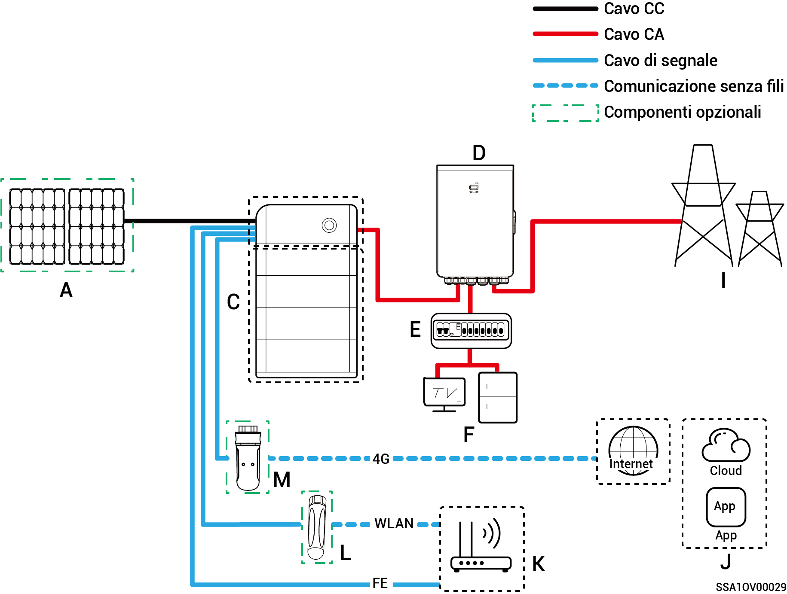
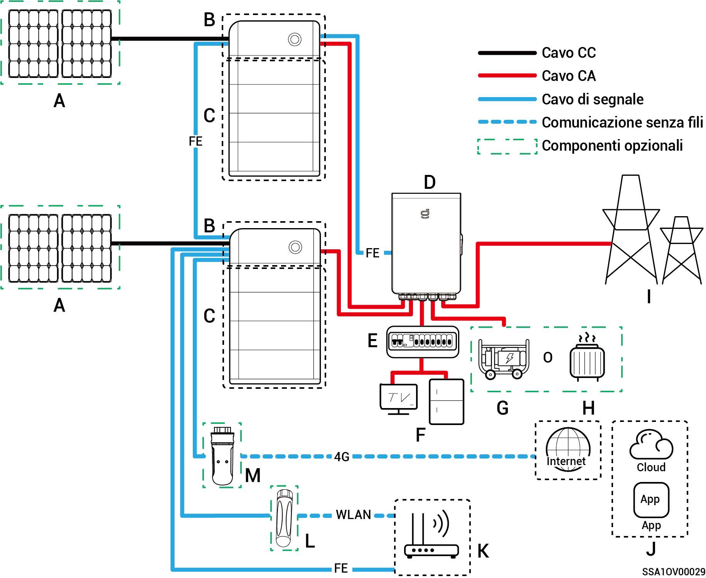
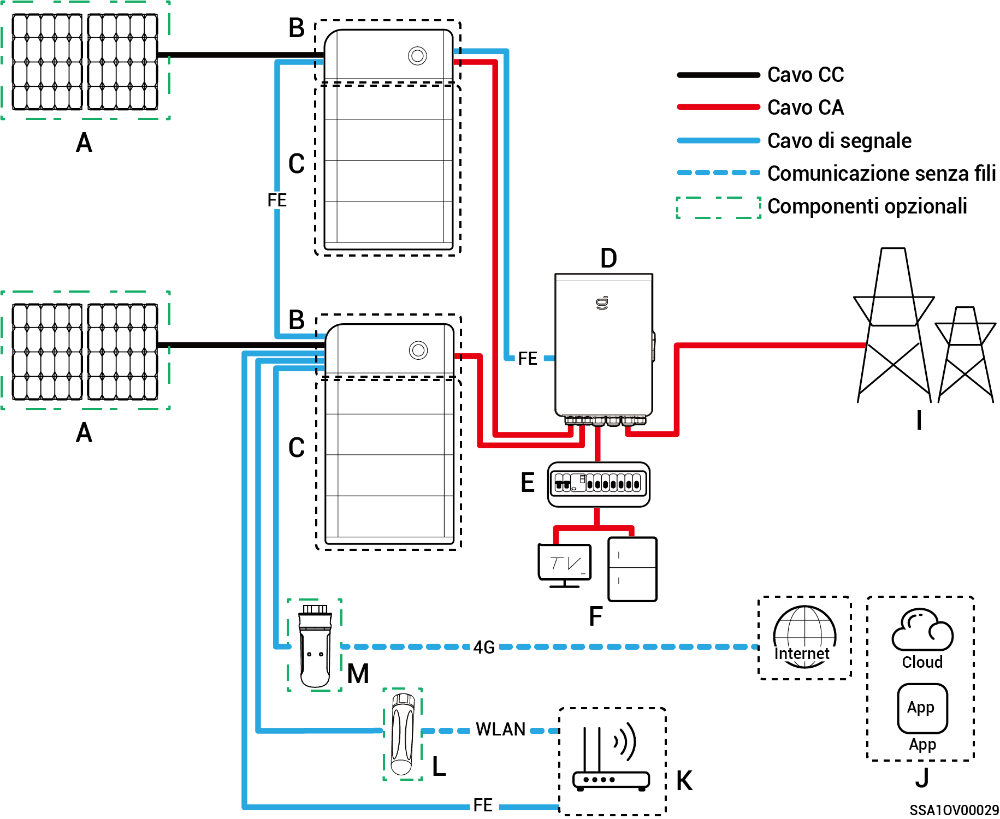
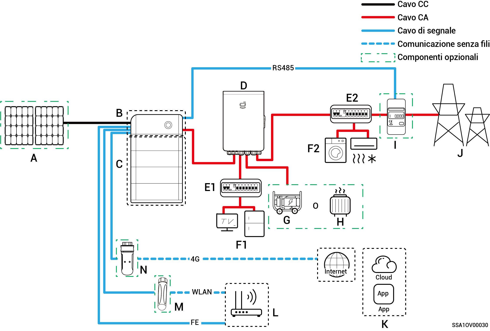
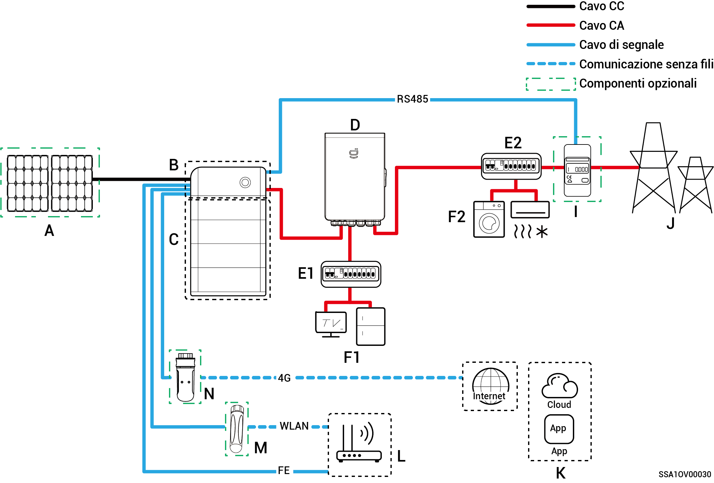
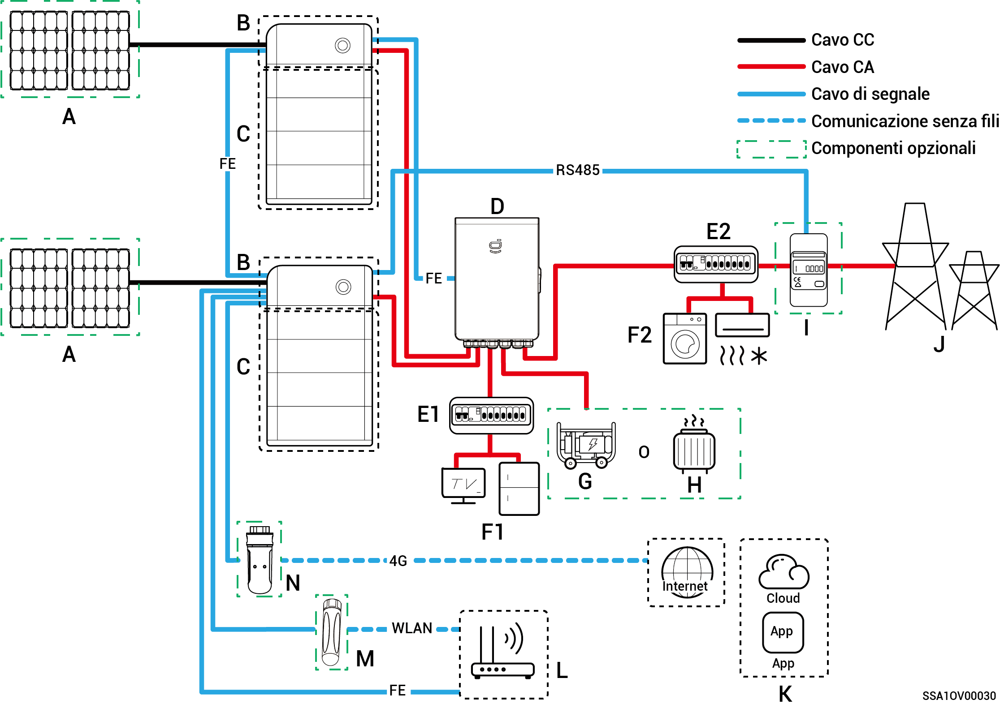
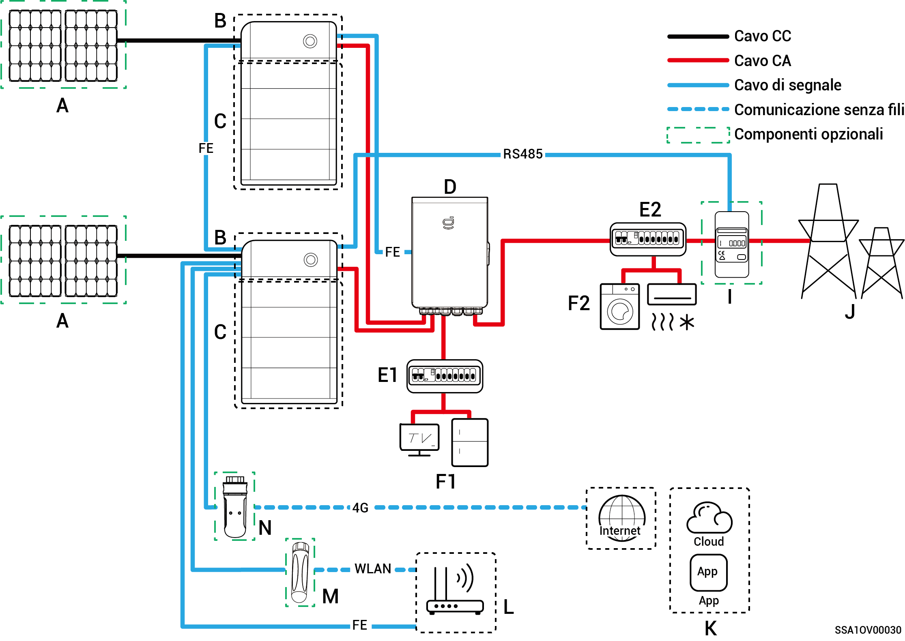

# Introduzione al cablaggio del sistema

* Questo prodotto è applicabile a scenari con collegamento alla rete del sistema di alimentazione di backup domestico. Deve essere utilizzato insieme ai pannelli fotovoltaici, agli inverter, ai pacchi batteria, agli interruttori di controllo principali, ai carichi, ai generatori e alla rete elettrica.
* Se si verifica una interruzione di corrente, il sistema di stoccaggio dell'energia domestico passa alla modalità operativa off-grid. Quando la rete elettrica torna a funzionare normalmente, il sistema di stoccaggio dell'energia domestico torna alla modalità on-grid. Ciò permette un passaggio senza soluzione di continuità tra l'accumulo fotovoltaico e il generatore.



* <mark style="color:blue;">Quando è attiva la configurazione della rete di alimentazione di backup, la durata del funzionamento off-grid del carico di backup è legata alla capacità di alimentazione del sistema di accumulo fotovoltaico. Se si verifica un'anomalia nell'alimentazione del sistema di accumulo fotovoltaico durante il funzionamento off-grid (ad esempio un'anormale generazione di energia fotovoltaica, carica della batteria non sufficiente e un'alimentazione del generatore non normale), il carico di backup non sarà comunque in grado di funzionare.</mark>
* <mark style="color:blue;">Lo schema di collegamento in rete prende in considerazione due inverter a titolo di esempio. Il numero di inverter che si possono collegare dipende dalle specifiche del gateway. Per maggiori informazioni, consultare la Tabella 2-1.</mark>

**Tabella 2-1**

<table><thead><tr><th width="75">N.</th><th>Modello</th><th>Numero di inverter che si possono collegare</th></tr></thead><tbody><tr><td><strong>1</strong></td><td>Sigen Gateway HomeMax SP</td><td>3 unità</td></tr><tr><td><strong>2</strong></td><td>Gateway Home SP</td><td>1 unità</td></tr><tr><td><strong>3</strong></td><td>Gateway Home SP 12K</td><td>2 unità</td></tr><tr><td><strong>4</strong></td><td>Sigen Gateway SP AU</td><td>2 unità</td></tr><tr><td><strong>5</strong></td><td>Sigen Gateway HomeMax TP</td><td>2 unità</td></tr><tr><td><strong>6</strong></td><td>Sigen Gateway Home TP</td><td>1 unità</td></tr><tr><td><strong>7</strong></td><td>Sigen Gateway TP AU</td><td>2 unità</td></tr><tr><td><strong>8</strong></td><td>Sigen Gateway HomeMax TP CN</td><td>2 unità</td></tr><tr><td><strong>9</strong></td><td>Sigen Gateway Home TP 30K</td><td>1 unità</td></tr><tr><td><strong>10</strong></td><td>Sigen Gateway Home TP 30K CN</td><td>1 unità</td></tr></tbody></table>

### Scheda di cablaggio del sistema di backup per l'intera casa

**Inverter singolo (il gateway ha l'interruttore automatico per collegare un carico intelligente o un generatore diesel)**

**Inverter singolo (il gateway non ha l'interruttore automatico collegato al carico intelligente o al generatore diesel)**

**Inverter multipli (il gateway ha l'interruttore automatico per collegare un carico intelligente o un generatore diesel)**

**Inverter multipli (il gateway non ha l'interruttore automatico collegato al carico intelligente o al generatore diesel)**

<table><thead><tr><th width="81">N.</th><th>Descrizione</th><th width="78">N.</th><th>Descrizione</th><th>N.</th><th>Descrizione</th></tr></thead><tbody><tr><td><strong>A</strong></td><td>Pannello fotovoltaico</td><td><strong>B</strong></td><td>SigenStor EC/SigenStor AC /Sigen Hybrid</td><td><strong>C</strong></td><td>SigenStor BAT</td></tr><tr><td><strong>D</strong></td><td>Gateway</td><td><strong>E</strong></td><td>Quadro di distribuzione di backup</td><td><strong>F</strong></td><td>Carichi domestici che necessitano del backup</td></tr><tr><td><strong>G</strong></td><td>Carichi domestici che necessitano del backup</td><td><strong>H</strong></td><td>Carichi intelligenti</td><td><strong>I</strong></td><td>Rete elettrica</td></tr><tr><td><strong>J</strong></td><td>mySigen</td><td><strong>K</strong></td><td>Router</td><td><strong>L</strong></td><td>Antenna</td></tr><tr><td><strong>M</strong></td><td>CommMod</td><td></td><td></td><td></td><td></td></tr></tbody></table>



* <mark style="color:blue;">Quando B è Sigen Hybrid, C è opzionale.</mark>
* <mark style="color:blue;">Se F (carico domestico che necessita del backup) è soggetto a dispersioni, sussiste un rischio di folgorazione. Per evitare questo rischio, si deve installare un interruttore differenziale (RCD) tra D (gateway) ed F (carico domestico che necessita del backup).</mark>
* <mark style="color:blue;">Il generatore diesel, come fonte di energia di backup per applicazioni off-grid a lungo termine, può lavorare in tandem con il gateway per offrire un passaggio agevole tra fotovoltaico, accumulo e generazione diesel.</mark>
* <mark style="color:blue;">Tutte le apparecchiature elettriche presenti nella casa del proprietario possono essere collegate come carichi intelligenti. Per garantire che gli utenti possano ricevere i massimi vantaggi da questo prodotto, si consiglia di collegare le apparecchiature ad elevata potenza come carichi intelligenti (pompe di calore, riscaldatori per piscine, asciugatrici, ecc.) che possono essere interrotti quando il sistema di accumulo dell'energia ha poca energia a disposizione. Le altre apparecchiature a bassa potenza sono collegate come carichi domestici (lampade, router, ecc.)</mark>
* <mark style="color:blue;">Si consiglia di utilizzare Fast Ethernet e una WLAN per la comunicazione con gli inverter. Quando il traffico 4G gratuito di CommMod si esaurisce, l'utente deve sostituire la scheda SIM.</mark>

### **Schema di cablaggio del sistema di backup parziale per la casa**

**Inverter singolo (il gateway ha l'interruttore automatico per collegare un carico intelligente o un generatore diesel)**

**Inverter singolo (il gateway non ha l'interruttore automatico collegato al carico intelligente o al generatore diesel)**

**Inverter multipli (il gateway ha l'interruttore automatico per collegare un carico intelligente o un generatore diesel)**

**Inverter multipli (il gateway non ha l'interruttore automatico collegato al carico intelligente o al generatore diesel)**

| N.     | Descrizione                                  | N.     | Descrizione                                      | N.     | Descrizione                          |
| ------ | -------------------------------------------- | ------ | ------------------------------------------------ | ------ | ------------------------------------ |
| **A**  | Pannello fotovoltaico                        | **B**  | SigenStor EC/SigenStor AC /Sigen Hybrid          | **C**  | SigenStor BAT                        |
| **D**  | Gateway                                      | **E1** | Quadro di distribuzione di backup                | **E2** | Quadro di distribuzione senza backup |
| **F1** | Carichi domestici che necessitano del backup | **F2** | Carichi domestici che non necessitano del backup | **G**  | Generatore diesel                    |
| **H**  | Carichi intelligenti                         | **I**  | Sensore di potenza                               | **J**  | Rete elettrica                       |
| **K**  | mySigen                                      | **L**  | Router                                           | **M**  | Antenna                              |
| **N**  | CommMod                                      |        |                                                  |        |                                      |



* <mark style="color:blue;">Quando B è Sigen Hybrid, C è opzionale.</mark>
* <mark style="color:blue;">Se E2 (quadro di distribuzione senza backup) è dotato di protezione contro le dispersioni, si raccomanda che la corrente operativa residua nominale sia maggiore o uguale al numero di inverter × 100 mA.</mark>
* <mark style="color:blue;">Se F1 (carico domestico che necessita del backup) è soggetto a dispersioni, sussiste un rischio di folgorazione. Per evitare questo rischio, si deve installare un interruttore differenziale (RCD) tra D (gateway) ed F1 (carico domestico che necessita del backup).</mark>
* <mark style="color:blue;">Il generatore diesel, come fonte di energia di backup per applicazioni off-grid a lungo termine, può lavorare in tandem con il gateway per offrire un passaggio agevole tra fotovoltaico, accumulo e generazione diesel.</mark>
* <mark style="color:blue;">Tutte le apparecchiature elettriche presenti nella casa del proprietario possono essere collegate come carichi intelligenti. Per garantire che gli utenti possano ricevere i massimi vantaggi da questo prodotto, si consiglia di collegare le apparecchiature ad elevata potenza come carichi intelligenti (pompe di calore, riscaldatori per piscine, asciugatrici, ecc.) che possono essere interrotti quando il sistema di accumulo dell'energia ha poca energia a disposizione. Le altre apparecchiature a bassa potenza sono collegate come carichi domestici (lampade, router, ecc.)</mark>
* <mark style="color:blue;">Il sensore di potenza svolge la funzione di acquisire dati per i punti di collegamento alla rete e consente il collegamento senza trasferimento di energia. Per il cablaggio del sistema di backup parziale</mark> <mark style="color:blue;">per la casa, il sensore di potenza non necessita di essere configurato. Per l'alimentazione di backup parziale e il collegamento alla rete senza trasferimento di energia, il sensore di potenza è configurato.</mark>
* <mark style="color:blue;">Si consiglia di utilizzare Fast Ethernet e una WLAN per la comunicazione con gli inverter. Quando il traffico 4G gratuito di CommMod si esaurisce, l'utente deve sostituire la scheda SIM.</mark>
