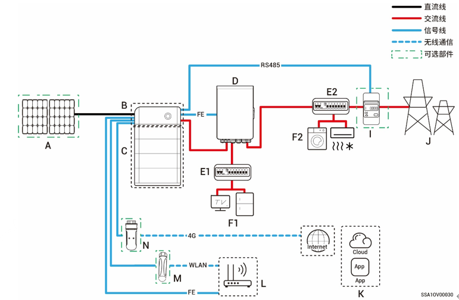

# 典型组网介绍

* 本产品应用于家庭备电组网场景。需与光伏板、逆变器、电池包、总控制开关、负载、发电机、电网配合使用。
* 电网断电时，可将家庭储能系统切换至离网运行模式。待电网恢复后，将家庭储能系统切换至并网运行。实现光储柴无缝切换。



* <mark style="color:blue;">备电组网下，备电负载离网运行时长与光储系统供电能力相关，若离网运行时，光储系统供电出现异常（包含但不限于光伏发电异常、电池电量不足、油机等供电源异常），备电负载依然存在无法运行情况。</mark>
* <mark style="color:blue;">组网图以2台逆变器为示例，不同型号的备电柜可支持接入的逆变器台数不同，请根据表1中所列内容进行匹配。</mark>

**表 2-1**

<table><thead><tr><th width="55" align="center">序号</th><th>型号</th><th>支持接入的逆变器台数</th></tr></thead><tbody><tr><td align="center"><strong>1</strong></td><td>Sigen Gateway HomeMax SP</td><td>3 台</td></tr><tr><td align="center"><strong>2</strong></td><td>Gateway Home SP</td><td>1 台</td></tr><tr><td align="center"><strong>3</strong></td><td>Gateway Home SP 12K</td><td>2 台</td></tr><tr><td align="center"><strong>4</strong></td><td>Sigen Gateway SP AU</td><td>2 台</td></tr><tr><td align="center"><strong>5</strong></td><td>Sigen Gateway HomeMax SP LA</td><td>2 台</td></tr><tr><td align="center"><strong>6</strong></td><td>Sigen Gateway HomeMax TP</td><td>2 台</td></tr><tr><td align="center"><strong>7</strong></td><td>Sigen Gateway Home TP</td><td>1 台</td></tr><tr><td align="center"><strong>8</strong></td><td>Sigen Gateway TP AU</td><td>2 台</td></tr><tr><td align="center"><strong>9</strong></td><td>Sigen Gateway HomeMax TP CN</td><td>2 台</td></tr><tr><td align="center"><strong>10</strong></td><td>Sigen Gateway Home TP 30K</td><td>1 台</td></tr><tr><td align="center"><strong>11</strong></td><td>Sigen Gateway Home TP 30K CN</td><td>1 台</td></tr><tr><td align="center"><strong>12</strong></td><td>Sigen Gateway HomePro TP</td><td>2 台</td></tr><tr><td align="center"><strong>13</strong></td><td>Sigen Gateway HomePro TP-L</td><td>2 台</td></tr><tr><td align="center"><strong>14</strong></td><td>Sigen Gateway Home SP AU</td><td>2 台</td></tr><tr><td align="center"><strong>15</strong></td><td>Sigen Gateway Home TP AU</td><td>2 台</td></tr><tr><td align="center"><strong>16</strong></td><td>Sigen Gateway HomePro SP</td><td>1 台</td></tr></tbody></table>

### 全屋备电组网图

**单台逆变器 (Gateway有用于连接智能负载/油机的断路器)**

**单台逆变器 (Gateway没有用于连接智能负载/油机的断路器)**

**多台逆变器 (Gateway有用于连接智能负载/油机的断路器)**

**多台逆变器 (Gateway没有用于连接智能负载/油机的断路器)**

<table><thead><tr><th width="73">序号</th><th width="110">说明</th><th width="63">序号</th><th width="295">说明</th><th width="63">序号</th><th>说明</th></tr></thead><tbody><tr><td><strong>A</strong></td><td>光伏板</td><td><strong>B</strong></td><td>思格能源控制器（SigenStor EC/Sigen Hybrid）</td><td><strong>C</strong></td><td>思格储能电池</td></tr><tr><td><strong>D</strong></td><td>思格能源备电柜</td><td><strong>E</strong></td><td>备电备配电单元</td><td><strong>F</strong></td><td>备电家用负载</td></tr><tr><td><strong>G</strong></td><td>发电机</td><td><strong>H</strong></td><td>智能负载</td><td><strong>I</strong></td><td>电网</td></tr><tr><td><strong>J</strong></td><td>思格云</td><td><strong>K</strong></td><td>路由器</td><td><strong>L</strong></td><td>天线棒</td></tr><tr><td><strong>M</strong></td><td>思格通信棒</td><td></td><td></td><td></td><td></td></tr></tbody></table>



* <mark style="color:blue;">F（备电家用负载）发生漏电可能导致电击危险，为避免电击危险，D（Gateway）和F（备电家用负载）之间必须安装漏电保护开关。</mark>
* <mark style="color:blue;">发电机可作为长期离网场景的备份能源，与备电柜配合可实现光储柴无缝切换的用电体验。</mark>
* <mark style="color:blue;">业主家中的用电设备均可作为智能负载接入。为保证本产品对用户利益最大化，建议大功率设备作为智能负载接入（如热泵、泳池加热器、干衣机等），当储能电量不足时可切出。其他小功率设备作为家用负载接入（如灯、路由器等）。</mark>
* <mark style="color:blue;">通信方式推荐采用FE和WLAN。思格通信棒赠送4G流量用完后，需用户自行充值或更换SIM卡。</mark>

### 部分备电组网图

**单台逆变器 (Gateway有用于连接智能负载/油机的断路器)**

**单台逆变器 (Gateway没有用于连接智能负载/油机的断路器)**

<figure><figcaption></figcaption></figure>

**多台逆变器 (Gateway有用于连接智能负载/油机的断路器)**

**多台逆变器 (Gateway没有用于连接智能负载/油机的断路器)**

<table><thead><tr><th width="54.25">序号</th><th>说明</th><th width="55.5">序号</th><th>说明</th><th width="54.25">序号</th><th>说明</th></tr></thead><tbody><tr><td><strong>A</strong></td><td>光伏板</td><td><strong>B</strong></td><td>思格能源控制器</td><td><strong>C</strong></td><td>思格能源控制器</td></tr><tr><td><strong>D</strong></td><td>思格能源备电柜</td><td><strong>E1</strong></td><td>备电配电单元</td><td><strong>E2</strong></td><td>非备电配电单元</td></tr><tr><td><strong>F1</strong></td><td>备电家用负载</td><td><strong>F2</strong></td><td>非备电家用负载</td><td><strong>G</strong></td><td>发电机</td></tr><tr><td><strong>H</strong></td><td>智能负载</td><td><strong>I</strong></td><td>功率传感器</td><td><strong>J</strong></td><td>电网</td></tr><tr><td><strong>K</strong></td><td>思格云</td><td><strong>L</strong></td><td>路由器</td><td><strong>M</strong></td><td>天线棒</td></tr><tr><td><strong>N</strong></td><td>思格通信棒</td><td></td><td></td><td></td><td></td></tr></tbody></table>



* <mark style="color:blue;">若E2 (非备电配电单元) 具有漏电保护功能，推荐额定剩余动作电流为≥逆变器数量×100mA。</mark>
* <mark style="color:blue;">F1（备电家用负载）发生漏电可能导致电击危险，为避免电击危险，D（Gateway）和F1（备电家用负载）之间必须安装漏电保护开关。</mark>
* <mark style="color:blue;">柴油发电机可作为长期离网场景的备份能源，与Gateway配合可实现光储柴无缝切换的用电体验。</mark>
* <mark style="color:blue;">业主家中的用电设备均可作为智能负载接入。为保证本产品对用户利益最大化，建议大功率设备作为智能负载接入（如热泵、泳池加热器、干衣机等），当储能电量不足时可切出。其他小功率设备作为家用负载接入（如灯、路由器等）。</mark>
* <mark style="color:blue;">功率传感器具备并网点数据采集实现零功率并网功能。仅部分备电时，功率传感器可不配置；部分备电+零功率并网控制时，功率传感器需配置。</mark>
* <mark style="color:blue;">通信方式推荐采用FE和WLAN。CommMod赠送4G流量用完后，需用户自行充值或更换SIM卡。</mark>
