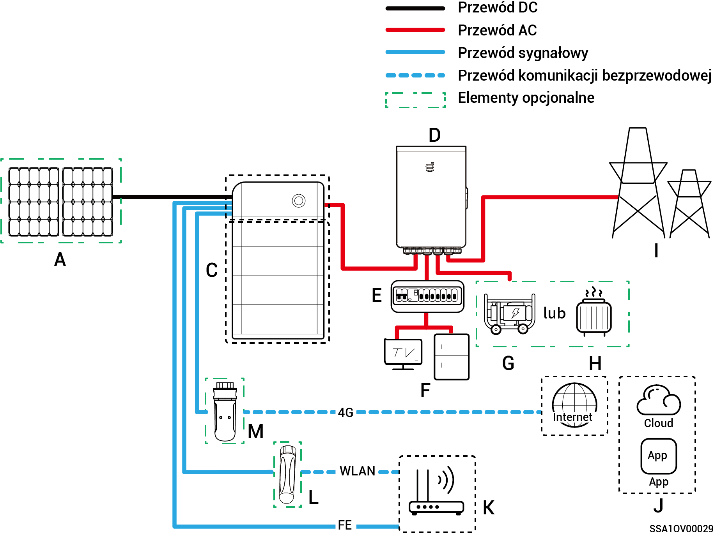
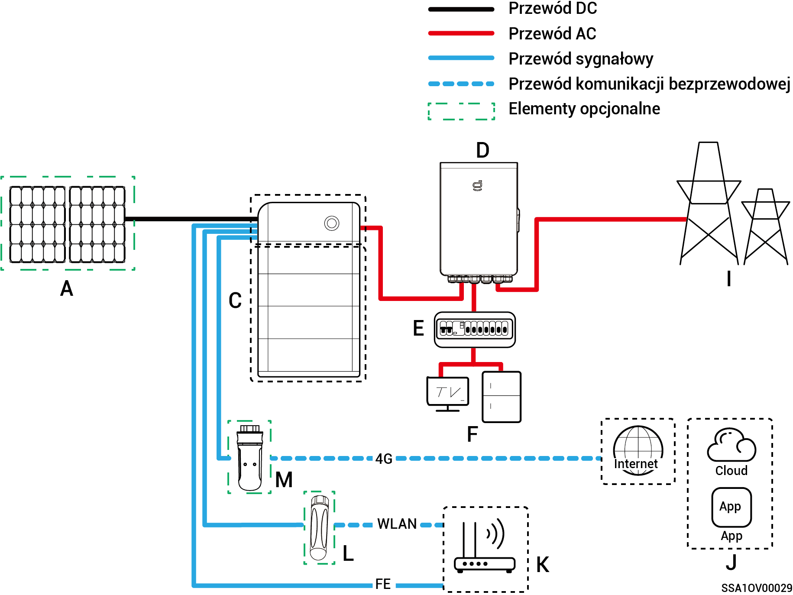
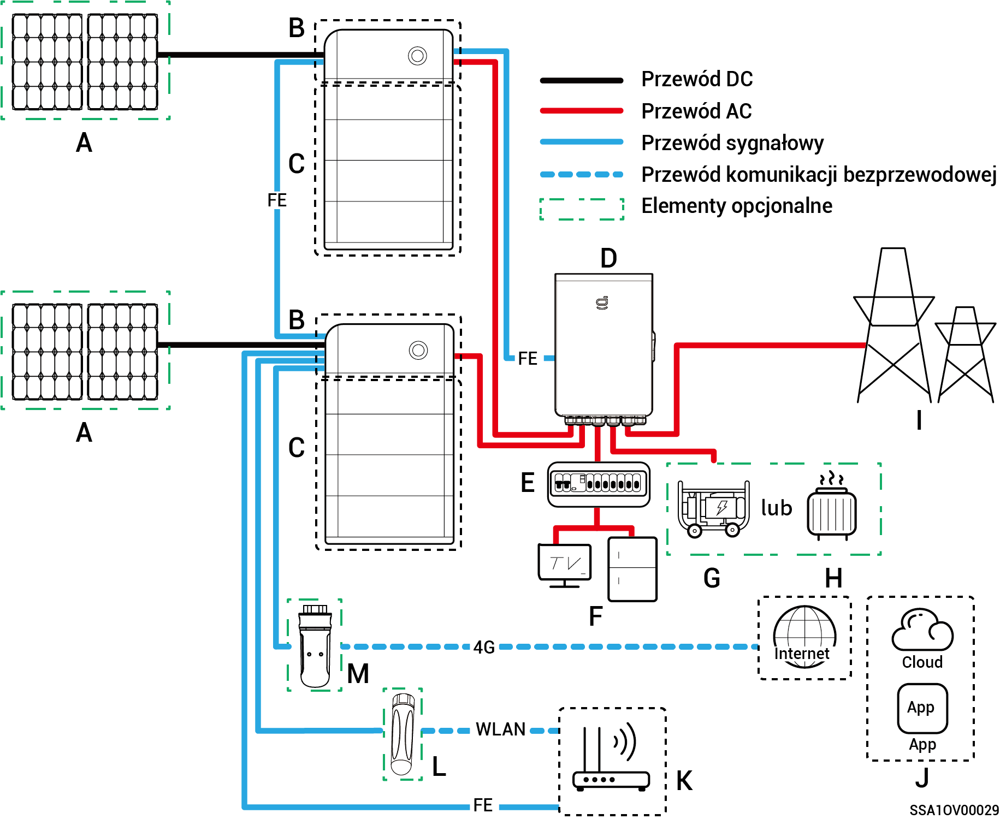
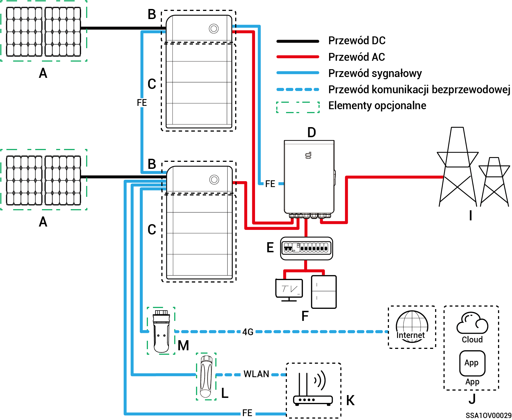
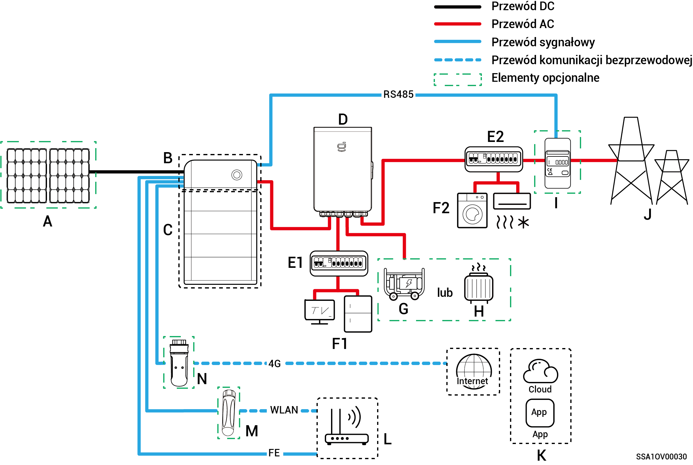
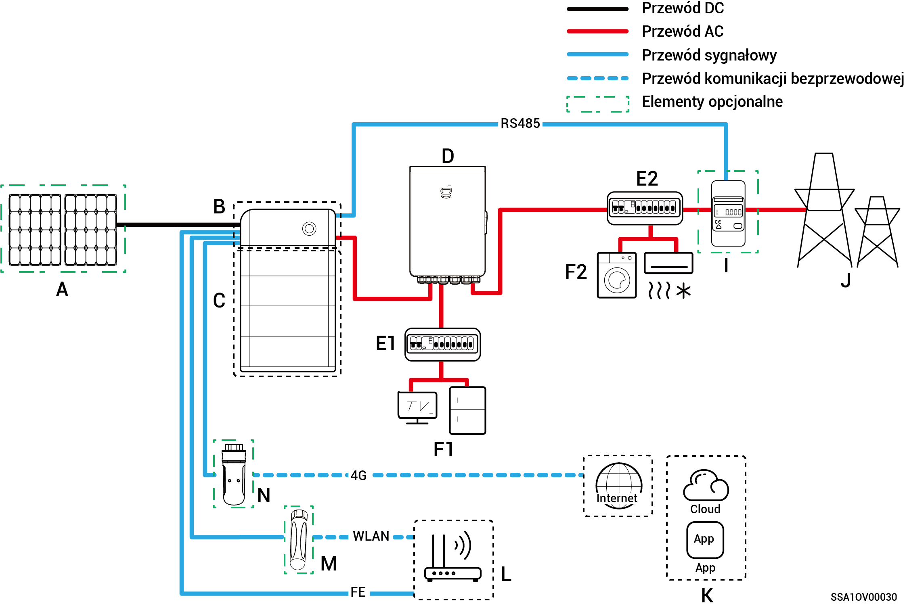
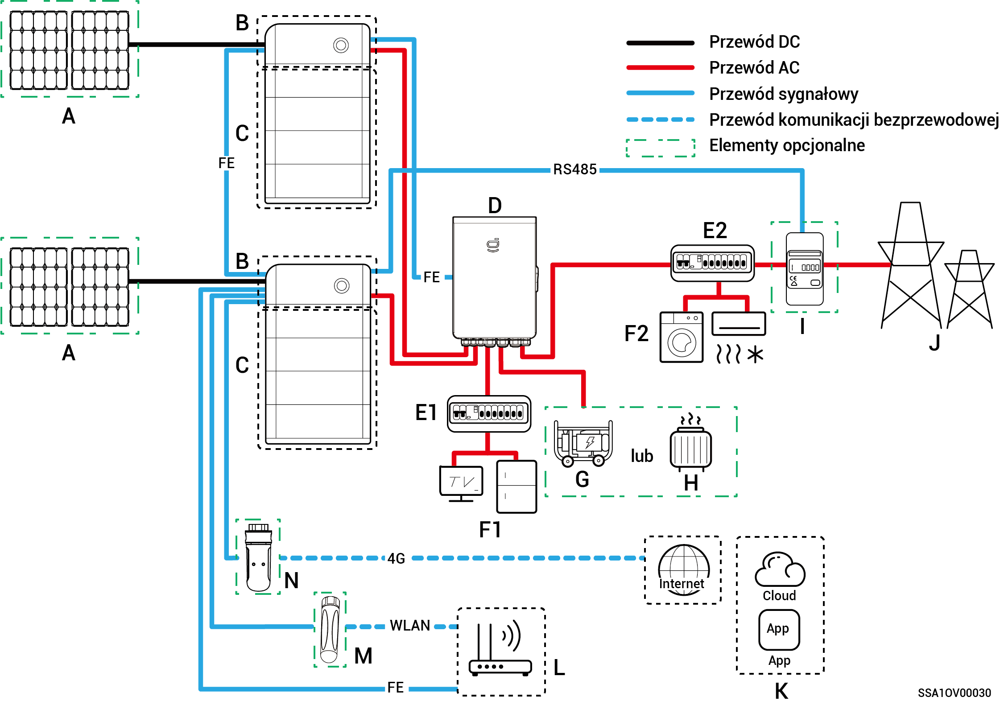
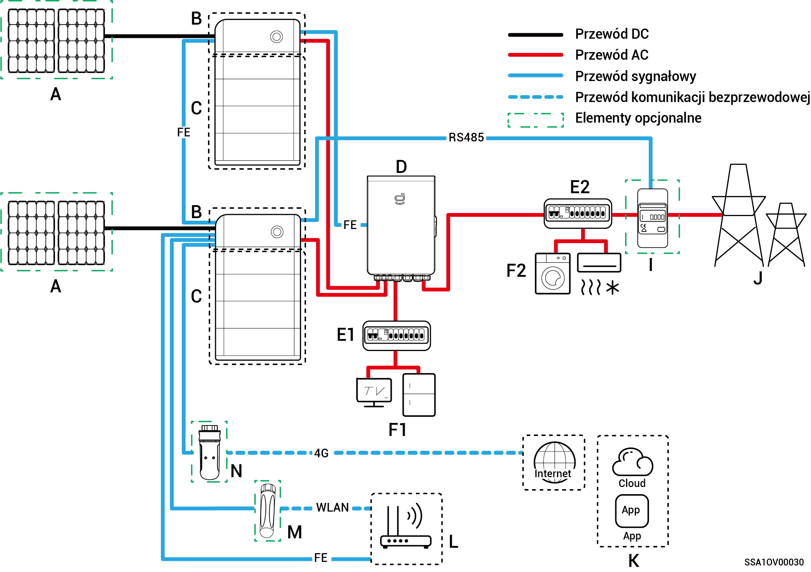

# Wprowadzenie do okablowania instalacji

* Produkt odpowiedni do tworzenia sieciowych systemów zasilania awaryjnego w gospodarstwach domowych. Należy go używać w połączeniu z panelami fotowoltaicznymi, falownikami, akumulatorami, głównymi przełącznikami sterującymi, obciążeniami, generatorami i siecią energetyczną.
* W przypadku przerwy w dostawie prądu domowy system magazynowania energii przełącza się na tryb pracy poza siecią. Po wznowieniu normalnej pracy sieci energetycznej domowy system magazynowania energii przełącza się z powrotem na tryb pracy w sieci. Umożliwia to płynne przełączanie między magazynowaniem energii fotowoltaicznej a generatorem.



* <mark style="color:blue;">Przy sieci z zasilaniem zapasowym czas działania poza siecią dla obciążenia na zasilaniu zapasowym jest związany z pojemnością źródła zasilania instalacji magazynującej PV. W razie usterki źródła zasilania instalacji magazynującej PV podczas pracy poza siecią (w tym, między innymi, nieprawidłowe generowanie energii PV, niewystarczająca energia w akumulatorze oraz nieprawidłowe zasilanie generatora) obciążenie na zasilaniu zapasowym nie będzie działać.</mark>
* <mark style="color:blue;">Na schemacie sieci w ramach przykładu uwzględniono dwa falowniki. Liczba falowników, które można podłączyć zależy od specyfikacji bramy. Więcej informacji znajduje się w Tabeli 2-1.</mark>

**Tabela 2-1**

<table><thead><tr><th width="75">S/N</th><th>Model</th><th>Liczba falowników, które można podłączyć</th></tr></thead><tbody><tr><td><strong>1</strong></td><td>Sigen Gateway HomeMax SP</td><td>3 jednostki</td></tr><tr><td><strong>2</strong></td><td>Gateway Home SP</td><td>1 jednostka</td></tr><tr><td><strong>3</strong></td><td>Gateway Home SP 12K</td><td>2 jednostki</td></tr><tr><td><strong>4</strong></td><td>Sigen Gateway SP AU</td><td>2 jednostki</td></tr><tr><td><strong>5</strong></td><td>Sigen Gateway HomeMax TP</td><td>2 jednostki</td></tr><tr><td><strong>6</strong></td><td>Sigen Gateway Home TP</td><td>1 jednostka</td></tr><tr><td><strong>7</strong></td><td>Sigen Gateway TP AU</td><td>2 jednostki</td></tr><tr><td><strong>8</strong></td><td>Sigen Gateway HomeMax TP CN</td><td>2 jednostki</td></tr><tr><td><strong>9</strong></td><td>Sigen Gateway Home TP 30K</td><td>1 jednostka</td></tr><tr><td><strong>10</strong></td><td>Sigen Gateway Home TP 30K CN</td><td>1 jednostka</td></tr></tbody></table>

### Schemat okablowania instalacji zapasowej dla całego domu

**Pojedynczy falownik (bramę wyposażono w wyłącznik automatyczny do podłączania obciążeń inteligentnych/generatora wysokoprężnego)**

**Pojedynczy falownik (brama nie posiada wyłącznika automatycznego podłączonego do obciążeń inteligentnych/generatora wysokoprężnego)**

**Wiele falowników (bramę wyposażono w wyłącznik automatyczny do podłączania obciążeń inteligentnych/generatora wysokoprężnego)**

**Wiele falowników (brama nie posiada wyłącznika automatycznego podłączonego do obciążeń inteligentnych/generatora wysokoprężnego)**

<table><thead><tr><th width="81">Nr</th><th>Opis</th><th width="78">Nr</th><th>Opis</th><th>Nr</th><th>Opis</th></tr></thead><tbody><tr><td><strong>A</strong></td><td>Panel fotowoltaiczny</td><td><strong>B</strong></td><td>SigenStor EC/SigenStor AC /Sigen Hybrid</td><td><strong>C</strong></td><td>SigenStor BAT</td></tr><tr><td><strong>D</strong></td><td>Brama</td><td><strong>E</strong></td><td>Tablica rozdzielcza sieci zapasowej</td><td><strong>F</strong></td><td>Obciążenia domowe z zasilaniem zapasowym</td></tr><tr><td><strong>G</strong></td><td>Obciążenia domowe z zasilaniem zapasowym</td><td><strong>H</strong></td><td>Obciążenia inteligentne</td><td><strong>I</strong></td><td>Sieć energetyczna</td></tr><tr><td><strong>J</strong></td><td>mySigen</td><td><strong>K</strong></td><td>Router</td><td><strong>L</strong></td><td>Antena</td></tr><tr><td><strong>M</strong></td><td>CommMod</td><td></td><td></td><td></td><td></td></tr></tbody></table>



* <mark style="color:blue;">Gdy B to Sigen Hybrid, element C jest opcjonalny.</mark>
* <mark style="color:blue;">Jeżeli w F (obciążenia domowe z zasilaniem zapasowym) występuje upływ prądu, może to stanowić zagrożenie porażeniem elektrycznym. Aby uniknąć tego zagrożenia należy zastosować wyłącznik różnicowoprądowy (RCD) pomiędzy D (brama) a F (obciążenia domowe z zasilaniem zapasowym).</mark>
* <mark style="color:blue;">Zapasowe źródło energii (generator wysokoprężny) w długotrwałych zastosowaniach bez dostępu do sieci energetycznej może działać we współpracy z bramą energetyczną, zapewniając bezproblemowe przechodzenie pomiędzy fotowoltaiką, magazynowaniem i generatorem wysokoprężnym.</mark>
* <mark style="color:blue;">Wszystkie urządzenia elektryczne w domu inwestora mogą być podłączone jako obciążenia inteligentne. Aby zapewnić maksymalne korzyści dla użytkowników, zaleca się podłączyć urządzenia dużej mocy jako obciążenia inteligentne (pompy ciepła, podgrzewacze do basenów, suszarki do odzieży itp.), aby można je było odłączyć, gdy w magazynie energii pozostało mało energii. Pozostałe urządzenia niskiej mocy podłącza się jako obciążenia domowe (oświetlenie, routery, itp.)</mark>
* <mark style="color:blue;">Do komunikacji z falownikami zaleca się korzystanie z sieci Fast Ethernet oraz WLAN. Gdy wyczerpie się bezpłatny limit danych 4G CommMod, użytkownik musi wymienić kartę SIM.</mark>

### **Schemat okablowania instalacji zapasowej dla części domu**

**Pojedynczy falownik (bramę wyposażono w wyłącznik automatyczny do podłączania obciążeń inteligentnych/generatora wysokoprężnego)**

**Pojedynczy falownik (brama nie posiada wyłącznika automatycznego podłączonego do obciążeń inteligentnych/generatora wysokoprężnego)**

**Wiele falowników (bramę wyposażono w wyłącznik automatyczny do podłączania obciążeń inteligentnych/generatora wysokoprężnego)**

**Wiele falowników (brama nie posiada wyłącznika automatycznego podłączonego do obciążeń inteligentnych/generatora wysokoprężnego)**

| Nr     | Opis                                     | Nr     | Opis                                       | Nr     | Opis                                                  |
| ------ | ---------------------------------------- | ------ | ------------------------------------------ | ------ | ----------------------------------------------------- |
| **A**  | Panel fotowoltaiczny                     | **B**  | SigenStor EC/SigenStor AC /Sigen Hybrid    | **C**  | SigenStor BAT                                         |
| **D**  | Brama                                    | **E1** | Tablica rozdzielcza sieci zapasowej        | **E2** | Panel rozdzielczy instalacji bez zasilania zapasowego |
| **F1** | Obciążenia domowe z zasilaniem zapasowym | **F2** | Obciążenia domowe bez zasilania zapasowego | **G**  | Generator wysokoprężny                                |
| **H**  | Obciążenia inteligentne                  | **I**  | Miernik prądu                              | **J**  | Sieć energetyczna                                     |
| **K**  | mySigen                                  | **L**  | Router                                     | **M**  | Antena                                                |
| **N**  | CommMod                                  |        |                                            |        |                                                       |



* <mark style="color:blue;">Gdy B to Sigen Hybrid, element C jest opcjonalny.</mark>
* <mark style="color:blue;">Jeżeli E2 (tablica rozdzielcza instalacji zasilania niezapasowego) posiada zabezpieczenie przeciwupływowe, zalecane jest zapewnienie parametru znamionowego prądu resztkowego o wartości większej lub równej liczbie falowników × 100 mA.</mark>
* <mark style="color:blue;">Jeżeli w F1 (obciążenia domowe z zasilaniem zapasowym) występuje upływ prądu, może to stanowić zagrożenie porażeniem elektrycznym. Aby uniknąć tego zagrożenia należy zastosować wyłącznik różnicowoprądowy (RCD) pomiędzy D (brama) a F1 (obciążenia domowe z zasilaniem zapasowym).</mark>
* <mark style="color:blue;">Zapasowe źródło energii (generator wysokoprężny) w długotrwałych zastosowaniach bez dostępu do sieci energetycznej może działać we współpracy z bramą energetyczną, zapewniając bezproblemowe przechodzenie pomiędzy fotowoltaiką, magazynowaniem i wysokoprężnym generatorem prądu.</mark>
* <mark style="color:blue;">Wszystkie urządzenia elektryczne w domu inwestora mogą być podłączone jako obciążenia inteligentne. Aby zapewnić maksymalne korzyści dla użytkowników, zaleca się podłączyć urządzenia dużej mocy jako obciążenia inteligentne (pompy ciepła, podgrzewacze do basenów, suszarki do odzieży itp.), aby można je było odłączyć, gdy w magazynie energii pozostało mało energii. Pozostałe urządzenia niskiej mocy podłącza się jako obciążenia domowe (oświetlenie, routery, itp.)</mark>
* <mark style="color:blue;">Miernik prądu realizuje zadanie pobieranie danych z punktów połączenia z siecią elektryczną umożliwia połączenie z siecią elektryczną w trybie zerowej mocy. W przypadku okablowania instalacji zasilania zapasowego</mark> <mark style="color:blue;">dla części domu nie ma konieczności konfigurowania miernika prądu. W przypadku okablowania instalacji częściowego zasilania zapasowego i instalacji połączonej z siecią elektryczną w trybie kontroli zerowego eksportu miernik prądu należy skonfigurować.</mark>
* <mark style="color:blue;">Do komunikacji z falownikami zaleca się korzystanie z sieci Fast Ethernet oraz WLAN. Gdy wyczerpie się bezpłatny limit danych 4G CommMod, użytkownik musi wymienić kartę SIM.</mark>
