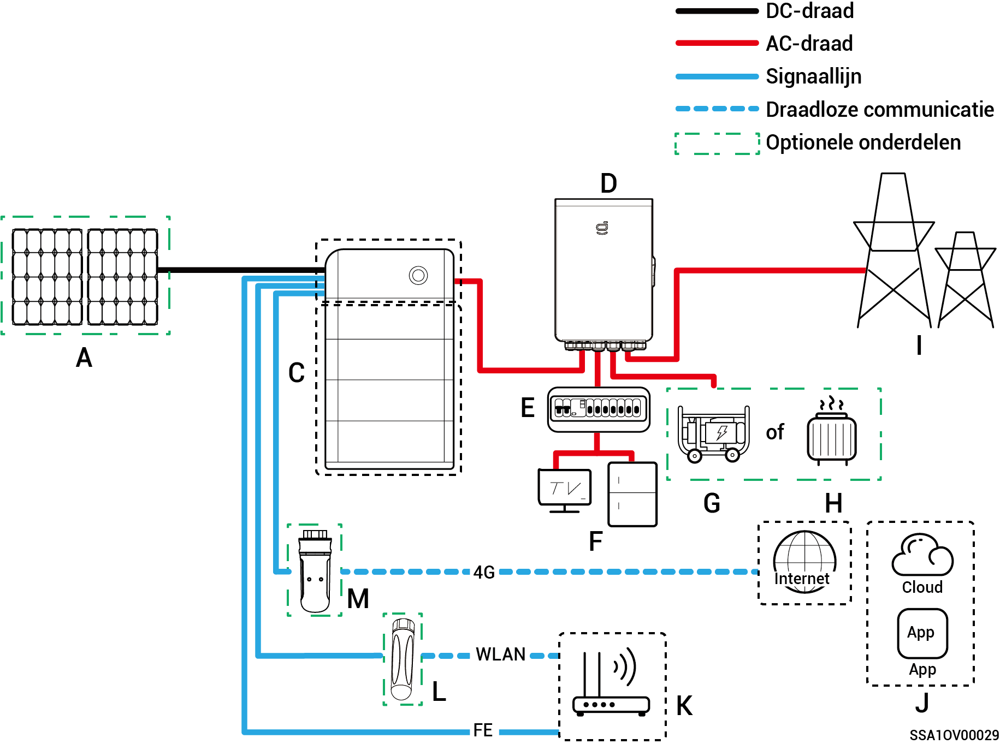
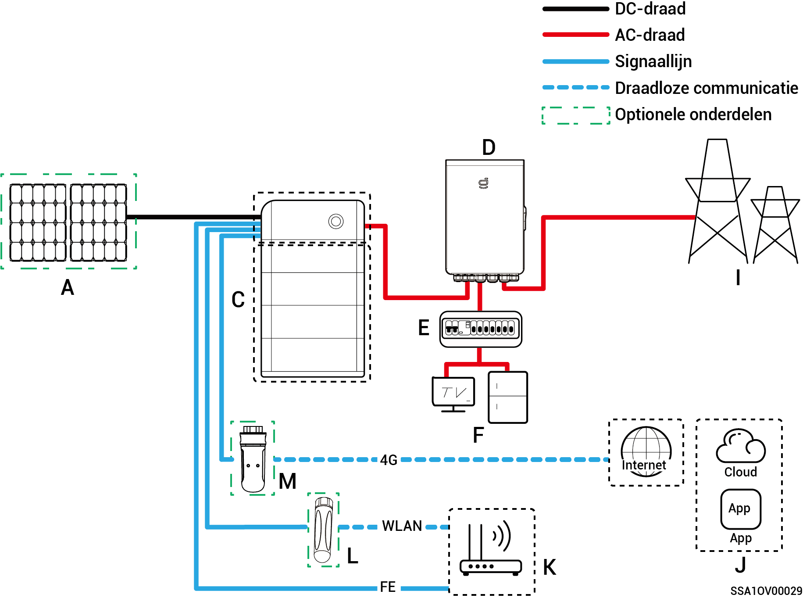
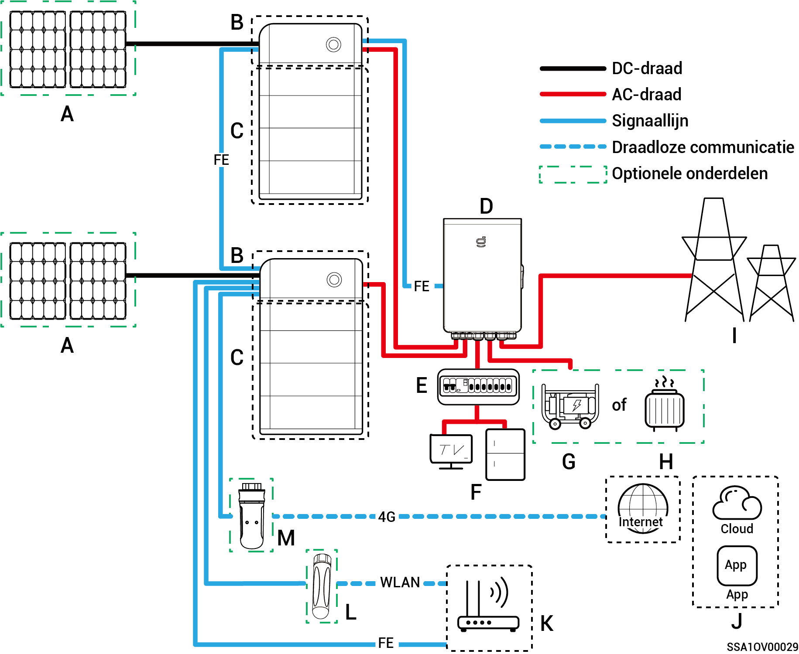
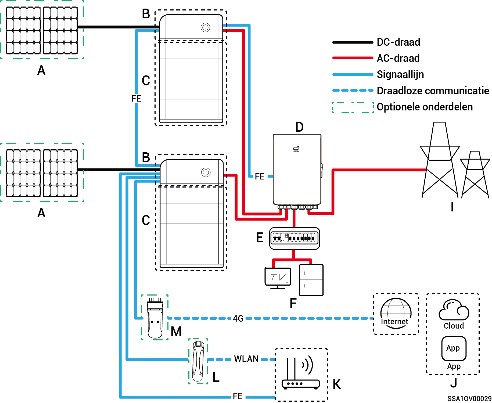
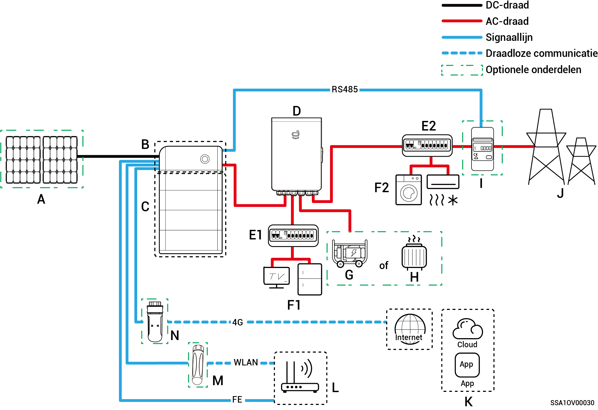
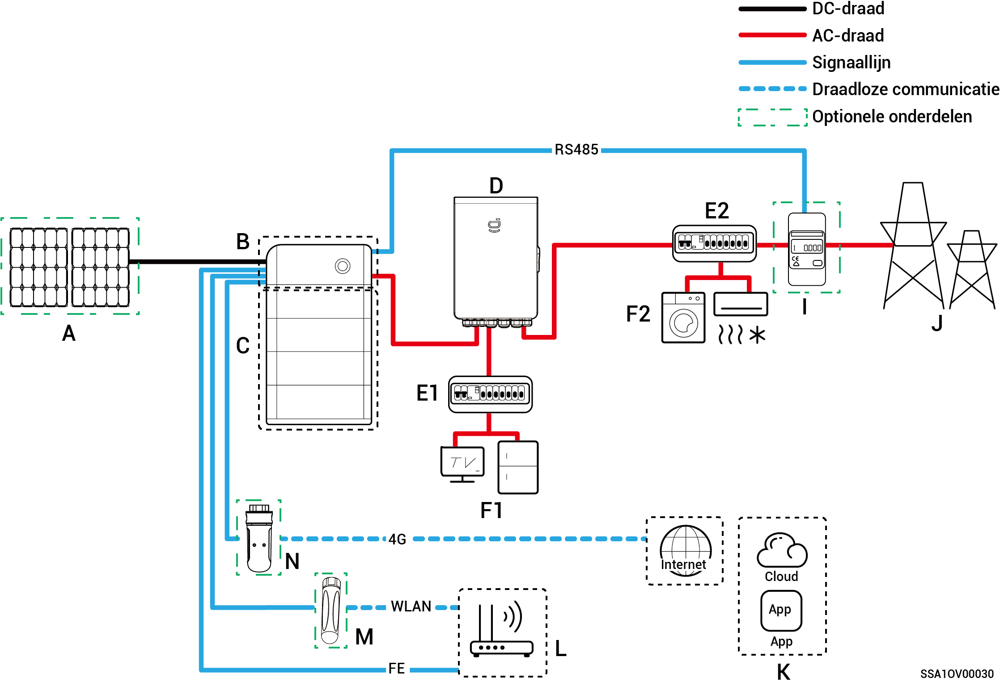
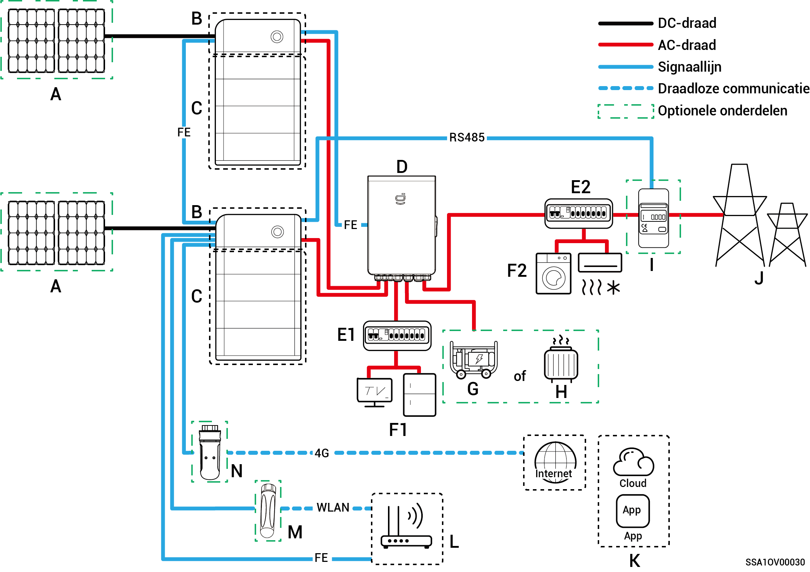
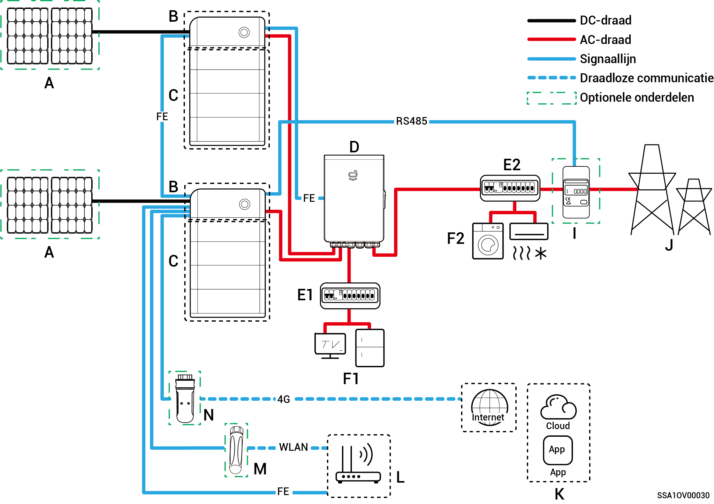

# Introductie tot systeembedrading

* Dit product is toepasbaar in netwerkscenario's voor huishoudelijke back-upstroomsystemen. Het moet worden gebruikt in combinatie met PV-panelen, omvormers, batterijpakketten, hoofdschakelaars, belastingen, generators en het elektriciteitsnet.
* In het geval van een stroomstoring schakelt het huishoudelijke energieopslagsysteem over naar de off-grid werkmodus. Nadat het elektriciteitsnet weer normaal functioneert, schakelt het huishoudelijke energieopslagsysteem terug naar de on-grid modus. Dit zorgt voor een naadloze omschakeling tussen PV-opslag en generator.



* <mark style="color:blue;">Bij een back-upvoeding is de duur van de werking van de back-upvoeding gerelateerd aan de voedingscapaciteit van het PV-opslagsysteem. Als er zich een abnormaliteit voordoet in de voedingscapaciteit van het PV-opslagsysteem tijdens werking buiten het elektriciteitsnet (inclusief maar niet beperkt tot abnormale PV-stroomopwekking, onvoldoende batterijvermogen en abnormale stroomvoorziening naar de generator) zal de back-upvoeding niet gebruikt kunnen worden.</mark>
* <mark style="color:blue;">Het netwerkschema neemt twee omvormers als voorbeeld. Het aantal omvormers dat aangesloten kan worden, is afhankelijk van de specificatie van de Gateway. Voor meer informatie, zie Tabel 2-1.</mark>

**Tabel 2-1**

<table><thead><tr><th width="75">S/N</th><th>Model</th><th>Aantal omvormers dat kan worden aangesloten</th></tr></thead><tbody><tr><td><strong>1</strong></td><td>Sigen Gateway HomeMax SP</td><td>3 eenheden</td></tr><tr><td><strong>2</strong></td><td>Gateway Home SP</td><td>1 eenheid</td></tr><tr><td><strong>3</strong></td><td>Gateway Home SP 12K</td><td>2 eenheden</td></tr><tr><td><strong>4</strong></td><td>Sigen Gateway SP AU</td><td>2 eenheden</td></tr><tr><td><strong>5</strong></td><td>Sigen Gateway HomeMax TP</td><td>2 eenheden</td></tr><tr><td><strong>6</strong></td><td>Sigen Gateway Home TP</td><td>1 eenheid</td></tr><tr><td><strong>7</strong></td><td>Sigen Gateway TP AU</td><td>2 eenheden</td></tr><tr><td><strong>8</strong></td><td>Sigen Gateway HomeMax TP CN</td><td>2 eenheden</td></tr><tr><td><strong>9</strong></td><td>Sigen Gateway Home TP 30K</td><td>1 eenheid</td></tr><tr><td><strong>10</strong></td><td>Sigen Gateway Home TP 30K CN</td><td>1 eenheid</td></tr></tbody></table>

### Schema voor het back-upsysteem van het hele huis

**Enkele omvormer (Gateway heeft de stroomonderbreker voor het aansluiten van slimme belasting/dieselgenerator)**

**Enkele omvormer (Gateway heeft geen stroomonderbreker voor het aansluiten van slimme belasting/dieselgenerator)**

**Meerdere omvormers (Gateway heeft de stroomonderbreker voor het aansluiten van slimme belasting/dieselgenerator)**

**Meerdere omvormers (Gateway heeft geen stroomonderbreker voor het aansluiten van slimme belasting/dieselgenerator)**

<table><thead><tr><th width="81">Nummer.</th><th>Beschrijving</th><th width="78">Nummer.</th><th>Beschrijving</th><th>Nummer.</th><th>Beschrijving</th></tr></thead><tbody><tr><td><strong>A</strong></td><td>PV-paneel</td><td><strong>B</strong></td><td>SigenStor EC/SigenStor AC/Sigen Hybrid</td><td><strong>C</strong></td><td>SigenStor BAT</td></tr><tr><td><strong>D</strong></td><td>Gateway</td><td><strong>E</strong></td><td>Back-updistributiepaneel</td><td><strong>F</strong></td><td>Back-up huishoudelijke belasting</td></tr><tr><td><strong>G</strong></td><td>Back-up huishoudelijke belasting</td><td><strong>H</strong></td><td>Slimme belasting</td><td><strong>I</strong></td><td>Elektriciteitsnet</td></tr><tr><td><strong>J</strong></td><td>mySigen</td><td><strong>K</strong></td><td>Router</td><td><strong>L</strong></td><td>Antenna</td></tr><tr><td><strong>M</strong></td><td>CommMod</td><td></td><td></td><td></td><td></td></tr></tbody></table>



* <mark style="color:blue;">Wanneer B Sigen Hybrid is, is C is optioneel.</mark>
* <mark style="color:blue;">Als F (back-up huishoudelijke belasting) lekstroom vertoont, kan dit een elektrische schok veroorzaken. Om dit risico te voorkomen, moet er een aardlekschakelaar (RCD) worden geïnstalleerd tussen D (Gateway) en F (back-up huishoudelijke belasting).</mark>
* <mark style="color:blue;">De dieselgenerator kan samenwerken met de gateway als back-up-energiebron voor langdurige off-grid-toepassingen om een soepele overgang te bieden tussen PV, opslag en dieselgeneratie.</mark>
* <mark style="color:blue;">Alle elektronische apparaten in het huis van de eigenaar kunnen worden aangesloten als slimme belasting. Om ervoor te zorgen dat de gebruiker zo veel mogelijk voordeel heeft van dit product, wordt aangeraden om apparaten met een hoog stroomverbruik aan te sluiten als slimme verbruikers (warmtepompen, zwembadverwarmers, wasdrogers, enz.), zodat deze kunnen worden uitgeschakeld als het energieopslagsysteem bijna leeg is. Andere apparatuur met een laag vermogen wordt aangesloten als huishoudelijke belasting (verlichting, routers, enz.)</mark>
* <mark style="color:blue;">Het wordt aanbevolen om snel Ethernet en WLAN te gebruiken voor communicatie met omvormers. Als het gratis 4G-verkeer van CommMod verbruikt is, dienen gebruikers een SIM-kaart te vervangen.</mark>

### **Bedradingsschema voor gedeeltelijk back-upsysteem van het huis.**

**Enkele omvormer (Gateway heeft de stroomonderbreker voor het aansluiten van slimme belasting/dieselgenerator)**

**Enkele omvormer (Gateway heeft geen stroomonderbreker voor het aansluiten van slimme belasting/dieselgenerator)**

**Meerdere omvormers (Gateway heeft de stroomonderbreker voor het aansluiten van slimme belasting/dieselgenerator)**

**Meerdere omvormers (Gateway heeft geen stroomonderbreker voor het aansluiten van slimme belasting/dieselgenerator)**

| Nummer. | Beschrijving                     | Nummer. | Beschrijving                            | Nummer. | Beschrijving                  |
| ------- | -------------------------------- | ------- | --------------------------------------- | ------- | ----------------------------- |
| **A**   | PV-paneel                        | **B**   | SigenStor EC/SigenStor AC/Sigen Hybrid  | **C**   | SigenStor BAT                 |
| **D**   | Gateway                          | **E1**  | Back-updistributiepaneel                | **E2**  | Niet-back-updistributiepaneel |
| **F1**  | Back-up huishoudelijke belasting | **F2**  | Niet-back-up huishoudelijke belastingen | **G**   | Dieselgenerator               |
| **H**   | Slimme belasting                 | **I**   | Vermogenssensor                         | **J**   | Elektriciteitsnet             |
| **K**   | mySigen                          | **L**   | Router                                  | **M**   | Antenna                       |
| **N**   | CommMod                          |         |                                         |         |                               |



* <mark style="color:blue;">Wanneer B Sigen Hybrid is, is C is optioneel.</mark>
* <mark style="color:blue;">Als E2 (niet-back-up distributiepaneel) lekstroombeveiliging heeft, wordt aanbevolen dat de nominale reststroom gelijk aan of groter is dan het aantal omvormers × 100 mA.</mark>
* <mark style="color:blue;">Als F1 (back-up huishoudelijke belasting) lekstroom vertoont, kan dit een elektrische schok veroorzaken. Om dit risico te voorkomen, moet er een aardlekschakelaar (RCD) worden geïnstalleerd tussen D (Gateway) en F1 (back-up huishoudelijke belasting).</mark>
* <mark style="color:blue;">De dieselgenerator kan samenwerken met de Gateway als back-up-energiebron voor langdurige off-grid-toepassingen om een soepele overgang te bieden tussen PV, opslag en opwekking van dieselenergie.</mark>
* <mark style="color:blue;">Alle elektronische apparaten in het huis van de eigenaar kunnen worden aangesloten als slimme belasting. Om ervoor te zorgen dat de gebruiker zo veel mogelijk voordeel heeft van dit product, wordt aangeraden om apparaten met een hoog stroomverbruik aan te sluiten als slimme verbruikers (warmtepompen, zwembadverwarmers, wasdrogers, enz.), zodat deze kunnen worden uitgeschakeld als het energieopslagsysteem bijna leeg is. Andere apparatuur met een laag vermogen wordt aangesloten als huishoudelijke belasting (verlichting, routers, enz.)</mark>
* <mark style="color:blue;">De stroomsensor heeft de functie dat gegevensverwerving voor netverbindingspunten, wat netverbinding zonder vermogen mogelijk maakt. Voor het schema van een gedeeltelijk back-upsysteem</mark> <mark style="color:blue;">van het huis hoeft de stroomsensor niet te worden geconfigureerd. Voor het schema van gedeeltelijke back-upstroom en zero-power netaansluitingcontrolesysteem is de stroomsensor geconfigureerd.</mark>
* <mark style="color:blue;">Het wordt aanbevolen om snel Ethernet en WLAN te gebruiken voor communicatie met omvormers. Als het gratis 4G-verkeer van CommMod verbruikt is, dienen gebruikers een SIM-kaart te vervangen.</mark>
