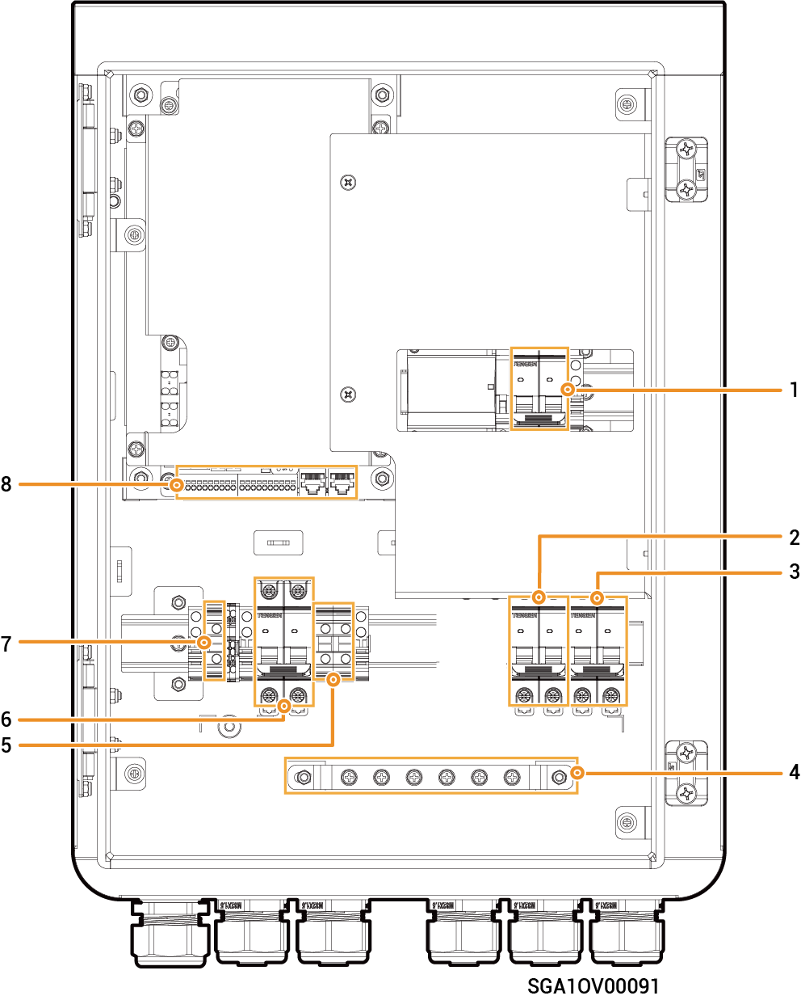

# Sigen Gateway Home SP 12K CN

### Dimensions

<figure><figcaption></figcaption></figure>

### Bottom View

<figure><figcaption></figcaption></figure>

<table><thead><tr><th width="146">S/N</th><th>Name</th></tr></thead><tbody><tr><td>1</td><td>Wire-in port of communication</td></tr><tr><td>2</td><td>Wire-in port of power grid</td></tr><tr><td>3</td><td>Wire-in port of non-backup load</td></tr><tr><td>4</td><td>(Optional) Wire-in port of inverter</td></tr><tr><td>5</td><td>Wire-in port of inverter</td></tr><tr><td>6</td><td>Wire-in port of backup household load</td></tr></tbody></table>

### Interior View

<figure><figcaption></figcaption></figure>

<table><thead><tr><th width="73.7999267578125">No.</th><th width="101">Label</th><th>Description</th></tr></thead><tbody><tr><td>1</td><td>QS1</td><td>Bypass switch</td></tr><tr><td>2</td><td>QF2</td><td>Miniature circuit breaker (connecting to a single-phase inverter)</td></tr><tr><td>3</td><td>QF3</td><td>Miniature circuit breaker (connecting to a backup household load)</td></tr><tr><td>4</td><td>
<figure><figcaption></figcaption></figure>
</td><td>Grounding copper busbar</td></tr><tr><td>5</td><td>X1</td><td>Terminal (connecting to a non-backup load)</td></tr><tr><td>6</td><td>QF1</td><td>Miniature circuit breaker (connecting to the power grid)</td></tr><tr><td>7</td><td>GND</td><td>Terminal (connecting to functional ground cable)</td></tr><tr><td>8</td><td>–</td><td>Communication terminal (connecting to FE, DI, DO communication cable)</td></tr></tbody></table>
